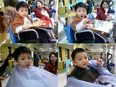

唸了好久 總算預約了家庭理髮師幫阿徹還有小愛剪頭髮  
前幾次阿徹都要從家裡帶他的卡通小椅子去才能乖乖不哭的讓阿姨好好style一番  
這次出發前跟他溝通了一番"坐阿姨那的椅子好不好 可以坐高高喔"  
他想了想後竟接受了 然後帶著一本書開開心心的去剪頭髮  
等候的空檔 這小子竟也煞有其事的看起了書  
那認真悠哉的模樣 就像是爸爸剪頭髮時的翻版  
呵呵~真的是小大人嚕

小愛的呆頭從她出生第40天被我隨便帶去家裡附近的理髮店胡亂剪的那刻起  
就被我跟爸爸嫌到不行  
好不容易長長一點了總算也可以跟隨哥哥腳步上髮廊嚕  
其實媽媽也不是說崇尚台北的設計師  
只是習慣了剪了10年頭髮的設計師  
所以現在一家四口的頭髮可都出自同一設計師阿姨之手ㄋ  
第一次給阿姨剪頭髮  
小愛很乖很讚  沒哭沒鬧也沒啥亂轉頭 就眼睛咕嚕咕嚕的瞧阿瞧  
阿姨說小愛圓圓的頭型很漂亮很難得喔  
而那濃密的頭髮也耗掉阿姨不少時間心力打薄  
看來小愛長大後離子燙的錢省不了嚕~  
對了 今天阿姨免費幫小愛剪髮 當作是他的見面禮 謝謝嚕~

