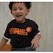

92年2月22日生的阿徹滿三歲嚕~  
日子真的過的好快  
記憶裡阿徹學爬學走路的模樣還清晰可見 彷如昨日才發生  
轉眼間卻已是個會思考會講甜言蜜語甚至跟我討價還價的小男孩了  
每每看到徹爸鏡頭下沉思的 開懷大笑的 認真的 頑皮的阿徹  
嘴角都忍不住上揚的告訴自己"這是我兒子"

平心而論 阿徹是個討喜且善體人意的乖小孩  
從幼稚園到家裡的路上  
檳榔攤 便當店 腳踏車店 披薩店的阿姨阿伯們都喜歡他  
喚他是乖巧的"小帥哥"  
而我跟徹爸除了偶而會被他嚕的怒火中燒外  
大部分的時間其實也都被他"吃的死死的"  
有時候徹爸會問我"如果阿徹沒這麼可愛的話 我們還會這麼愛他嗎"  
呵呵 不知道爺...

前陣子阿徹很喜歡拿著他的疊疊杯疊成像蛋糕一樣一層一層的  
開心的要我跟他唱著生日快樂歌 (唱完中文版還要來各英文版)  
再假裝上面有蠟蠋 開心的吹著蠟燭  
然後母子倆再開心的假裝大快朵頤一番  
看到他這麼開心的過生日都忍不住告訴他"等你生日到了 媽媽買真的蛋糕給你吹蠟燭嘿"  
阿徹也都一臉認真期待的說"好"...  
還記得阿徹2歲生日時是拿著幾顆糖望著書上的蛋糕唱生日快樂  
今年媽媽真的買個你最愛的草莓口味蛋糕給你唱歌喔~

  

