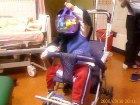
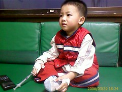
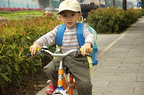
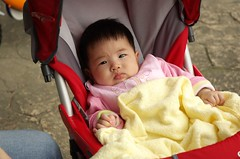
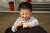
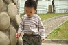
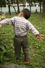

阿徹趕流行病了  
從週日晚上九點喝奶喝到吐開始  
20小時內掛了二次急診  
第一次急診打了止吐針觀察二個小時  
然後在爸爸的心軟下父子兩聯手欺騙護士阿姨沒吐吐了而被放行回家  
回家後喝水吐 不喝水也吐 連黃黃的膽汁也出來了  
小肚子也痛到無法入眠  
只是無力的蜷縮在家裡的大沙發上 有時咳有時吐  
就這麼咳咳吐吐的連電視 卡通都吸引不了他  
而我們兩個大人也只能心疼無奈的陪他一起蜷縮著  

週一下午四點多 還是吐且連水都不想喝了  
只好再帶去急診打點滴了  
二十四小時內來急診報到了二次  
醫生想也不用想的就說 得打點滴了  
原本小孩就不好打點滴  
因為脫水更是難上加難  
醫生努力的在左手上搓了五分鐘 想要殺出一條血路  
阿徹哭到不行 而爸爸竟也臉色慘白冒冷汗暈針了  
左手不行 只好再換右手  
好不容易右手總算可以插針了 (插完針爸爸也忍不住去廁所抓兔子了)  
但為了收集一定的血量送檢 卻也讓醫生費力的搓揉了五分鐘之久  
最後在再也揉不出血的情況下 只好免強接受那一小管的血了

其實阿徹的哭鬧比我們想像中的好多了  
插針的時候一直跟他說 因為獨角仙餓扁了需要吃糖糖 獨角仙被其他蟲蟲咬咬  
而稍能安撫他的情緒  
醫生揉血時 也相信了我說的這是獨角仙的ㄋㄟㄋㄟ 而且還是阿徹最愛的紅色  
想不到獨角仙又派上用場了 扮演了關鍵角色....

坐在急診室裡 望著總算睡著的阿徹  
體會了中午去診所時醫生娘說的"小孩的血管是很寶貴的"  
不只不好插 點滴還要打好久 需要一小滴一小滴的滴他個八小時以上

總算周二清晨三點多 阿徹滴完點滴也通過觀察而回家了  
回到家後精神好多了  
會嘰嘰渣渣的跟我說話 要我說故事  
而白天也認份的吃了一些粥跟蘇打餅乾  
沒再吐了但開始拉了  
醫生說 吐完會換拉  
那拉完應該就好了吧....

週三早上起床後 勉為其難的吃了半碗粥  
然後跟著我到辦公室晃晃 順便下午的回診  
今天東西又吃的少了 且在喊肚子痛 走幾步路便會跟我說沒力氣要抱抱  
最慘的是又吐了....  
等候看診的時候 竟然累攤的趴在我身上睡著了  
然後在半夢半醒間被帶進去看醫生  
在搞不清醫生跟我說些什麼情況下  
突然被我告知需要住在醫院時  
眼淚飆了出來 剎那間我的眼淚也快掉下來了  
慶幸我的理智還是適時發揮了...  
然後抱著垂著淚的阿徹去批價 辦理住院手續 通知徹爸...

其實住院是為了完全禁食 讓腸胃好好休息  
點滴是唯一的營養來源 連水都不能喝  
為了讓阿徹自在點 爸爸夜間陪伴舒服點 選擇了需自費三千多的單人房  
剛進到病房時 這小子還突然傻裡傻氣的覺得這裡很棒  
而為了安撫他的情緒 也只得派出電視保母  
他應該會覺得長這麼大從沒看電視看的這麼爽吧

準備打點滴時 當護士知道前天急診才剛打過時  
面露哀容用著鼓勵的口氣說著"只能請(醫生)叔叔努力點了"  
阿徹糊裡糊塗的被我們帶到護理站  
但一看到阿姨手上拿著傢斯伙 矛頭不對 開始奮力的掙扎哭喊  
哭的比急診時還淒厲... 連獨角仙都派不上用場  
菜菜的醫生也是先在左手找了好一會 插了一針不行只好再換右手  
這次換護理長出馬 果然薑是老的辣 一針ok且一下子就收集了一管血送檢

搞定最難的插針後 急忙回家準備阿徹跟爸爸的衣物  
還有擠出早已漲到不行的奶 要不然小愛就要斷糧了  
再到醫院時 阿徹已經又看了2個多小時的電視  
請護士把點滴換成針筒準備洗澡時 阿徹開始第一波的哭鬧  
想要拔掉手上的滴管 想要回家...  
胡亂洗了澡 穿上衣服 聽了兩個故事 然後含著淚水睡在我懷裡  
趁阿徹睡著前 我還鼓足勇氣跟他告知 等他睡著後我必須回家接妹妹照顧妹妹  
幸好他接受了 沒哭喊"我要媽媽"

匆忙回到家 洗了澡 接應從嘉義上來的阿公阿嬤  
接到妹妹時已經是十點三十多分了  
一如週一阿徹急診掛點滴時  
小愛一樣過了平常睡覺時間還未睡 眼睛望阿望的像是在找尋東西  
回到家 聽媽媽說了一下話 咕咕的笑了笑  
抱在懷中拍阿拍的十來分鐘便沉沉睡去  
大概是等媽媽去接 等到累了...

會在醫院住幾天 不知道  
只能等阿徹不吐了 水便狀況好一點了  
等醫生指示可以喝米湯 可以吃粥 等漸進式的進食  
期間若又惡化 則一切從頭來過

週四水便次數減少了點  也沒喊肚子痛了  
取而代之的是哭喊著要吃東西  
看書看到香蕉喊要吃香蕉 看到蛋糕想要吃蛋糕  
帶去外頭散步 更是喊著要吃麵 跟我指著哪有賣蛋糕 賣果汁  
等到下午時 已經是妥協式的跟我喊要吃'湯湯的飯'  
到晚上則再退一步哭鬧要吃餅乾  
阿公阿嬤心疼的拼命想要替她解套  
"吃點東西沒關係吧" "只有打點滴肚子會餓啦" "嘴巴太乾了啦"..  
捱不住小的鬧老的唸 只好去詢問哀求護士"可以喝點米湯嗎"  
開始進食的這種大決定 小護士想當然耳是不敢擅自決定  
不過她也捱不住阿徹那哀求的眼神 只好請示值班醫師  
值班的菜鳥醫生看過後 勉為其難的說那喝一點米湯跟電解水  
但是一天只能60 cc 哇勒一天只能60 cc 怎麼喝阿 到時候越喝越餓  
據徹爸形容阿徹喝到第一口米湯時的表情彷若人間美味  
喝了禁食後的第一口米湯 便是要等著看大便的情形  
如果又拉的嚴重甚至又吐 那就又得從頭來過了  
那種等待結果的心情真是給他戰戰兢兢...  
結果是當晚水便的一次......嗚嗚嗚 真怕醫生說不准吃了

週五早上一樣提了一晚米湯要給阿徹吃  
想說起碼在醫生再下封口令前 再吃點東西  
不過這小子怎麼樣就是不肯吃 只是哭喊著要吃餅乾  
看他這樣 原本就緊張不已的阿嬤又急著揣想各種原因  
'粥沒鹹他不吃啦' '煮的不夠爛啦'  '是不是肚子還在痛'...  
就我這娘最鐵心的說'不吃就算'  
好不容易醫生來了 問了問大便狀況跟聽了腸胃蠕動情形  
醫生說"沒拉比較嚴重就是有進步 可以開始吃粥吃餅乾跟土司啦"  
嘿嘿 這是我想要聽的答案...讚啦  
帶著阿徹去買了小嬰兒吃的牙餅  
第一口餅乾入口 哇賽 那表情真有夠讚的  
希望阿徹日後也都能抱著這種感恩的心情吃飯...  
只是吃了餅乾後 更是炒著要吃其他東西  
阿公阿嬤只好又急忙著帶去散步 買禮物  
唉...坐在推車上的阿徹就像各小皇帝一般  
而阿公阿嬤就像小心翼翼唯恐一不小心皇帝不高興的老宮女與太監...

有餅乾吃了阿徹又更不吃粥了  
連阿娘下午辛苦回家煮來的粥也不吃  
其實心理大概有底 阿徹不是哪麼喜歡吃粥 尤其又是白白無味的粥  
只是阿嬤看到不吃粥 可又是緊張的要命  
四下無人時 偷偷問了阿徹 是不喜歡吃粥還是吃不下  
他說"要海苔醬" 喔!原來是這樣 早說嘛害娘耗了不少唇舌跟阿嬤解釋

前兩晚都是徹爸在醫院陪睡  
每晚我要回家時都會告知阿徹我要去接妹妹 照顧妹妹  
阿徹雖然百般不願 但還是含著眼淚讓我走  
只是每天早上都會看到阿徹因為前一晚的哭泣而雙眼皮消失&泡泡的眼睛  
考量妹妹的庫存奶量夠喝到隔天早上了  
且好幾天沒盡情吃東西的阿徹實在有點給他小吵小番了  
於是今天由媽媽我親自坐鎮醫院陪睡  
晚上8點多 早早趕了爸爸們回家後  
母子倆就悠哉的玩遊戲 看書書 然後躺再病床上醞釀睡意  
希望這是在醫院的最後一晚 明天可以回家了  
對了 阿徹今天似乎已經很習慣吊點滴了  
要移動時已經會自然而然的自己推著掛著點滴的桿子走  
也習慣靠著左手拿取東西 被固定的右手掌只是輔助角色  
從他這幾天的轉變表現  
我跟徹爸忍不住直呼 小孩的適應力真是驚人阿

週六早上帶著既期待又怕受傷害的心情等著醫生出巡到來  
醫生問了問 看了看開口第一句話說　”我想讓你們回家了哩”  
聽的我開心的說”我們也想回家了”  
然後提醒阿徹要問醫生　”我可以吃海苔醬嗎”  
醫生說”可以吃一點點”  
再問了問除了白粥　白土司　蘇打餅乾外　阿徹還可以吃些什麼東西水果  
醫生說”蘋果　香蕉”  
哇　香蕉椰　聽到香蕉阿徹的眼睛都會笑了．．．  
中午回到家　母子兩趕緊洗了洗澡　洗掉醫院的病菌  
然後阿徹就忙著玩他的玩具　看他的故事書  
像是情人久別重逢一般　連午覺都捨不得睡了．．．

週日早上吃完麵包後的阿徹喊著要恩恩  
看著他坐在小馬桶上恩出一條條的便  
我開心的跟徹爸喊著”成行嚕”  
有種總算達陣的放心感　總算可以稍微鬆口氣了．．．

然後阿徹嚷著想要去他的公園騎車  
於是一家四口一起開開心心的去公園散步嚕  
阿徹騎著他的小車車　妹妹坐著他的小推車  
這可是一家四口第一次一起到阿徹的公園散步ㄋ  
尤其是在阿徹病後  
望著奮力騎著車的阿徹跟躺在推車上的小愛  
忍不住鬆口氣露出一絲幸福的微笑~

後記:  
週一晚上回診 醫生宣布OK嚕 只需避免太油膩的食物  
當阿徹聽完醫生說可以喝半奶 可以吃飯了  
走出診間時 忍不住"呦嘿"了一聲 開心的嚷著"醫生叔叔說我可以吃飯"  
這場病真是來的快又猛但也去的快...  

