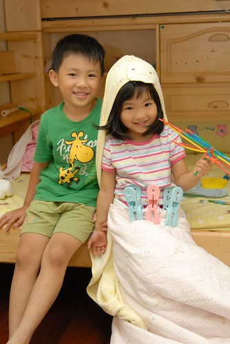
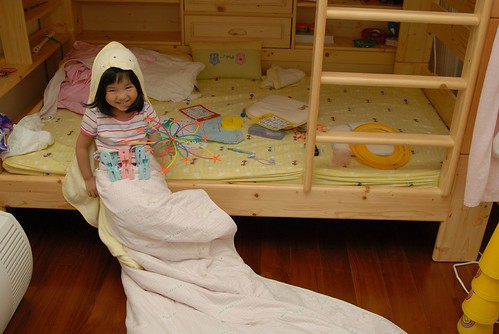
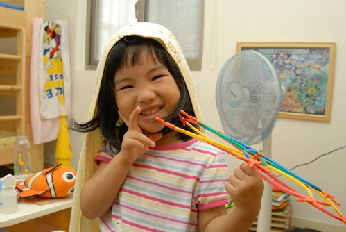
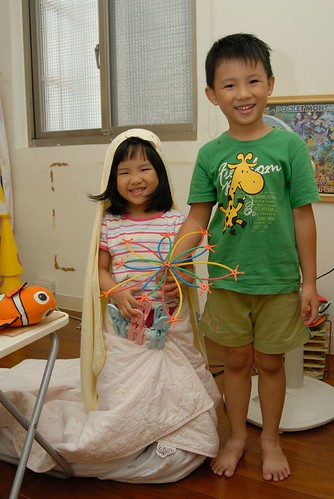
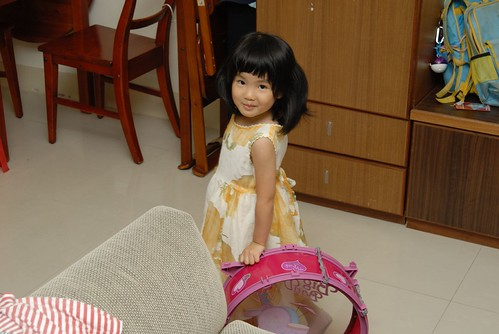
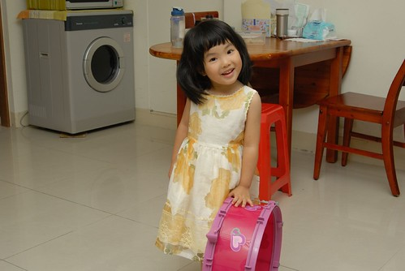
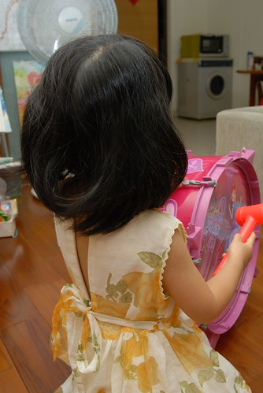
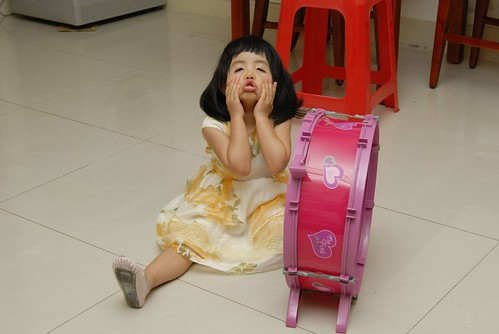
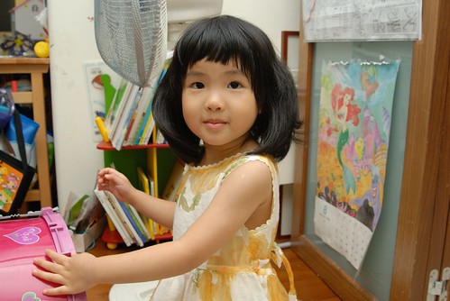
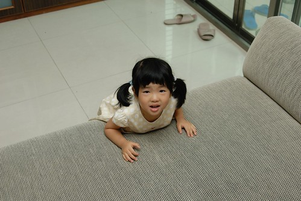

雖然A型的小愛個性有點害羞靦腆 但她應該算是個愛笑且笑點有點低的女生 尤其她常被她的阿徹哥哥逗的開懷大笑 更貼切說法是笑的很花枝招展卻又很豪邁 前幾天阿徹跟她玩的時候又讓她笑的超誇張 徹爸忍不住搖了搖頭說'阿徹以後一定很會把馬子 有妹妹的男生比較會把七仔..' 徹爸還舉我陳家兩位哥哥的例子 還有他家兩位弟弟的例子(就是徹爸跟他哥啦) 最後下了個這樣的結論'以後不要讓愛愛找有妹妹的男生交往' 我說有妹妹的男生從小訓練下 說不定比較了解女生的心思 比較體貼阿 徹爸竟然說這以後長大再學就好   - -'''

前一陣子阿徹常會跟我說 他不喜歡當男生他想當女生 甚至要我拿小愛的裙子給他穿但都被我否決了 剛開始以為他只是三八亂講 故意跟他說"好阿! 那帶你去醫院把小鳥剪掉就可以當女生了" 以後小愛每次聽到他哥說想當女生時就會冷冷的跟他哥說"你要去醫院把小鳥剪掉喔?" 有一天放學回家時問阿徹今天快樂嗎 阿徹一臉認真憂鬱的告訴我"不快樂" 再追問他說"我不想當男生" 這下為娘我真的有被嚇到  "想當女生"這事好像不是隨便說說的玩笑話而已 派出同樣身為男人的徹爸探詢阿徹原因  他總算鬆口說"因為女生可以穿好多不一樣的衣服" ㄟ...很令人OOXX 哭笑不得的理由  看來以後更不可以買太多可愛衣服給小愛了以免他哥羨慕 不過在有一天阿徹又在哭夭的時候 我真的去拿了一件比較大愛尚不能穿的洋裝給阿徹穿 阿徹雖然有點害羞但還是穿上了  穿上洋裝照鏡子時他應該總算明白自己穿裙子是什麼模樣 自此不再吵著要我拿裙子給他穿或嚷著想穿看看裙子 (原來還是下猛藥才有效) 不過阿徹還是很愛三不五時把他妹打扮成她們所謂的公主或新娘子模樣 而偏偏小愛也很愛被他哥這樣搞 瞧~他被他哥哥裝扮的多開心 還真的像新娘子一樣的嬌羞

小愛是她哥哥的最佳小小Model阿 (手上是阿徹做的新娘捧花)

我們笑說如果有一天阿徹成了服裝設計師 他一定要感謝他妹妹從小這樣讓他這樣練習

上週末去坪林溪邊玩水回來 阿徹的腰背被嚴重的曬傷紅腫 我笑說 你這樣子怎麼穿褲 剛好讓你有機會穿裙子好了 阿徹笑著說"不要啦" 後來小愛跟我出門時突然一臉超嚴肅的跟我說 '媽媽 你回家後拿我最大最大的(雙手還比出很大的樣子)裙子給哥哥穿" 我說"不用啦" 小愛還是說"沒關係啦 要不然阿徹會痛ㄚ!" 好妹妹~ 不枉費你哥平常對你的關照

小愛自己也越來越愛穿裙子 逼的為娘的我下達指令只有週一跟週五可以穿裙子去上學 不過每天放學回家後就只願意穿她說的長長的裙子了(洋裝) 尤其這一件洋裝是她的最愛 她說這個很澎 轉圈圈的時候會飛起來好像新娘子喔

因為裙子已經經過好幾手 穿沒幾次後面的拉鍊就壞掉了 但是姑娘還是堅持要穿 她說把後面帶子綁好就好啦 然後就變成這樣的小露背洋裝

自己養了女兒後 不得不承認女人天生就愛美的 就看後天的環境"消磨"多少這樣的天份

有一天晚上我在煮晚餐的時候 小愛大發現似的跑來跟我說 '我們的房間還有你們的房間沒有開燈的時候 可以看到綠色的燈光喔.. 就是我男朋友的那個顏色阿' (阿母知道綠色長什麼樣啦) 我更正她說'你年紀還小不可以說男朋友 說阿嵂的名字就好' 姑娘聽我這麼說沒有反駁竟還一臉認真的重新描述說 '我們的房間還有你們的房間沒有開燈的時候 可以看到我的阿嵂的那個顏色喔..' ㄟ...雖然說法有比較含蓄了 但是很好笑椰!!你的阿嵂ㄌㄟ!

幾個月前愛愛一直理所當然的認為他唸完寶寶熊之後將會如她哥哥一樣的進去咖啡熊接受Frefa三年薰陶的 也就是她將跟著阿嵂還有阿錡 她的兩個超麻吉朋友一起在咖啡熊當小蜜蜂 但兩個月前幾經思考掙扎 媽媽最後決定讓她去唸一般的小班就好 (不是經濟考量也不是重男輕女 純粹因為個性考量還有好奇小愛能與阿徹的幼幼班老師能激盪出什麼火花) 雖然媽媽下決定後有鄭重的跟小愛說 接著她將去唸Jenifier的小班而不是咖啡熊的小蜜蜂 但當幼幼班老師開始跟小朋友們做升上小班的心理建設時 小愛竟還是跟著阿嵂開心的說著'我以後要唸咖啡熊喔' 害得老師緊張的跟我報告這件事 我再好好跟小愛洗腦一番 小愛沒有反抗 沒有不願意的接受我的洗腦 明白唸Jenifier的小班後將無法再跟阿嵂一起上課 後來每當我們說到將無法跟阿嵂朝夕相處時  她竟然像大人一樣的說著 '沒關係! 我可以在遊戲區跟阿嵂玩' 就像哥哥跟洪同學那樣(幸好有哥哥的例子讓我們來強化小愛的信心)

有一天當哥哥上完黏土課又在喊著黏土課多好玩時 我跟小愛說'你上小班後也讓你去上好不好'  小愛開心的說好阿 哥哥又多嘴的說'那妹妹你要不要上畫畫課 畫畫課也好好玩' 小愛又開心的說好呀 ㄟ...三個才藝課有點花錢哩 而且很懷疑小班上畫畫課的'成效' 我只好說我們上兩個就好 除了舞蹈 你比較想上畫畫還是黏土 我以為她一定會選黏土的說 結果她竟然說畫畫 幸好阿母很會騙小孩 我就'阿嵂有上黏土課 你上黏土的話就可以跟他一起上喔' 嘿嘿...果然她聽了後開心的喊著'我要上黏土' 然後後來三不五時說著'我上小班後要跟阿嵂一起上黏土課' 徹爸曾經笑我說讓小愛唸一般小班的最大陰謀在於要拆散她跟阿嵂兩人 哈哈!! 佛說不可說也...

