7/19(星期日)下午 屬於阿徹的人生第一個典禮在縣政府禮堂裏舉行著 今年的畢業活動與以往的典禮形式很不一樣 是以"獅子王音樂劇"呈現....

(以下就用照片輔以簡單的文字說明紀錄)

小獅子阿徹 說著直昇機怎麼唸 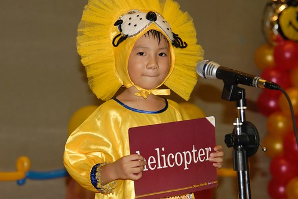

A型的阿徹上台後也是有點ㄍ一ㄥ的人 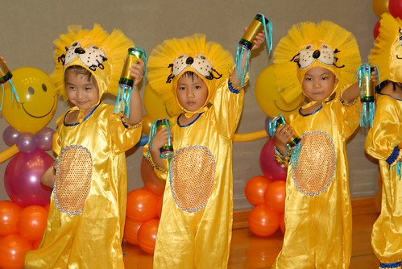

個頭小的阿徹要墊高腳 抬高頭才能搆著麥克風 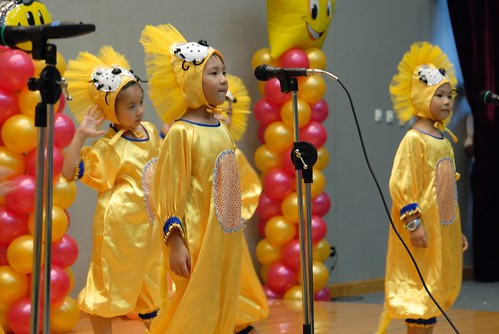

阿徹班上有幾位小朋友很HIGH  一群人笑成一團 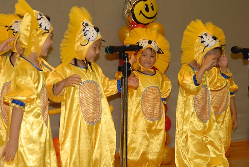

而阿徹是害羞的花 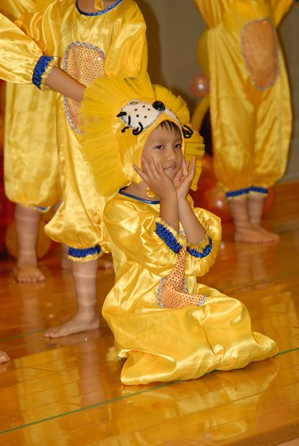

中途表演結束時看到有人獻花 美賢阿姨也迫不及待的獻上她給阿徹的花束 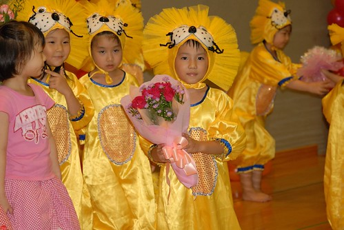

表演進行1/2 一個多小時後著畢業服進行頒發證書 頒獎儀式   總算有點畢業典禮的感覺了 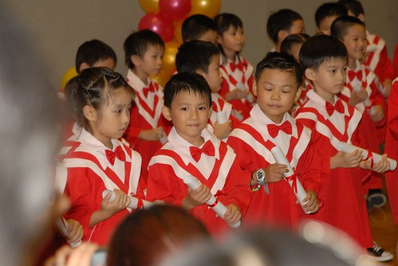

其實園長獎 主任獎 市長獎 立法委員獎的禮物人人都有 但是分由不同的小朋友上前代表領取 不知道是不是抽籤決定的 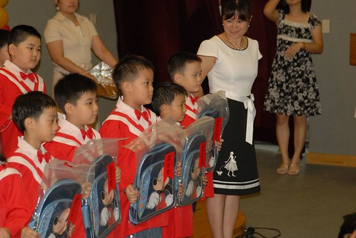

這是敖了四年多才能領取的"晨暘寶寶"獎 連阿徹在內有四位小朋友可以領取 因為她們的爹娘從她們才2歲多就開始送她們到晨暘直到大班畢業 真的是讓老師們從小看著長大的 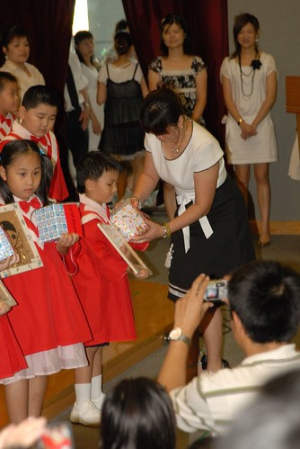

每年園長媽咪都會畫一張小朋友的可愛畫像送給這些從小看到大的晨暘寶寶 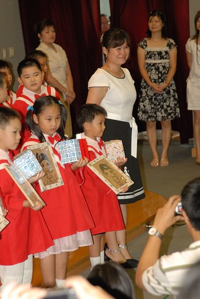

然後聆聽園長媽咪最後的一席話 阿徹雖然沒有哭但是表情很凝重的樣子 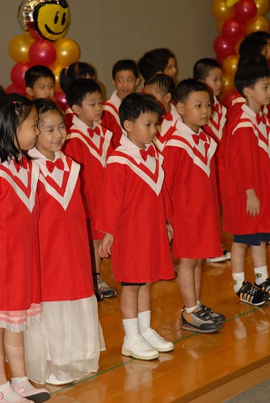

最後換上王子衣服進行最後的表演 很剛巧阿徹分派到的位置就在我們位置的走道旁 讓徹爸輕鬆的照的一清二楚(那天場面之亂 照相之困難絶非想像) 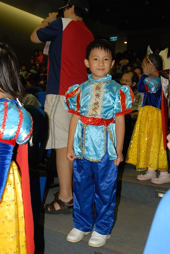

最後全體老師一起接受學生家長的感謝 辛苦你們了! 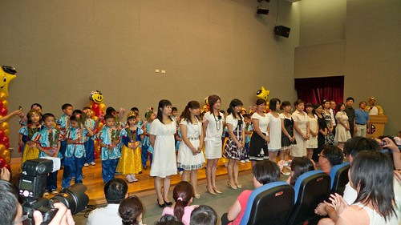

典禮結束 阿徹總算開懷的笑了 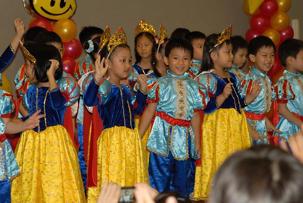

活動結束換好裝後跟美賢阿姨合照 謝謝打從阿徹被宣布來到這世上的第一天起就開心疼愛阿徹的美賢阿姨 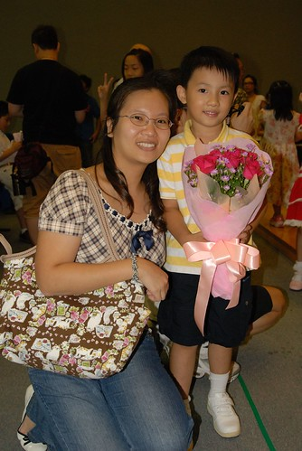

全家大合照 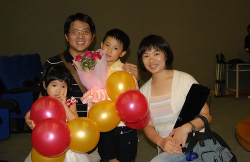

三年恩師 Freda 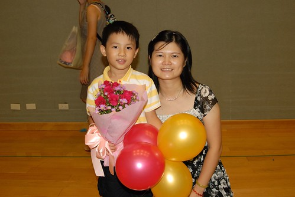

最後一年的外師 Teacher Gorden 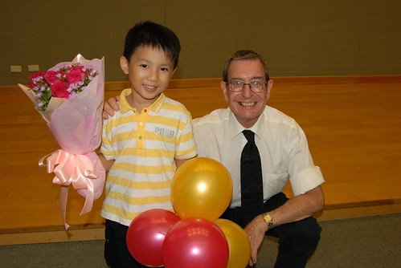

小班時的外師Tony 被困在荷蘭兩年總算回到台灣了 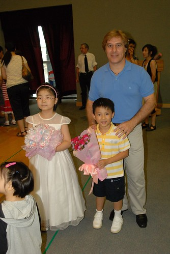

園長Kitty媽咪 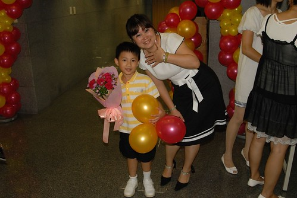

恭喜阿徹 恭喜我們 阿徹畢業嚕~~~~好日子結束嚕~~~~

++++++++++++++++++++++++++++++++++++++++++++++++++++++++++++++++++++++++++ 參後感:

看著預先發回的節目表單 我跟徹爸熱烈的期待著當天的音樂劇 可是當天活動進行不到一半 我們卻已深深失望與失落.... 主要原因有: 1. 場地不適合此種形式的表演 造成照相家長與表演者搶空間的亂相 2. 一整個趕場 小朋友不斷進進退退 大人也跟著不斷前前後後卡位照相 好忙好累好亂 3. 雖為音樂劇但大部分的印象全為一群小孩在台上跟著與獅子王相關或不相關的音樂跳跳跳 只有阿徹班級有烙英文的表演 但一整個與獅子王沒關 且更顯得其他班級的小朋友就像在跑龍套似的 雖然大部分的家長看起來還是很開心很得意 很以台上的小孩為榮 而在台上的那些小朋友們也似乎"玩"的很開心 也雖然就像老師園長說的第一次的大改變難免經驗不足與混亂 但老師學生們可都認真賣力 但這樣的形式/表演 真的讓我跟徹爸忍不住整場感嘆"沒有畢業典禮的盛重 莊嚴與感動" 也許是我們太過拘泥於對畢業典禮的期待 但我想了很久我總覺得今日這樣的活動不正血淋淋的反應著現今台灣教育現況 教育者/大人或因著自己的期望或打著為小孩好的美意 希望小孩學的多學的好 但一路下來不只大人累小孩更累 這麼忙這麼趕所求到底為何? 難道只是因為大人害怕小孩沒學到 害怕小孩不夠茁壯不夠特別 而一句"小孩子開心就好"卻又像把上方寶劍 讓一切給正名化 合理化了....

其實現在的教育方式很極端 大部分(體制內)的人希望小孩學的多學的好 少部分(走體制外)的人只希望小孩學的快樂 我承認我們很矛盾也很俗辣 既不茍同現今大部分家長/教育者的期望/做法  卻又很俗辣(也不想)走體制外的那套 徹爸說 大家都說希望讓小孩快樂的學習 但大家真的可以接受沒有壓力的結果嗎? 所以我們要更堅定我們自己的堅持 讓小孩可以適應大環境卻仍有自己的獨特性 現在阿徹要上小學了 我相信考驗會越來越嚴峻的... 希望就像徹爸說"她相信他兒子可以的"

+++++++++++++++++++++++++++++++++++++++++++++++++++++++++++++++++++++++++++ 最後感 這幾年來對於阿徹幼稚園很放心也很感恩她們的辛苦/努力與付出 僅以下面這篇所寫的寶寶手冊衷心表達我們的謝意:

會開始用文字用blog紀錄徹家的點滴 開始於阿徹開始上幼稚園的那一天 因為那時候的阿徹還要包尿布 還不會講超過3個字的話 甚至連"張有徹"都不會說 也就是說超級的"無知無能"啦 也因此阿徹上幼稚園後 每天我們都感覺他一點一滴的成長/不一樣 就為了紀錄阿徹的每一個小成長 小事件 媽媽努力的敲鍵盤寫東西 還記得當阿徹上學半個多月後會講他的名字是"張有徹"時 我跟徹爸開心的直呼"果然上學有差喔" 如今已經上了四年的學 有沒有差? 當然差很大嚕~

永遠記得第一次去參觀晨暘時當我問Kitty媽咪學校採取什麼教學法時 Kitty媽咪頓ㄉㄟ了一下然後回答我"開放式"教學吧 這個答案出乎了我原本有限的認知(蒙式 美式…) 但我喜歡這個答案 也因為這個答案讓我在只參觀一個幼稚園後就決定了阿徹在搬家到板橋後每天白天要待的環境 四年下來我真的很欣慰當初的決定與幸運~

我一直認為幼稚園老師對於小孩的影響是又深且遠的 扣除掉吃飯睡覺的時間 其實小孩每天與老師相處的時間比跟爸媽還要久 所以老師的價值觀 待人方式 說話語氣…等都將深深影響著小孩 當然家庭教育?對還是那最重要的一環 但好的老師扣著另外一環更能把小孩帶往好的方向 因此每當阿徹週期性或是不定期的不穩定/耍番/耍嚕時 多虧有了你們 讓我們更清楚阿徹的所想所為以及彼此配合嚴格督促

我想我們的不重視課業/學習成果的態度應該多少有造成你們(園方)的困擾 但我衷心的感謝你們尊重我們與阿徹 讓阿徹可以依著他自己的步調開竅 雖然每當聽別的爸媽說自己小孩會九九乘法表 會珠心算 會寫字讀書.. 而我們家阿徹卻什麼也都不會 我們會自嘲的笑他說"阿你去上學是學什麼的阿" 但我們心裡清楚阿徹上學可忙的 做的事可多的 學的東西可也不簡單ㄋ 重點是阿徹喜歡上學 喜歡他的幼稚園 他的同學老師 只是這些都"累積"在看不見甚至感受不到的地方… 阿徹大班這一年來讓我最欣慰的事是每天的聯絡簿幾乎都勾選著上課認真 "認真"是我們對阿徹的學習唯一要求的地方 很高興看到他有在努力要"認真"

雖然阿徹很愛講話 很調皮 甚至脾氣有點不好 但我喜歡他現在還能保有的創意,天真與傻勁 謝謝你們也喜歡這樣的阿徹 且費心的"維護"著 "改良"著… 衷心的感謝您們~ 辛苦您們了~
