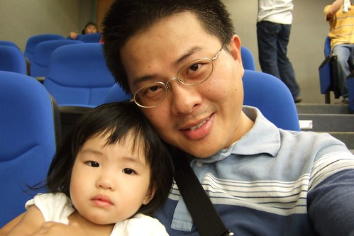
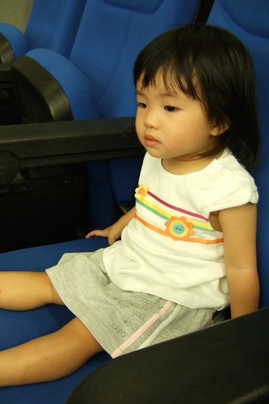
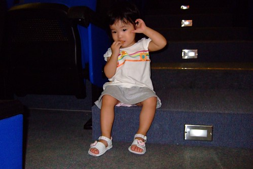
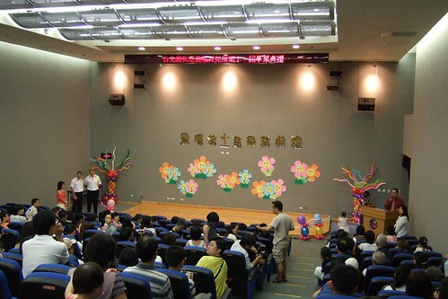
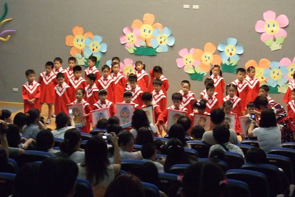
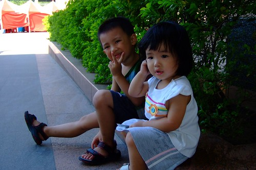

阿徹要畢業了嗎?當然不是....  
純粹因為阿徹念的是混齡班 所以全班共同參與畢業典禮的才藝表演  
呃啘的這是媽媽第一次沒能親自參與目睹阿徹的學校活動  
可憐的媽連三週的週六都得去關渡上課  
更可憐且令人感念在心的徹爸則得獨自一人奮戰這兩個頑皮豹  
徹爸輕裝從簡的只帶小3出門(連園長都發現今天的徹爸少了重裝備)  
當阿徹在台上表演時 徹爸一手持著相機一手抱著小愛  
除了得奮力的搜尋捕捉阿徹的身影   
還得持續出聲"看 徹在那裡~"吸引小愛的注意力  
而拿著相機的那手則需伸的遠遠以免遭受小愛毒手(中間跑掉亂照的部份就是相機被小愛搶過去啦)  
  
媽媽晚上回家看到影片時 內心真是百感交集  
一來被阿徹的扭腰擺臀逗的哈哈笑  
二來真是為徹爸當下的手忙腳亂感到抱歉萬分...  
  
[http://myvlog.im.tv/?id=2121825&mid=322793&album=0](http://myvlog.im.tv/?id=2121825&mid=322793&album=0)

  
數週前便從阿徹老師口中耳聞阿徹擺臀時十足可愛  
也央求過阿徹在家表演取悅阿母  
但這樣的場合 服裝 聲光效果 才更體會明白阿徹的認真與熱情  
個頭雖小 動作也稍顯慢拍  但真的賣力 認真...  
重點是自己跳的很開心 也難怪真的下定決心說要去學舞蹈....  
  
本來徹爸考慮不要帶小愛去的但阿徹哥哥不准  
且徹爸說如果沒帶小愛去 那其他時間他會很無聊(2小時的典禮阿徹大概只會出現5-10分鐘吧)  
所以父女倆就相依偎的一起在台下等候吧...  
  
  
  
一開始小愛很乖巧的坐著欣賞典禮進行  
  
  
  
徹爸拿出餅乾讓小愛打發時間後 開始不安分爆走  
後來索性坐在台階上慢慢啃起餅乾  
  
  
  
阿徹學校活動幾乎都是在台北縣政府的禮堂或是表演廳 會議室舉行  
小小幼稚園畢業典禮也搞的煞有其事的樣子  
  
  
  
畢業生逐一唱名進場 穿上畢業服...  
據徹爸說園長除了哽咽致詞 還為每個晨暘寶寶(就是從幼幼班就唸起的小孩)畫了張畫像(徹爸說很像)  
(我已經開始想像起兩年後阿徹站在台上 領晨暘寶寶獎勵的模樣了)  
  
  
  
OHYA~典禮順利結束 父子女三人再悠悠哉哉的坐捷運回家睡覺 等媽媽回家出門吃鍋嚕~  
  

