每年7月幼稚園畢業的季節都可以在阿徹校門口看到應屆畢業生的畢業"紀念冊"展示 看了4年總算輪到我們家小孩的照片被放在門口被瀏覽...

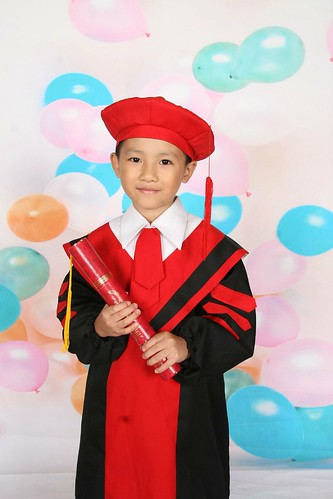

其實我一直不知道該怎麼去形容那本東西 是紀念冊沒錯..不過總覺得那比較像是藝術照之類的小孩成長紀念 而不像是小孩子在這幼稚園成長茁壯的紀錄紀念 我跟徹爸總覺得"畢業紀念冊"就該有全班同學的大頭照/名字 要不也該有一些平日在校學習活動的照片阿? ! 去年曾經好奇的問過阿徹老師 為什麼畢業紀念冊是長這樣阿 老師說小孩子每次拍照做造型時都好開心  對她們來說這是很難得的體驗與紀念 也許吧! 起碼對像我跟徹爸這種父母來講根本不太可能掏錢去拍這種"藝術照"的吧! 而且我得承認拍照的那幾天阿徹很開心 很興奮可以嘗試不同的造型... 所以雖然我心理依舊充滿疑惑 但如果從小孩子玩的開心與機會難得的角度來想這錢花的有釋懷點...

前幾天跟陳大哥陳二哥約好一起帶三個小毛頭的紀念冊回家看 看到(陳大哥家)阿瑜紀念冊上列出全班同學的畢業大頭照以及名字 徹爸說"對嘛~這才像畢業紀念冊嘛~" 然後看到(陳二哥家)萱萱紀念冊上有平日在校上課的照片  徹爸又說"對嘛~這才有意義嘛~" 可是鑒於阿徹紀念冊的價錢最便宜以及造型最多款 陳大嫂說"還是台北的的便宜 CP值高" 而價錢最貴(雖然在台北)的陳二嫂則抱怨說"這麼貴 還放一堆學校照片充版面" 那時我才赫然驚覺  每對父母的要求與期望果然都不一樣 好啦! 我承認我跟徹爸難搞!!!

阿徹的紀念冊裏除了一張全園畢業生與老師們的大合照以及自己的畢業照外 唯一一張有"團體"feeling的照片就是下面這張合照 照片中有Teacher Gorden,  kitty媽咪, Freda 以及在咖啡熊一起從小班唸起的另外四個同學

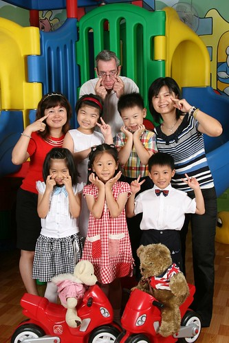

剩下就是各種不同造型的藝術照了

這是放在封面的照片 超痞的  我個人唯一不喜歡的造型(不過阿徹還是愛)

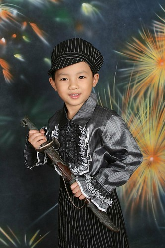

下雨天全副武裝造型 照片中那把傘 徹媽還真炸錢買過哩 心得是重看不重用 有興趣的人要三思

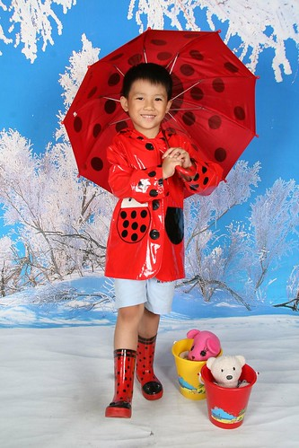

賽車手造型

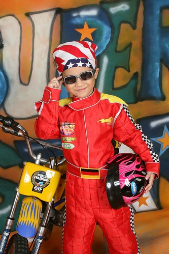

韓國風嗎?  不過那個琴用扛的有點好笑 好像在扛槍喔

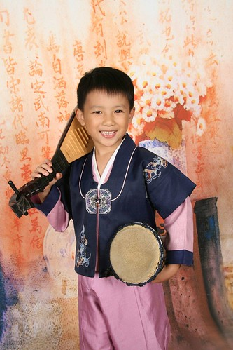

穿靴子的海盜造型 (發現阿徹的造型怎麼很大的比例是紅色系阿?! 雖然我跟徹爸一直覺得阿徹挺適合紅色的)

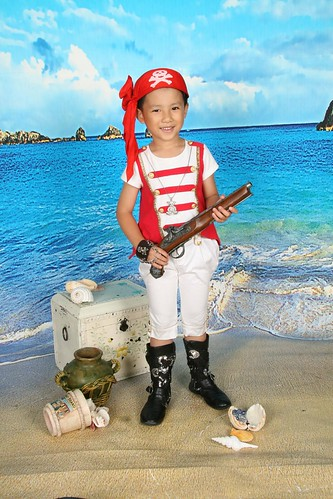

海盜還扛槍 拿斧頭勒..

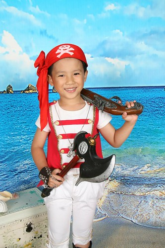

這是自己準備的造型 其實那天不知道要穿自己衣服拍照的 幸好阿徹自己說要穿有領帶的衣服 阿徹她們所有的照片分兩次完成  而兩次間隔了半年之久 所以本子裏長袖的短袖的照片都有 甚至很多小女生的照片裏有的缺門牙 有的不缺牙很好玩 (女生換牙換的比較早 加上半年時間讓牙長出來了)

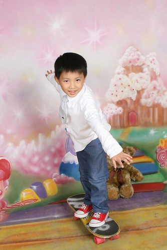

雖然覺得阿徹每個造型都很有型 他也都笑的很自然 可是還是最愛這樣家居造型的阿徹 我跟阿徹說這是媽媽最喜歡的一張

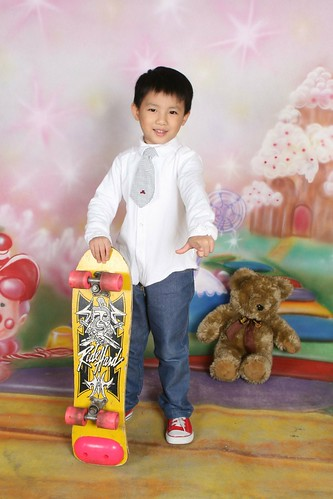

阿徹說這是他最喜歡的一張 (原來他喜歡這麼屌的感覺喔)

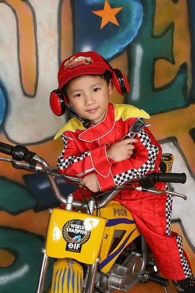

小愛說這是她最喜歡的一張  哈哈! 因為只有這張有她阿 (拍畢業照那天我們也都盛裝去拍全家福)

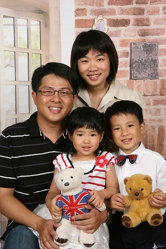

得承認阿徹還蠻上相的  阿嬤說阿徹以後一定是黑狗兄~~

+++++++++++順道清以下的照片++++++++++++++++++++++++++++++++++++

我跟徹爸都屬於戴帽子不好看的那類  很奇怪卻生出兩個頭型適合戴帽子的小孩 剪頭髮阿姨常說 我這媽把他們生最好的地方就是那額頭 難道因為額頭好所以戴帽子就好看嗎?  真的是這樣嗎?!

以下就由阿徹來示範百變領巾的多種用法

(帽子一) 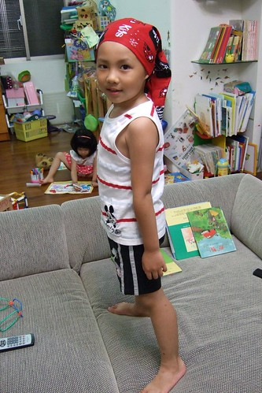

(可愛開喜婆婆) 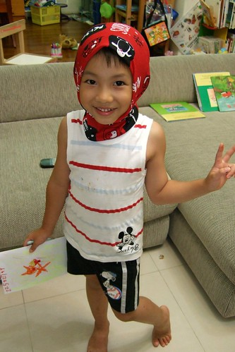

(普普頭圈) 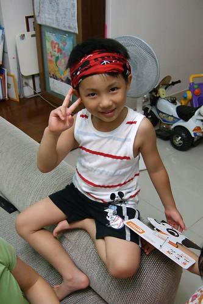

(帽子二) 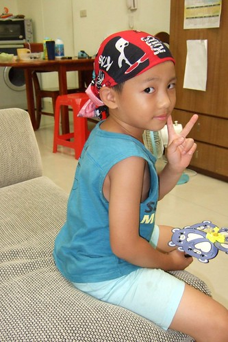

(帽子三 ) 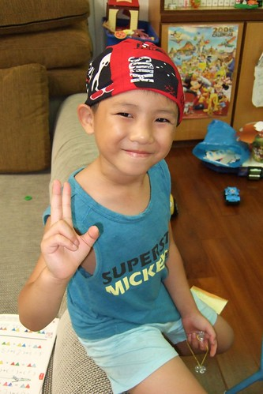

(搶匪口罩) 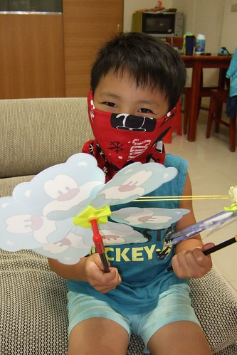

(帽子四 店小二) 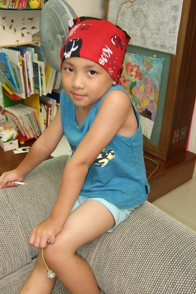

(這該怎麼形容... 蒙面俠好了) 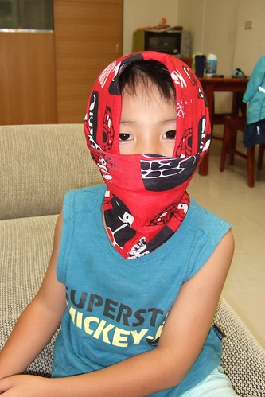

(帽子五 自己瞎戴的簡易版) 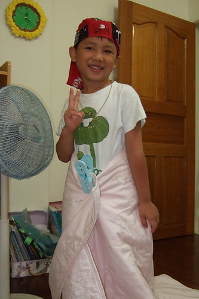

有了這領巾加持 大大提升阿徹的公主形象 常自己拿著領巾 棉被把自己打扮的像公主(他可能把領巾當作假髮吧) 然後滿身大汗的跟他妹玩公主遊戲  最後逼的阿母把領巾收起來不准玩了

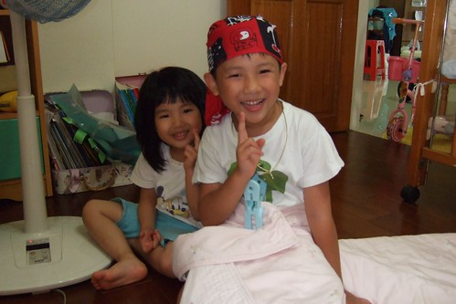

真的很不公平! 戴在媽媽頭上像日本兵的帽子到他頭上後竟然也變可愛了

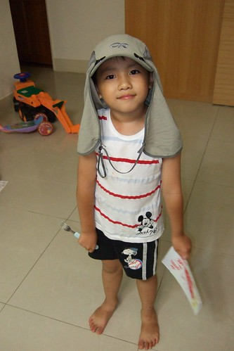

忌妒歸忌妒 羨慕歸羨慕  幸好這小子是我生出來的兒子   為娘的我也輸的心甘情願了!

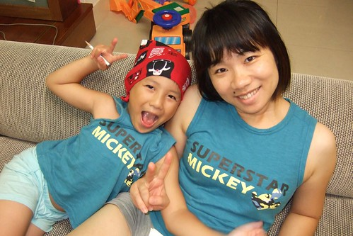
