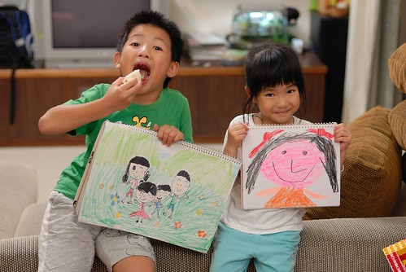

愛愛最近很愛畫畫 尤其是畫小女生... 雖然每個她畫下的小女生在我們看來都是同樣的模樣 但她總能娓娓到來衣服哪不一樣 顏色哪不一樣 我喜歡她那鮮豔的用色還有那笑盈盈的大笑臉  讓人覺得這世界真是繽紛 多彩 可愛阿! 

從很小的時候每當阿徹哥哥在畫畫時 愛愛就很愛在旁邊有樣學樣的跟著畫畫 只是她畫的東西 講真的沒她的解釋還真看不懂 而就算她栩栩如生的解釋了 也還是需要高超的想像力才能理解 但上中班後 愛愛畫的東西越來越具體形像畫了 雖然我們還是常錯把兔子看成熊 錯把男生看成女生 但可以明顯感受她自己越來越清楚她在畫什麼 想要畫什麼 這一切的變化或許是因為年紀大了 也或許是因為中班後繪畫課的啟發吧  

不過我覺得對她最大的影響應該還是阿徹哥哥 因為她到現在還總是跟著阿徹哥哥 做著阿徹哥哥在做的事 一起玩家家酒布置游戲 畫圖 看繪本 剪剪貼貼 只是小妹妹越來越有自己的想法了 每當哥哥念她這樣畫不對時 她總能自信的說"我這樣..不行嗎 我難道不能有自己的想法嗎?"   然後問我"媽媽 你說對不對?" 被這麼一問我這媽當然也只能點頭如搗的說"嗯~ 是阿~ 那是愛愛的畫她想要怎麼畫都都可以 她開心就好" 只是這小妮子有時候卻又很故意  說要畫張畫送我 然後拼命來問我 裙子要長的還是要短的 衣服要什麼顏色 鞋子要什麼顏色 我跟她說"那是你要畫送我的 你就畫你想要畫 喜歡的就好" 愛愛一臉明明是開心得意的表情 卻說著"可是我不知道嘛...你告訴我啦..." 而當我說出他喜歡的顏色時 她便會開心的說"我本來也想要用XX顏色的說" 聽到這阿母我再也忍不住大呼"那你還問我! " 或許這也是愛愛"ㄍ一ㄥ"的個性的一面  希望每個人喜歡她的每樣事物 所以當阿徹哥哥堅持她畫的東西很醜時 她可以哭的鼻涕縱橫 泣訴她哥哥說她的東西醜 

很奇怪小孩子的小手畫出來的筆觸 隨便怎麼看就是可愛 不像大人我怎麼畫怎麼看怎麼醜 

這是愛愛畫的第一張全家福由下到上是妹妹 哥哥 媽媽跟爸爸 她說大家都是笑笑臉只有她是哭哭臉 因為她想要跟媽媽一樣的捲捲頭 我說"那你就給自己畫捲捲頭阿"  愛愛說"可是我不是阿" 我又說"媽媽現在也不是捲捲頭 而且頭髮還短短的哩" 反正愛愛就是堅持她畫的愛愛是哭哭臉 因為想要捲捲頭...Orz 

上面全家福是她送我的卡片的外頁 這是內頁 大大漂亮的 I Love U 真是看的阿母我心花怒放阿 

有這樣sweet的小女生 爸媽的心怎麼會不sweetㄋ!!! (下面是愛愛跟萱萱表姐共同完成的畫) 
