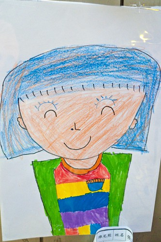
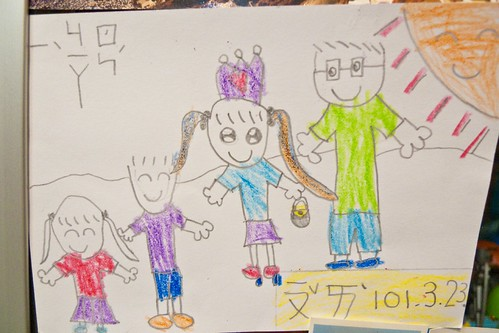
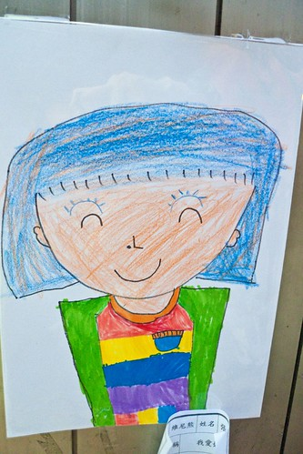
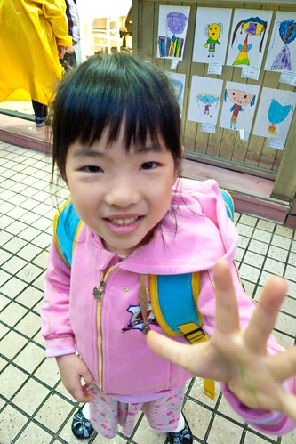
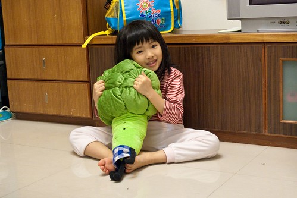
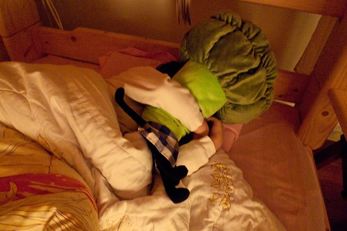
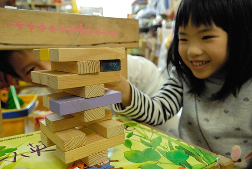
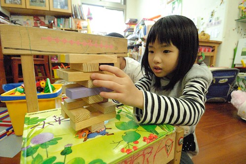
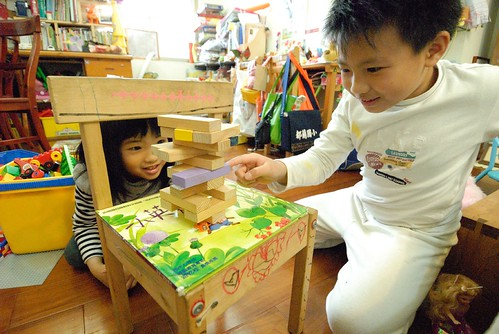

受阿徹哥哥影響 愛愛也很愛畫 雖然愛愛最常畫最愛畫的 不是長的像公主的女生 便是長的像王子的男生 但每隔一段時間 我總會驚豔於她筆下人物的"進化"... 話說前陣子愛愛開始畫會閃爍著大眼睛的人物 愛愛畫裡的人 不只是她自己還是阿徹哥哥 還是老師或媽媽 每個都有雙漂亮 晶瑩又無辜的大眼 有一天我們一起看著她們去郵局參觀所寄回的名信片上的一家人 我說"你把媽媽畫的很漂亮 戴皇冠 長頭髮還大眼睛 但是臉上沒有痣實在不像你媽媽耶" 愛愛笑著哎呀 說"可是我只會畫漂亮的女生阿" (話說是覺得有痣就不漂亮喔) 過一陣子後的某天放學 愛愛興沖沖的告訴我"我們今天畫我愛媽媽 我有畫你的痣 還有短頭髮喔" 然後又用著讓人摸不著到底是道歉還是得意的笑容說"你看到後 一定會說我把你畫醜了" 星期一我總算看到張貼在幼稚園門口的"愛愛媽"了 我覺得這次愛愛真的把我畫得好漂亮喔~ 

這是那張愛愛親自從郵局郵筒寄回家裡的明信片 明信片的背面是事前在學校畫的一家人 除了媽媽夢幻的很不真實外  裡頭的爸爸 哥哥跟妹妹都有抓到那麼點神韻  經過我投書抗議後的媽媽看起來真實多了 不過我還是忍不住跟愛愛說"那個痣應該介於鼻子跟嘴巴中間 這樣看起來很像鼻孔" 而且藍色的頭髮好酷阿 不過看的出愛愛試圖營造我那挑染紅色的效果 跟徹爸讚嘆說起這幅畫 徹爸也好想看 於是我厚臉皮(生平第一次)帶相機去幼稚園門口照相 結果徹爸看到後第一個反映也是"那個痣應該下來一點"  (夫妻倆真是有志一同) 徹爸還笑說"Kitty媽咪才有藍眼睛吧!" 不過我真的覺得愛愛有把媽媽那可愛又賢淑的氣質給畫出來啦 (不小心自捧了) 而且愛愛還幫媽媽設計了一件好漂亮 但是媽媽常穿的休閒風衣服 棒! 愛愛又突破了!!!  拍照時 值班老師也說很多媽媽看到都說這張畫的很漂亮 嘿嘿~ 不好意思 我女兒畫的啦~ 就算是難得佳作 但起碼有過這麼一張 足以紀念了 (話說其實我覺得是跟愛愛同貼一區的同學作品讓愛愛的作品給突顯了 )  

順道來說一下 愛愛的花椰菜娃娃 話說某個媽媽跟家裡請假的週日下午 父子女三人一起去逛IKEA 逛完去接我時  父女倆說起有個花椰菜娃娃超級可愛 可是怕媽媽不准所以不敢下手 阿母哪那麼嚴格 所以阿母就說"那就去買阿"  於是父女倆真的又去IKEA 把花椰菜娃娃扛回家 所以花椰菜娃娃最近成了愛愛的新歡  早上睡眼惺忪時拿著它  傷心難過去找它  有一次還真的就這樣抱著花椰菜睡著了  沒仔細看 還真像花椰菜版的麵包超人哩  不得不承認 我們對於愛愛真的是寵愛多一些 也難怪哥哥覺得我們偏心 我們當然要鐵口的說 "因為她是妹妹 連你也對她很好阿"  不過真的如我所說 兒子可以不生但女兒一定要有阿 與女兒的"交流"層面 真的不一樣....  我不太相信姓名學與命理說 但我明白名字對於一個人的影響 不知道是愛這個字讓愛愛這麼令人喜愛 還是因為愛愛自己讓她的名字更顯意義 "愛"對於我們家 對於爸爸媽媽還有哥哥來說 真的很重要! 
