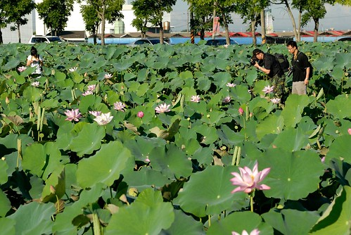

最近傍晚6點 從捷運站搭電扶梯準備出站時 總在電梯走到一半時 便感覺到一波一波連綿不絕的熱浪席捲而來 讓人忍不住心裡嘀咕著'這外面到底有多熱.. 夏天怎麼可以熱成這樣阿...' 除了穿涼快 吹冷氣 吃涼拌菜消暑外  也勤勞地煮著薄荷綠茶或菊花涼茶讓徹愛少噴點鼻血 (開始炎熱後 兄妹兩常突然的噴鼻血 喝涼茶狀況便改善許多) 而前幾天燉的一鍋蓮藕排骨湯 除了是阿徹最愛的湯品外 也一樣有著消暑作用... 不知道賞蓮是不是也一樣有著消暑作用ㄋ?? 

上週末回嘉義前幾天 突然閃過想去白河賞蓮的念頭 嫁到嘉義這麼多年從沒去過白河 想想也真說不過去... 於是週日早上我們全家起了個大早 六點起床出門賞花去...

本來我是想跟徹爸兩人清晨五點單獨來個賞花約會的 結果阿徹聽到我們的賞蓮計畫 竟然高八度音的問著'你們要去白河賞蓮喔'  那語氣像是他跟白河很熟 他去那賞過蓮似的 原來是學校國語課本裡有教過啦 雖然清晨五點的早起讓他有點卻步 但他說課本上說有大王蓮他想去坐看看 一心想著跟徹爸單獨約會的我勸阻著'這麼早去 店都還沒開 應該沒有大王蓮啦' 阿徹說'那你早上先叫我看看 我再決定' 結果週日早上我自己賴床到六點 而阿徹也跟著賴床說不要去了 可是原本不打算去的愛愛卻想去了 雖然我一再明示不要去 可是她想又不想 最後還請徹爸幫她決定 而又怎知徹爸不明我的心意 一心想要寶貝女兒陪著 於是愛愛開心的起床要跟著一起出門 這下子又尷尬了 因為沒有妹妹陪著 阿徹又肯定睡不著了 所以到最後是全家四個人一起出門賞蓮去... 可是可是...最後半小時的賞蓮中 愛愛竟然只要待在車上以好好享受她的御飯團早餐 Orz 讓阿母我只好走馬看花賞個幾分鐘 便回到車上陪公主  更別說原先想的夫妻約會也泡湯了... 不過沒關係! 有徹爸的照片幫我們記憶我們一家子的白河賞蓮就好...

講真的雖然知道白河是蓮子之鄉 但熊熊還真不知道該上哪看花哩 徹爸上網查了查 發現現在剛好是蓮花季 所以台南縣境內的7-11都有賞蓮單張可取 從嘉義到白河 不用30分鐘的車程 真的很近很近... 到白河後找了家7-11買飯團也拿了活動單張 我們便順著單張上的指示尋花去 車子繞了大半圈發現蓮田其實是一小塊一小塊分散著  並未有想像中的那樣'盛況' 直到看到這片池  這片池其實並沒有很大 而且蓮花看起來很熱的樣子... 但是池邊停了很多車 也看到很多攝影手穿流其中  我們想這裡應該就是最佳'點'了吧  礙於我要留在車上陪小人  徹爸只好肩負著老婆給的使命 好好去拍個幾張像樣的蓮花給老婆看  早上七點 空氣還有那麼一點點涼 但太陽已經很大很大了 但太陽大歸大起碼還沒烈  所以蓮花雖然看起來很熱的樣子 但還有燦爛  尤其清早時分的光影襯得蓮花穿透欲滴 煞是美麗 

 而荷葉上的露珠也還遺留著夜晚的涼爽  雖然我沒能漫步田中 好好觀賞蓮花的百態 但透過徹爸照片也算好好的賞了個蓮  路上 我們四個人討論著 蓮花跟荷花有什麼差別 大家甚至洋洋灑灑的說了 那個葉子哪裡不一樣 那個哪裡哪不一樣... 結果隔天徹爸上網查了查 三八啦~蓮花跟荷花是一樣的啦 只是荷指的是花的部分 而蓮指的是果實的部分 就是蓮子跟蓮藕啦 虧我們還煞有其事的討論好一會.. 不過我想我們一輩子都會記得蓮花就是荷花了 (這是未採收的蓮蓬 裡頭被曬乾的蓮子看起來好像黑珍珠般)  徹爸說 這朵花的光影很棒 只可惜有個花莖破壞了畫面..  我們賞了半小時的花 然後再花半小時時間回到嘉義 回到家還不到八點 阿嬤們也才剛吃完早餐 而我們卻已經看完美麗的蓮花回來嚕.. .

賞蓮到底消不消暑? 就過程來講 清早的空氣是消暑的但太陽不消暑  現場的蓮花是不消暑的但照片很消暑...
