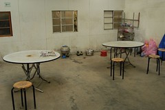
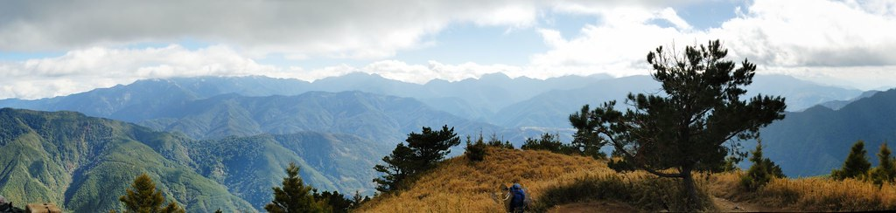
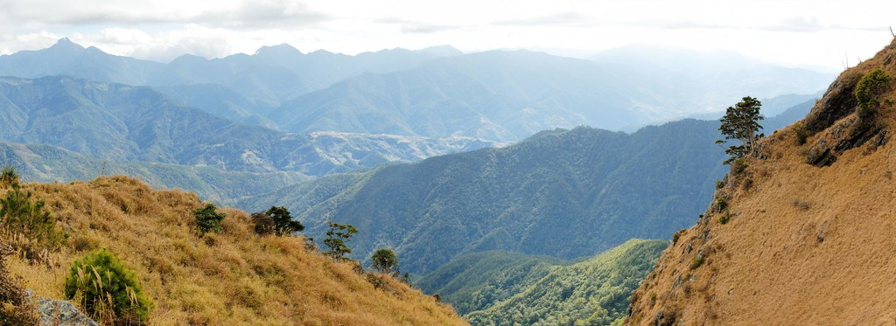
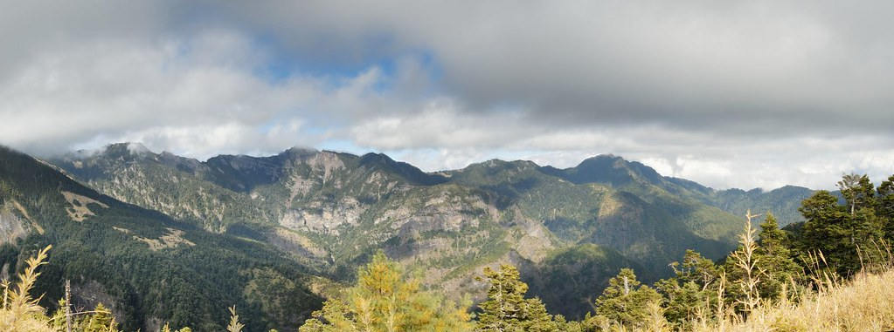

百岳﹖﹖ 你有聽過吧!! 不過...有沒有爬過就不一定了吧...

百岳們...我來了.....

大家一定奇怪, 為什麼徹爸會突然要拋家棄子地離開家兩天而跑去爬山勒??

原因在於徹爸有個同事有去爬過幾次山, 每次都聽他說的很不錯的樣子...

於是就跟徹媽商量一下是否可以去爬山...

而我們家那英明耐操的徹媽聽到我想去爬山...

很興奮地說...好呀, 不過下次你要帶我去毆...

帶徹媽去當然ok摟...

就這樣...跟同事一起研究要去爬哪座山...

找了一下...這個好像不錯...雪山主東峰...

才走2天, 爾且走的時間很短...

第一天晚上走2公里,

第二天走5.1公里, 爾且下午就到了...

第三天14公里...不過有10公里都是下坡...

看起來..."應該"算是入門級的...OK...就這個吧...

懷抱著興奮的心情...買了許多登山用品...等待爬山那天的到來...

\----------------------------------------------------------------------------------

終於到了 12/12, 當天下午請了半天假, 先去保養車子...

急急忙忙回家...買了些麵包當上山備用糧食...

洗完澡, 就出發往古亭站集合了...

 

導遊拿著名單點點名...怪怪..女生還不少勒

(後來才知道, 我們這一團有3個是單獨報名的女生,

在這裡真是要致上最敬禮, 妳們真是...蠻猛的...)

右邊紅外套的那位仁兄就是我同事...目前未婚...

今天的月亮也特別漂亮...

 

坐了4個小時的車子, 終於到武陵農場的登山口了...我同事一臉剛睡醒的樣子...

這是登山口的小屋...大家上完廁所...就要正式..出發摟...

這是我的"完整"裝扮...

今天晚上要先走2km到達今天要睡的地方...七卡山莊...

不過...真正走時, 我才發現...不妙了...挖勒, 怎麼都是上坡??

不會吧...再來的路都是這樣呀!!!

很不幸的, 真的被我猜中了

接下來的2天裡...大部分的路都是上坡

(網路上大家都沒說這麼陡呀...有多陡, 看下去就知道...)

最後終於靠著意志力...撐到了七卡山莊....

也不管什麼了...倒頭就睡了...

不過清晨時, 就被冷醒了...感覺真像在當兵時的感覺...

睡著大通舖...蓋著薄薄的棉被...想著茫茫未知的今天...

\-------------------------------------------------------------------------------------

清早起來...仔細瞧瞧這個傳說中的七卡山莊...

比想像中的乾淨...走來走去, 別有一番感覺...

          

這是廚房, 跟走道的部分...如果要我在這邊呆一天...應該也是ok吧...

今天的天氣好像還不錯, 導遊說...看樣子天氣會很好...

還是照張到此一遊照吧...

這就是昨天走上來的階梯...

我偷偷問導遊...今天要走的有比昨天陡嗎??

導遊也是老經驗...笑笑跟我說...陡一點點爾以...

很好, 那就是表示陡很多了....

這是七卡的旁邊...維持的算不錯了...

耶...哎呀, 還真像猩猩勒...

七卡前的地圖,

導遊說其實台灣的登山步道都維持的不錯...

只要不要亂亂跑...都是蠻安全的...

我的帽子真的買錯了...帶起來真是..不太好看....

這就是我們睡的大通舖...

山青-小幸...幫我們準備熱呼呼的早餐...辛苦了...

廚房是用木頭搭建的...好像不太牢固的樣子...

用4個小爐子一起煮稀飯...

這就是我們的早餐了....

碗買太大了, 幸好有帶另一個小的...

哇...天氣真的不錯...

爬雪山有證書可以申請...

好像只要寄照片跟個人資料過去就好了..

\-----------------------------------------------------------------------------------

吃完早餐要開始出發摟...

好吧...就看你路有多陡.....

看著天空...光線透進森林的感覺...真好...

這邊海拔比較高...好像楓葉就比較少了...

不過還是有零星幾顆楓葉...

上個月來武陵時, 楓葉蠻美的...

(請見 武陵賓館篇 [http://blog.yam.com/hmchen1975/article/18480783](http://blog.yam.com/hmchen1975/article/18480783)

          桃山瀑布步道篇 [http://blog.yam.com/hmchen1975/article/18481351](http://blog.yam.com/hmchen1975/article/18481351)

           農場篇 [http://blog.yam.com/hmchen1975/article/18481064](http://blog.yam.com/hmchen1975/article/18481064) )

有沒有感覺我的笑容是擠出來的...

真的佩服有的人可以一邊聊天, 一邊拍照, 還可以跟上團隊的速度...

至於路有多陡...有圖有真相...

幸好我同事體力還不錯...他幫我拍了不少照...

我已經氣喘虛虛了...根本不想照相了...

一路上都有路牌介紹有名的樹種...

這個絲絲的東西...好像是跟樹木共生的植物...

太喘了, 沒注意看植物名字...

整顆樹都長滿了一絲絲的鬚鬚...

又是上坡...哇勒...

不過休息時, 看著遠方...心情還是不錯的...

路都碎了...大家還是奮力爬...

到高點時, 導遊會讓我們休息...看看風景...

其實上坡時, 都是沒時間欣賞風景...

只有像這種休息時, 才有時間欣賞...

我已經臉色蒼白了...爾且...我大腿已經抽筋了...

糗了...才走1公里多耶...再來的每一步都是煎熬....

遠眺武陵農場...原來武陵是長這樣呀...

厚....又是上坡....加油呀...

 

有沒有看到右下方的步道...那邊就是傳說中的哭坡...

為什麼叫哭坡...應該不難想像吧...真的太哭了...

上哭坡前有個亭子...在這邊有個大休息...

再來就要上哭坡了...

順便也讓我抽筋的大腿休息一下....但是, 我忘了按摩了....

休息太久...一站起來, 哇靠....打球抽筋也沒這麼痛吧...

 (回到台北, 回想這幾天頭腦中最常出現的畫面...

居然是...火影忍者被打的亂七八糟時, 居然還能站起來的畫面...

雪山....我跟你拼了....)

亭子前的風景真的不錯...

要我坐一個下午...應該也不難吧(尤其腳抽筋了)....

酷吧...這就是哭坡...拼了吧...

忍著雙腿的抽痛...終於...終於...上去了...

有看到左邊的亭子吧...就是剛剛休息的地方...

哇...真是心曠神怡....但是...

今天的路程才走一半耶....

又是硬擠出來的微笑...

這個路...真是太讚了...

我同事的體力真的不錯...一直幫我照相...

爬上又爬下的..

我已經掉到最後的集團了...

領先集團已經在"對岸"了

還有人跟我揮手勒...好啦, 我會加油的...

厚...就是這樣爬下又爬上啦...

壯闊的風景...只能解暫時的疲勞...

笑容再也擠不出來了...

來這邊不就是為了看這壯闊的風景嗎﹖﹖

一定撐得到的....

東峰...東峰...終於到了....

真是...有點爽的感覺....

這是全部團員的合照....

建男(忘了介紹我同事的名字)一直要幫我照相...

他說...來了不照太可惜了...幸好他的積極, 我才能有這麼多照片...

左邊的小房子就是今天晚上要住的...369山莊...快到了...

這是這次的導遊之一...山鼠大哥...

369看起來很近...但是..也還要2km....

大家休息一下...呆會又要出發摟..

真是...美麗的風景..

這就是傳說中的停機坪...

遠遠看起很小..近近看很大...

大家體力真的不錯...我真的下次要先訓練一下了...

變幻莫測的白雲...

快到369了...也看到一點點的積雪了...

到了...終於....

到了.......

這是比較清楚的地圖照片..現在海拔已經有3100m了...

聽說這是新蓋的廁所...蠻不錯的...不過我只有小過便...

眼睛都快閉上了..

好想就趴在這邊睡一下...

一到山莊...大家就各自休息...到了5點才吃晚餐....

到了傍晚. 雲海圍繞在山莊旁了...

可惜出來吃飯時, 忘了帶相機...吃完飯已經天黑了....

照片沒拍幾張....

溫度才3度...

真的很冷....吃完飯早早就休息了...

明天就是重頭戲....攻雪山主峰了...

凌晨1點就要起床了...

導遊說...如果下雪就不去攻雪山了...

我心理想...我好希望下雪...不用攻雪山, 還可以玩雪...

這不是很爽嗎﹖﹖

(爾且還可以跟人家說...

不是我不攻, 是導遊不帶我去... 哈哈哈...)
