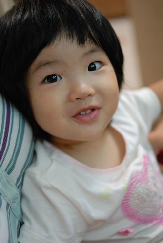

她...絕對是阿徹的妹妹...  
雖然很多時候她會靜靜的觀望 自得其樂的享受屬於自己的樂趣  
甚至在深夜或是清早睡不著覺哎哎時 露出甜到不行的笑容讓痛苦起身的爸媽不忍心斥責  
但她越來越顯見的調皮 靈活  
在在顯示她就是張有愛 好個張有徹的妹妹阿~~~  
  
  

哥哥上頂樓練車時  小愛也騎著愛車轉圈圈 溜阿溜  
  
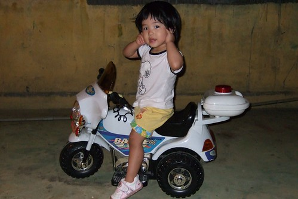  
  
最近突然醒悟 實在該好好利用這個頂樓  
上樓10秒鐘的事 就可以讓小孩跑一跑 蹓蹓車  
況且屋頂罩頂不怕刮風下雨  
比起總得費心挪出時間才能去的公園 投資效益真的大多了  
所以該是好好善加利用 好好打造頂樓樂園的  
  
(這兩張太糊了 所以只能小圖見人)  
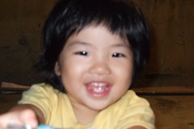  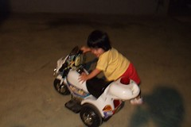  
  
很像邋遢的歐里桑背影  
  
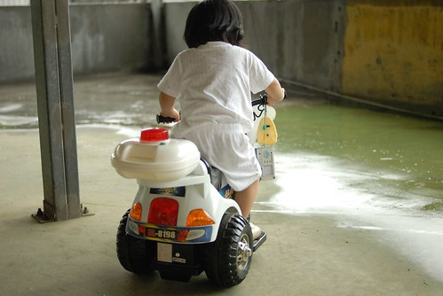  
  
正面帥氣多了  
不過媽媽的懶惰+小愛的不愛束縛 當然只能呈現出這樣的一頭亂髮  
這個冬天真的要來把頭髮留長 往氣質美女邁進了  
  
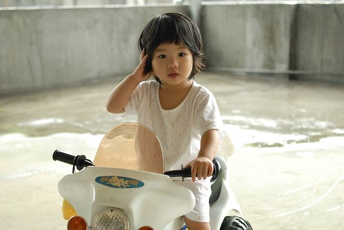  
  
嘟嘟嘴的性感模樣...香一個吧  
  
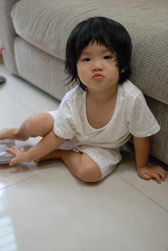  
  
再恬靜的女生哭起來也是醜  
嚎啕大哭 -> 抿嘴裝可憐 -> 沒人理嚎啕加倍 -> 開始自殘 把小手塞到嘴裡  
然後哭的滿手滿臉都是口水  
很能哭 有連哭半小時的好本事  
爸爸有時候會學她哭 自殘的樣子給她看   
或是錄下她哭哭的樣子給她看  
咦~好熟悉的身影阿 指著放映中的畫面 "妹妹.."  
是...就是你...可以不哭了吧....  
  
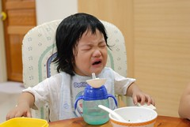  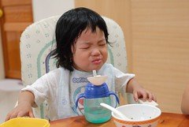   
  
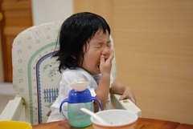 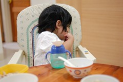  
  
還是這樣乖乖玩玩具的時候比較可愛啦  
沒事別亂哭阿~~  
  
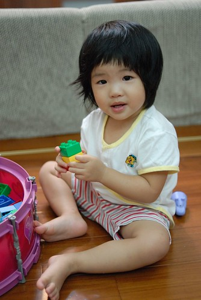  
  
哈哈!!!以上純屬看圖說故事...這就是標準的徹家用照片寫日記阿~
