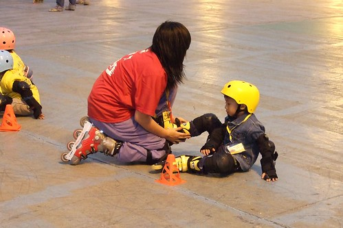
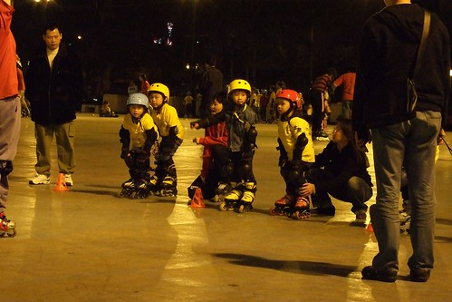

小孩子每天每天在大  興趣也跟著每天每天的在變  
阿徹的獨角仙好久沒有出現了 因為阿徹說獨角仙上天堂了  
爸爸媽媽遊戲是目前在家裡 在學校阿徹最夯的遊戲  
至於腳踏車也過了學會後的新鮮/得意/戀愛期     
而曾經還遙不可及甚至壓根不敢預期什麼時候才可以大到擁有的直排輪成了阿徹的新挑戰  
  
  

阿徹這陣子每看到人家溜直排輪的身影都會嚷著想要學  
但都被我跟徹爸以"年紀還太小" "時機還不適合" 等理由給擋了下來  
其實應該說我跟徹爸沒有很特意想讓阿徹這麼早學  
一來因為小孩的興趣實在廣泛而且日新月異 永遠沒有滿足的一天  
再來直排輪的整套裝備所費不貲而且小孩腳在大也挺快的  
最重要的一點是我跟徹爸實在沒有信心假日都能這麼陪阿徹去練習場練習  
所以我跟徹爸算是一直打著緩兵之計 能緩則緩  
  
結果就在張公張嬤難得上台北的週末下午  
我建議了無聊的張公可以去板橋車站廣場晃晃  
不愛睡午覺的阿徹當了張公張嬤的小地陪出門後  
直排輪的夢想就在一切的機緣巧合下 出現在阿徹手邊讓他垂手而得了  
原本我跟徹爸還陶醉在難得的週末下午日劇的美好時光中 (同時間小愛獨自在房裡睡的不醒人事)  
結果張公的一通電話打斷了倆人的甜蜜時光    
阿公說"阿徹想要學直排輪..."  
徹爸說"等他大一點再買..."  
阿公又說"可是他都只能在那裡看人家練習 他說他想要學..."  
徹爸說"這個問題我跟合旻討論過了 等阿徹大一點再學就好... 你叫阿徹聽"  
然後徹爸跟阿徹說了一些平常我們達成的共識  
阿公接了電話後又說"可是他說他想要學...."  
徹爸氣呼呼的說"既然你都決定要買給他了 那幹麻還打電話回來問...."   
我們猜想 打電話的當下直排輪應該已經買了吧  
只是阿徹怕爸爸媽媽罵 所以阿公打電話的用意是要我們告訴阿徹"不要怕 可以買的吧"  
只是沒想到徹爸與我這麼的硬  
  
一個小時後 阿公打電話回來說"阿徹學的很好 你們要不要來看" 語氣中盡是開心與得意  
然後再換阿嬤講"很有趣 你們可以來看看..."  
明顯的感受到倆老語氣中的驕傲與興奮    
可惜我跟徹爸一心想著等他們回來後該如何冷處理  
再一小時後兩佬一小開開心心的回到家裡  
幸好阿徹還有把平常的教訓加減放心上  不敢太囂張有點唯唯諾諾的等候我們的開鍘  
結果是"買就買了 但這就是今年二月的生日禮物了 今年生日不能再買其他禮物了  
             還有下次不准再這麼讓阿公花錢了"  
雖然阿公一直在那打圓場說 這是他們給阿徹的過年禮物  
但世界上哪有這麼好康的事 所以還是得當生日禮物當作是小懲罰  
  
上回在嘉義阿公帶著阿徹出去買麻油 結果買了一小時扛回一台腳踏車  
往往阿徹一句掛在嘴邊的"嘉義都沒有腳踏車可以騎" "我想學直排輪"  
都成了阿公剛好可以寵孫子的好機會  
其實我們可以理解阿公阿嬤疼孫子的心情也盡量睜一隻眼閉一隻眼   
只是阿....人的慾望很無窮....  
而且小孩子真的很聰明 懂得利用別人對他的好的  
  
阿公很難理解為什麼我們這麼堅持不要現在買 說"你們就放假的時候帶她去練習就好啦"  
ㄟ....我只能說實際執行上真的有他的挑戰與困難性  
受挑戰的不是阿徹 而是我們該如何持之以恆的讓阿徹去練習 去培養這樣的興趣  
尤其在那個難以抗拒午覺誘惑的週末下午阿....(我跟徹爸真的不想當孝子孝女)  
  
一週後的週六下午 徹爸還是當了孝子帶阿徹去練習  
板橋車站附近的追風廣場  一個讓小孩很難抗拒誘惑的直排輪練習場地  
  
  
  
徹爸說有分幾級練習 阿徹先去最低級的站立練習  
練習前教練會先檢查裝備有沒有穿戴OK  
  
  
  
然後講解技巧 注意事項  
  
  
  
鮮艷的黃色系配備 蠻對我跟徹爸的喜好  
  
  
  
整套行頭穿戴起來還蠻有模有樣的  
只是有一點小小感慨 這模樣越來越像台北小孩了  
一直覺得直排輪有點像是被炒作起來的"流行品"  
想不到阿徹也成了這樣的小雅痞  
  
  
  
練習走嚕~  
膽小的阿徹果然前幾趟都是小小歨 慢慢走   
  
  
總算到最後一趟阿徹一馬當先  
不過..呵呵...因為厲害的都回家了啦  
  
  
  
徹爸說練習場上可以看到各式各樣的父母  
有人亦步亦趨的跟在小孩身旁  
有人同步轉譯教練的話再三提醒小孩  
而徹爸應該算是在一旁涼的閒爸 只要偶而投予阿徹一各充滿鼓勵的笑容就好  
希望阿徹可以拿出練習腳踏車的決心毅力 認真的培養他所選擇的興趣  
要不然.....來人阿...吊起來打啦.....  
不過看來徹爸也得想辦法搞雙直排輪來個父子勁技  
要不然還真懷疑這興趣到底能持續多久阿....  
真的  凡事花錢事小  懂得珍惜才是難能可貴阿~  
  

