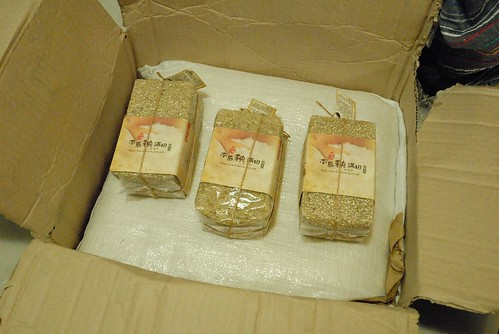
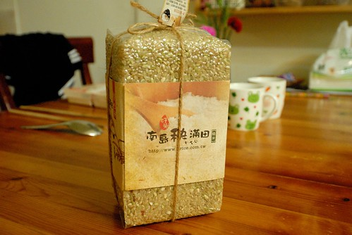

去年偶然的機會看了買買氏的棄業日記(忘了到底是偶然的知道這本書還是在書局偶然的看到所以買了) 然後FB加入了由他所發起的"直接跟農夫買"粉絲團 從此我的人生被劇烈的影響著... 雖然從小我們就被教導"盤中飧粒粒皆辛苦"的道理  但看到一篇篇真實紀錄農夫或是農友們自己寫下的文章 心每每被劇烈振盪著.. 我認同也喜歡直接跟農夫買的訴求 不只友善健康也友善環境 友善農夫 所以直接跟農夫買平台介紹的不見得是有機(有機其實未必友善) 但絕對是安全 是對人 對作物 對土地都友善 透過平台 我陸續直接跟農夫買過柚子 蜜柑 稻米... 每次交易連絡時 總會在過程中一再聽到對方說謝謝 好像每個能講謝謝的機會都不放過 自己總會被感動的心頭好暖好暖 而食物入口時更是覺得份外香甜(食物本來就真的很好吃)

 

家裡一直都是去全聯買花東米吃  雖然買不起有機買不起高檔但能吃到品質不差的當期稻米也令我滿意了 前陣子去上直接跟農夫買小學堂的"今天你吃幾號米 X幾號米都能好料理"課後 我很認真的尋找/思索著直接購買池上米 無樂米或是青松米... 無奈仔細計算過後 不得不承認這樣的稻米支出將會嚴重衝擊到我每個月的飲食預算 一切只好作罷 直到透過平台看到關山的"南島 秧滿田"  我很開心我遇到了"答案" 我給徹爸看農家的網站時 徹爸說"怎麼能取這麼美(意境)的名稱阿" 讓他看的就起雞皮疙瘩了 每一個嘗試經營自產自銷的農家通常都特別的有想法有堅持 南島 秧滿田的想法是"最終，希望與愛護我們的朋友們建立一個長久且互信的供給循環，請用好心情食用我們的米，把台東的陽光吃進肚裏，把台東的山水好好咀嚼" 而堅持是"因為對農作物的愛和對土地的尊敬，還有身為作田人的驕傲，我們堅持一定要把得來不易的米推廣出去...希望米能在最好吃的時間內被食用才好，到時就由口中的米飯香來告訴大家：家的飯桌少不了的米飯香可以又香又健康"

米寄來的那天 宅配人員的好態度好服務讓收到米的我更是滿心開心 我迫不及待打開箱子 看到前一天才輾好的12公斤白米與3公斤糙米 雖然稻米還沒拆開 但連徹愛都能聞到稻米味 尤其當一大袋的白米打開時撲鼻而來的新鮮香味阿  這些米不只帶來美味也帶來感動 我的心也跟著秧滿田了~  提外話: 四年多前去上美語課時  我對於一個南非籍外師講的一段話印象深刻 他說 "我搞不懂為什麼台灣COSTCO賣場總是人擠人 每個人的推車總是堆滿食物 那些從國外運來的東西是需要浪費多少的地球資源 一點都不Green" 雖然家裡本來就不常買COSTCO的東西 但從此後我更少去了... 我一直偶而會想起外師的這些話 我很高興現在我漸漸有時間 心力與經濟支持可以去實踐更永續的生活方式 起碼我可以從在地消費實踐起....
