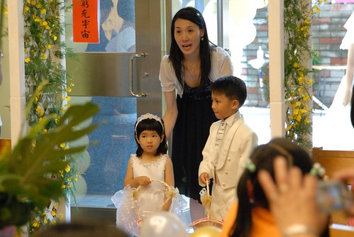

最近除了洪同學學區事件外 接下來要寫的這件事也是讓我覺得很"巧妙"的一件事 就在我po了愛愛的偽花童體驗後沒多久 老天爺竟然就真的給了她機會 讓小愛一圓當小花童的美麗夢想 

話說6月中某天早上徹爸送阿徹小愛去上學時  Freda跟徹爸說有人要找阿徹小愛去當花童 徹爸聽的不明就裡也在MSN裏跟我說的不清不楚 什麼哪個老師還是誰的弟弟結婚啥的 後來Freda遇到我時才仔細說明清楚 原來是阿徹小愛的舞蹈老師的哥哥要結婚找不到花童啦

舞蹈老師後來親自說明邀請時說 因為是她們家第一次辦喜事大家很重視 可是她們的親戚小孩都很大 找不到小的可以當可愛的花童 舞蹈老師就跟他哥說 你們好可憐喔都找不到花童 於是舞蹈老師想到也許可以問問園長的意思 請幼稚園的小朋友幫忙 然後她想說既然要找可愛的 第一個就想到了小愛然後還有阿徹 舞蹈老師先是問了問園長可行性 (聽說園長聽到後超高興就像是要找她小孩當花童一樣) 請老師先問我們的意願然後再又親自邀約

我聽到人家要找自己家小孩當花童當然是又驚又喜 起碼就外觀或是內在來講應該都是對自己小孩的一種肯定吧(哈!也像是間接肯定了自己啦) 而且這是多麼難得的讓小愛有了圓夢的機會.... 只是開心的感覺只有持續兩三天 之後想到後續的準備出席等等...越想好像越麻煩便有點想推掉了 可是小愛已經完全沉浸在她即將當那個可以拿花籃的花童的期待喜悅中 於是我們全家只好捨命陪君子 陪她一起完夢~

婚宴是在6/28週日的晚上  兩週前便跟新人們約在婚紗公司挑衣服(幸好只在板橋) 女生花童的衣服是不接受修改的 所以小size的小愛可以選擇的衣服很少 小姐一開始就說明是衣服挑人 不是人挑衣服 試了唯三件小愛可以穿的禮服後 小愛自己決定了下面這件有很多小花花的小白紗 (其實我跟舞蹈老師是比較愛另外一件的 可是可能因為比較大小愛穿起來比較不舒服)

至於哥哥則是應新人期望的穿了整套白 要當白馬王子嚕~ 試衣服的時候雖然看阿徹穿著整身白的禮服實在有夠帥的 但是為娘實際的馬上就想到 那鞋子怎麼辦? 家裏只有黑皮鞋哩! 況且很少看到有在賣小男生的白皮鞋吧?! 服務的先生就說 "對! 男生的白皮鞋很少 所以大部分的客人都是搭白布鞋 小孩子搭起來還OK" 可是我實在很難接受白禮服+布鞋這樣的搭配說 感覺粉怪哩 所以在舞蹈老師的認可下 讓阿徹穿黑褲子好配合黑皮鞋 只是後來新人看了照片討論過後 還是覺得穿著全身白的阿徹比較可愛 因此應新人要求的還是讓阿徹當白馬王子 而舞蹈老師們也允諾她們會去找可以讓阿徹穿的白鞋子 雖然最後的鞋子不是白皮鞋 但起碼是比布鞋好一些的白休閒鞋

原本一開始的邀約是週日晚上婚宴的進場"秀" 但在試完禮服時新人不好意思的問我們 "當天中午她們在教堂的儀式是否可以參加" ㄟ...灑兩次花瓣阿? 感覺一整天好像就都沒了 而且教堂儀式可能在前一天晚上還要過去彩排哩 (舞蹈老師幫我們爭取只要當日提早到即可) 我有點頓ㄉㄟ的說 "ㄟ...我回去跟爸爸討論一下"  (其實決定權在我啦) 老實講真的突然覺得這事情怎麼越搞越大了 雖然她們都說阿徹的白禮服是婚紗包套內的 但據很多過來人經驗都說男花童的衣服是另外付費的 想想租這麼一套禮服也是挺貴的 而且她們好不容易找到花童了 基於投資報酬率來講 好像灑兩次花瓣會值得划算點 因此就像洗頭一樣好像只得硬著頭皮給他洗完了.... 幸好後來不用提早一天去彩排也不用提早到預演 我們在週日中午11點45分典禮開始前20分鐘到即可

這是阿徹小愛第一次進教堂 尤其還是她們超喜歡的結婚 兩人可開心期待的

等待10來分鐘  全套行頭上身 準備要上場嚕~ (小愛頭上的白色蕾絲髮圈是舞蹈老師提供贊助的)

美麗的彩虹老師陪著阿徹小愛等待儀式的開始 (阿徹緊抿的嘴巴 還有小愛"嚴謹"的表情 看的出兩人粉緊張哩)

典禮開始進場時 阿徹果然很有經驗的把花灑高高 晚上時舞蹈老師說下午她們親戚到他家時 都問說那個男生好有花童架式喔 那個可愛的小不點女生是誰阿?!

一分鐘走完 灑完 完成中午儀式的任務

完成任務的小愛 臉也總算放鬆不緊張了

雖然小愛很愛當公主 可是當公主的時候儀態真的得多注意一下 穿的這麼美結果還是抬起腳抓癢 粉粉粉....醜哩

舞蹈老師事前有說 如果我們不看儀式可以提早離席沒關係 可是阿徹很渴望 很堅持的要看教堂結婚儀式 因此我們還是留下來觀禮 只是冗長的牧師政道 教友勉勵 還是讓徹爸跟小愛忍不住去外頭透透氣

徹爸說小愛穿這衣服看起來有點胖 臉圓圓的 胸檻也很厚說 不過就像去挑衣服時 所有大人說的 不管小女生穿什麼禮服都會可愛 所以即使沒有美麗但起碼還是會有可愛  這樣應該就夠了吧!?

再進入會場時剛好是新人們交換信物 誓約...儀式的時候 小愛問我"怎麼沒有親親"  然後一臉期待的等著看新娘新郎親親

嘿嘿~親了親了 新娘新郎親了~ 不知道那時候的小愛有沒有幻想以後他跟阿嵂也要這樣子結婚

新人儀式完畢 教友獻唱詩歌時我們還是給他偷偷溜走了 但是臨走前不忘在美麗的教堂前留影一下 阿徹跟小愛像不像是從教堂落跑的新人阿

教堂在中和 因此回到家也已是1點半後 我跟徹爸又不知道在累什麼的急需睡個午覺補充精神 但晚上依舊有重頭戲的阿徹跟小愛卻還是High High High的玩了一整個下午 直到5點鐘提早吃Pizza晚餐 5點半抵達在台北縣政府的婚宴場地

5點半抵達會場是因為好像還是需要彩排一下 只是大家都知道的 不管事前怎麼安排規劃 結婚當天還是會亂亂亂 因此我們一家四口還是得枯等好一會

幸好6點過後花籃便先交給阿徹小愛培養感情 兩人藉著花籃轉移不少注意力

其實一開始阿徹是不想當這花童的 因為他說他當過了而且在老師面前他會怕(應該是害羞吧) 而小愛聽哥哥說不要便也跟我說她也不要 我跟她說"當花童喔 可以提花籃喔" 聽到花籃 小愛眼睛整個亮了起來的說"我要 我要當花童" 然後每天開心的念著 我要當花童 我可以拿花籃灑好多的花瓣

就算我們後來想勸退她不要當花童也沒辦法 因為她已經深深中了花籃的毒阿

其實阿徹對於灑花瓣已經沒有新鮮期待了 他滿腦子想辦法 可不可以藏一些花瓣拿回家洗玫瑰花瓣澡 為了避免他屆時想要多留花瓣而灑花瓣灑的太小氣 我只好跟他約定先拿一小手的花瓣起來 其餘的都要灑光光

婚宴進場的彩排 在6點半多總算進行 因為新娘是由爸媽陪著到紅毯起點 然後會有新人答謝女方爸媽的小儀式 再來才是小花童的進場 新人的進場 因此阿徹要記住該在什麼時機站出來 走出去   算是有點小困難度的花童任務

彩排完當然又是繼續等 (大家應該也習慣婚宴從來不會準時開始 晚上的能7點半開始就算好的了) 而阿徹跟小愛的花童形象越來越蕩然無存...

YA! 跟這兩週剛好忙著去大陸出差的爸爸照張相  (爸爸眼袋給他有深有累喔)

彩排完又等到7點20分左右總算宴會快要開始 彩虹老師幫我們留下難得的全家福紀念照

婚宴正式開始 準備進場的新人&花童好像都有點緊張哩

因為小愛下午灑花時的臉實在有點嚴肅 因此下午跟晚上灑花前 一直交代她要笑咪咪的灑花喔 如果有看到照片上的她是笑咪咪的 隔天我要請她喝養樂多 於是為了一瓶養樂多 小愛的臉似乎比下午時柔和了一些 只是後來看徹爸錄的小影片時 看到相較於阿徹哥哥那手舉高高的灑花瓣雨 愛愛是小手一抓然後往正下方的地上一手"丟"下去 我跟徹爸笑翻了

試衣服時 彩虹老師跟她的哥哥嫂嫂這麼形容小愛 雖然小愛不是那種很漂亮的女生 但是小愛給人的感覺就是很可愛很讓人喜歡 希望阿徹跟小愛那一天的表現沒有讓交予我們這重責的新人以及彩虹老師失望... 也衷心的謝謝她們給了小愛這個圓花童夢的機會 以及讓阿徹跟小愛有這樣的機會一起走在紅毯上為新人灑下祝福的花瓣...

