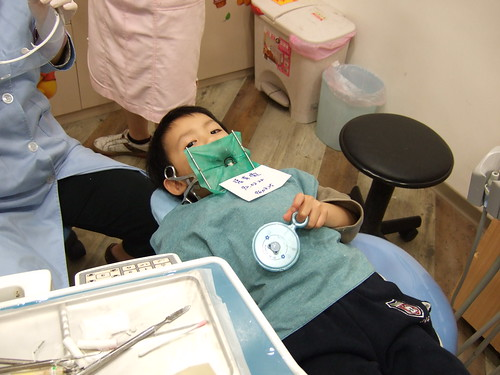
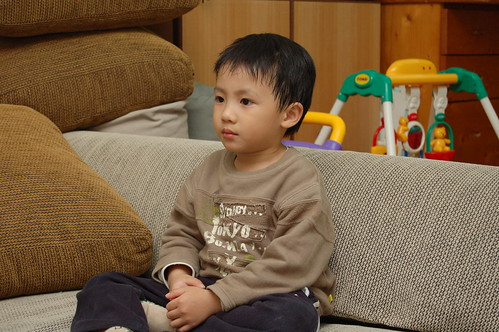

幾週前阿徹睡前刷好牙給我檢查時  
赫然發現左下方第一顆臼齒齒縫邊上怎麼有點黑黑灰灰的樣子  
想 也許是海苔黏在上面沒刷掉  
觀察了2-3天還是這樣 又怕自己眼花於是請徹爸再檢查看看  
徹爸還拿了牙線棒往那黑灰地帶刺刺看  
徹爸說"應該真的是蛀牙了 刺下去空空的 有洞的樣子"  
然後夫妻倆有默契的一起跟阿徹宣判說"ㄏㄡˊ 你蛀牙了 真的要去看牙醫了"  

阿徹總算意識到事態的嚴重性 不敢說不要去看牙醫  
不過還是會一臉緊張害怕的問我"要把牙齒拔掉嗎 會流血嗎"  
於是跟他說" 趕快去看牙醫也許只要把壞蟲蟲抓出來就好了  
而且看牙醫又不恐怖 說不定還會送小朋友玩具哩"  
阿徹說"真的嗎 醫生會送我玩具阿"  
應該吧...小兒科醫生不是都這樣 而且網路上很多媽媽都這樣寫阿  
  
上網查了板橋哪兒有兒童牙醫  
不是頂多但平常活動區域內有幾家專看兒童牙醫的(真的不得不誇獎一下住在繁華新埔的便利性)  
其實會想找兒童牙醫而非一般牙醫   
主要是想說兒童牙醫的環境應該比較卡通 柔和讓小孩子不緊張吧  
而且也許哄騙小孩子的玩意也可能比較多吧  
最後找了家走路15分鐘可以到的診所然後打電話去預約  
哇賽~小孩子的錢果然好賺  預約要排到一個星期以後  
無法速戰速決 只好一整個星期都"ㄘㄨㄚˋ ㄟ ㄉㄤˋ"  
  
總算等到這個星期一晚上6點半的門診  
六點在學校接了阿徹後 母子兩慢慢散步的走去診所  
15分就抵達診所 填了初診資料 然後等待.....  
越等阿徹似乎越緊張 不安的看著童書 不安的坐在沙發上  
6點半到 樓上的醫生call樓下的櫃檯護士"可以上來了"  
護士先仔細清楚的講解看診規定 "媽媽只能在旁看 不能講話 ...如果小孩子哭鬧就要請媽媽先離開讓醫生好好跟小孩溝通....照3-4張x光片檢查後 醫生會先說明治療計畫...."等等之類  
講了一堆主要就是"要完全信任醫生 把小孩交給醫生啦" (我轉譯的啦)  
上到樓上看診區 有一個小房間專門看兒童牙醫的   
果然貼了幾張大型卡通圖案 但躺椅看來一樣冰冷哩  
還不小心撇見一旁的束縛床  傳說中要固定小孩的東西 忍不住心驚了一下  
(聽說有的診所規定穿束縛衣 但這裡是真不行才穿)  
醫生阿姨跟阿徹打了聲招呼後 就帶阿徹去照x光  
 (進到診區後 媽媽開始認份的不說話 除非醫生跟我講解溝通)  
醫生仔細的跟阿徹解釋怎麼含著咬著片子照相  
阿徹也勇敢的自己獨留小房間中照相(沒哭也沒驚恐樣  好的開始)  
等待片子的同時 醫生也仔細的查看一下阿徹的牙齒  
醫生第一句說的話是"齒溝很深喔 一般就算恆齒也不會這麼深 況且是乳齒 "  
我說"齒垢很深? 媽媽沒刷乾淨喔" (被說小孩齒垢深 超不好意思的)  
醫生說"這麼深 就算是我也刷不乾淨 更何況是媽媽"  
越聽我越不懂... 等到醫生拿著器具在臼齒上方比畫給我看 我總算明白"是齒溝啦"   
醫生說一般恆齒才會建議做"預防性的填補"(忘了學名是啥 這是我自己取的)  
但像阿徹這樣這麼深 也許可以考慮一下  
我緊張的問一下多少錢 "一顆800"   
哇 心裡盤算著 800\*4 800\*6 貴阿~  
  
剛好X光片出來了 醫生跟我解釋治療方針  
只有左下方臼齒那有蛀牙 不過看樣子 有90%有蛀到神經需要根管治療  
從沒做過根管治療的媽媽 聽到根管治療就嚇的有點疲皮挫  "這麼嚴重喔"  
醫生說"齒縫中的蛀牙外表是看不出來的 都要照x光才能發現 往往外表可以發現時都已經蛀到神經了"  
要確認有沒有蛀到神經只能透過3Dx光 但要自費太貴且需要等待啥的  
所以醫生都是建議直接進行治療 先處理上層 然後就能知道神經有沒有蛀到有的話就直接也做根管治療  
醫生説明清楚治療計畫後 問要今天就治療還是回家跟小孩建設好下次再治療  
ㄟ~夜長夢多 今天就解決吧 於是醫生開始今天的治療....  
先拿了把小鏡子給阿徹 讓他可以看阿姨抓蟲的情形  
教阿徹深呼吸 打麻藥 然後一堆清 挖 吹...的動作  
醫生阿姨在做任何措施前 都會先跟阿徹解釋現在要做什麼 "讓牙齒睡著...要吹風風...要給牙齒戴蝴蝶戒指...要抓大蟲蟲"  
而且會先在阿徹手上 捏一下 刺一下 吹一下啥的讓他先體會等會可能會有的感覺  
我想兒童牙醫跟一般牙醫最大的差別就在於怎麼跟兒童溝通 化解小孩的恐懼吧  
  
治療後果然...蛀到神經需要根管治療 (媽媽第一個想到的是 自費2500的牙套 貴阿...)  
之前還都很得意阿徹沒蛀牙 看起來一口好牙的樣子 想不到第一顆蛀牙就這麼嚴重 需要根管治療  
不過該做的還是得做 該花的還是得花哩  
過程中阿徹一直想拿著鏡子看自己的嘴巴  
醫生阿姨看到那累到稍微颤抖的小手就會提醒"阿徹 手手累了可以放在肚子上休息"  
不過阿徹似乎緊張的聽不懂 於是醫生只好請護士有空的時候稍微扶持著他的小手  
30分鐘的門診治療 阿徹都沒有皺眉頭 也沒有吭 沒有唉   
只有偶而會微抬起他的小手(媽媽看牙醫不舒服時也會微抬自己的手)或是用眼神與媽媽交流一下  
出乎媽媽意外的鎮定表現    
   
過程中其實很想用相機照下阿徹勇敢的樣子 以及那些器具冰冷的樣子  
媽媽我第一次這樣這麼仔細且近距離的觀看整個治療過程(我一直站在阿徹的腳邊)  
老實說我還是覺得牙醫蠻恐怖的  
即使有上了麻藥 但要張大嘴那麼久而且看著感受著那些器具在嘴裏ㄎㄧㄎㄧㄎㄡㄎㄡ的  
打死我都不覺得看牙醫不是件恐怖的事  
(寫日記的今天早上媽媽也去看牙醫拔掉蛀掉的智齒 整個過程幾乎雙眼都是閉的  
 更加覺得阿徹還真是勇敢 看牙醫都是張大雙眼 媽媽我真的做不到)  
趁著看診完 護士拿出相機要照相留證(我沒聽懂照相的原因是什麼)  
我趕緊像是撿到便宜般的說"我可不可以也拿我的相機照一張"  
在醫生的許可下 趕緊照下阿徹的模樣  
  
醫生叮嚀了一些注意事項後算是結束了今天的治療  
接下來就是兩週後的上牙套嚕~  
回家的路上我問阿徹"看牙醫感覺怎麼樣"  
阿徹說"一點都不恐怖"  
回家後我跟徹爸說阿徹很棒很勇敢 徹爸誇獎阿徹說"聽說你很勇敢阿"  
阿徹一臉理所當然的說"我一直很勇敢的 難道你不知道嗎"  
ㄘㄟˊ 爸媽還真不知道你很勇敢哩 還一直很勇敢勒~  
  
  
最後小小對醫生的感想:  
戴著口罩的醫生阿姨講的一口標準又讓人感覺專業 果斷的國語  
但最後脫下口罩時 才發現醫生阿姨其實很年輕哩 臉的感覺有點像總統千金(幸好走路跟講話的樣子不像)  
醫生阿姨雖然很有禮貌也很仔細的跟小朋友及媽媽溝通說明  
但感覺...ㄟ...很"相敬如賓(冰)" (用形容夫妻的辭來形容好像有點怪)  
少了原先假設/預期的童言童語 充滿陽光熱情的樣子  
徹爸說"這樣不好嗎"  ㄟ...是沒有不好啦  
也許如徹爸說 這樣才顯得醫生阿姨的專業形象 小朋友比較不敢"ㄍㄟ 笑"  
也許...而且看診仔細認真最重要嚕~   
  
看完牙齒又去小兒科看感冒 回家吃完晚餐後 一臉倦容的阿徹(看牙醫時就是都這表情)  

