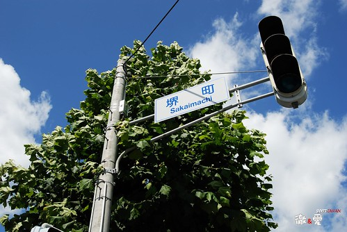
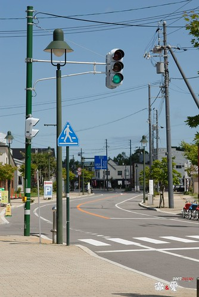

  
  
人的一生永遠要學習 要承擔的就是"抉擇"  
年輕的時候有"年輕"可以當本錢   
可以做夢 可以逃避  可以義無反顧的向左走向右走  
當不再年輕  不再像小時候那樣有理所當然的目標可以前進時  
找工作要抉擇...  
要不要結婚 要不要生小孩 要不要生第二胎要抉擇...  
當全職媽媽好還是當職業婦女好要抉擇...  
投資股票好還是投資基金好要抉擇...  
甚至該讓小孩上什麼學校 學什麼才藝都是抉擇...  
  
人生好像就是這麼一直遇著這些大大小小的紅綠燈 轉來轉去走來走去  
也許找到了通往羅馬的那條大路  
也許依舊在方塊裡轉來轉去 但已熟悉每條小路每個街景  
也也許走著走著也搞不清楚自己走在哪條路上 要往哪個相向走去  
幸好那不絕於耳的小孩嬉戲聲 男人相機喀嚓聲  提醒了自己要往那片藍天白雲邁進  
是啦~就是那個天~那個藍藍的天~  
   

