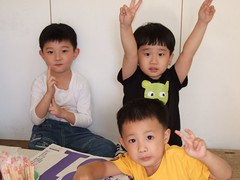
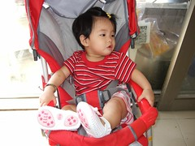
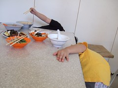
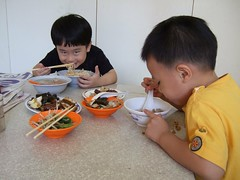
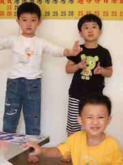
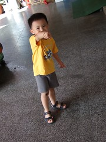
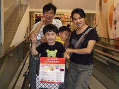
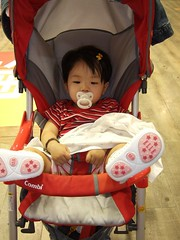
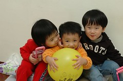
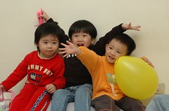

不回嘉義的週末幾乎都會回新莊的外婆家  
若無聊的在家阿徹也會嘀咕著要回"圭圭阿嬤"家找阿瑜哥哥/萱萱姐姐玩  
或是就是要回阿嬤家玩玩具 吃滷肉飯或碗稞  
雖然小毛頭們聚在一起常會為了爭奪玩具吵翻天哭翻天  
但家裡鬧哄哄的好不熱鬧(只是大人的耳膜有時真的會受不了)  

打鬧歸打鬧 三個小朋友應該還算很珍惜這手足情的  
有好吃好玩的偶而都會想起哥哥姊姊或是弟弟妹妹的  
尤其在阿嬤家什麼東西都要有三份  
除了因為太少恐會引起爭奪外  
小朋友們也都會為不在場的人爭取一份

阿徹除了有個親親小愛妹妹  
也有從小跟著一起長大的阿瑜哥哥 萱萱姐姐(三個人相差不到3個月)  
好不熱鬧 好不幸福阿~  

右後阿瑜哥哥 左後阿嬤店裡附近常一起玩的佑佑哥哥 

爸爸媽媽忙著解殘而被晾在一旁的小愛

躲避徹爸相機的兄弟倆 覺得這張照片超好笑 只看到兩人忘了藏的那隻手

兄弟倆的中餐 哥哥:乾麵+貢丸湯 弟弟:滷肉飯+大骨肉湯+青菜 還有兄弟倆都愛的豆干

收完攤後的下午一起去HOLA尋找傳說中的南瓜裝

逛到不支 快睡著的小愛(小愛最近都還蠻配合的願意坐推車 雖然那雙腳都會很沒氣質的翹高高)

去年底三人的合照(好久沒來三人大合照了)

