小愛三月住院/出院後的隔週末 本來想要帶去郊外走一走呼吸點新鮮空氣順便練一下體力 可惜天公不作媒.... 可是在家又呆不住 於是靈機一動去了魔鬼甄曾經介紹的"科學教育館"... 位於士林區的國立科學教育館與台中科學博物館完全不一樣的性質與展出 感覺教育館是比較偏小學至高中程度有關"科學展覽"的教育(大家國小時每年一定都要做科學展覽吧) 整個館很新很大很明亮 但是我們今天只有直攻我們的目標地"八樓 活力跳跳城展覽館" 什麼叫做跳跳城?! 就是讓小孩在裡面盡情跳的城堡啦~ 雖然光是跳跳城的兒童票就要220元  大人陪同票120  實在不算便宜 但整體來說很"肯定"台灣有這樣性質的活動與場地

以下就看照片說故事順便介紹館內設施還有活動

一樓大廳 有售票處還有一些DIY活動的舉行 整個建築物的中庭"開天窗"設計 (哈 被我形容的很怪)感覺很明亮很大器 讚!

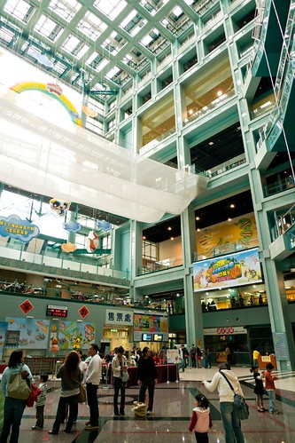

一旁有一大型氣墊溜滑梯讓人可以免費玩  應該是為了促銷大家多去跳跳城吧

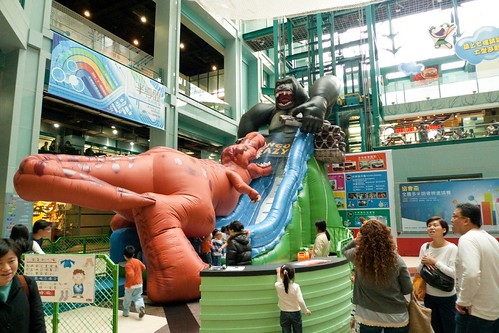

售票處旁有一哈哈鏡  去了兩次每次我買票時 小愛她們都好奇的在這看自己變高變矮

變成長腿妹妹 瘦瘦帥爸嚕~

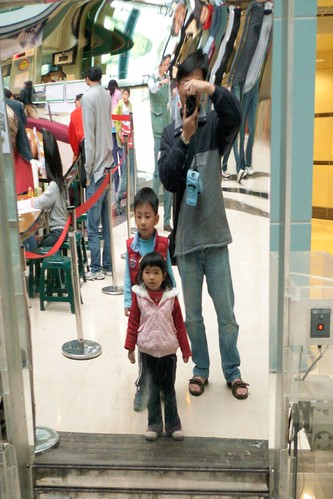

變成白雪公主裏的小矮人了

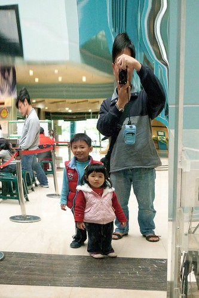

今年的跳跳城活動由CN 頻道贊助 所以很多飛天小女警或是BenTen的卡通人物佈置

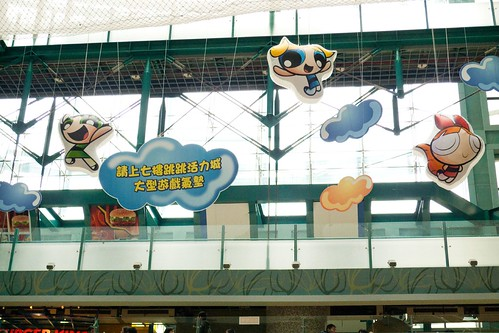

館內還有空中腳踏車可以騎(要另外付費) 雖然下面架有網子 但是這樣騎在高處感覺還是很恐怖說...

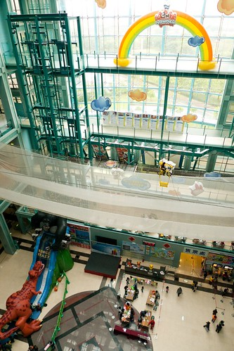

跳跳城由八樓驗票 然後再下手扶梯到達七樓的會場 手扶梯到達七樓會場後 很難不驚艷於這樣大型的遊戲氣墊

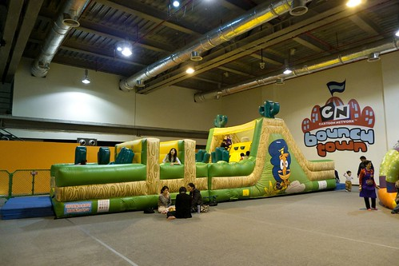

阿徹看到這些馬上High開 一個人東跑西玩的

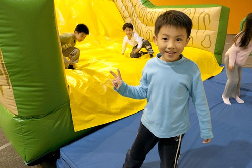

這些攀爬對他來講都是小case嚕  所以我跟徹爸也毫不擔心的讓他自己一個人四處玩

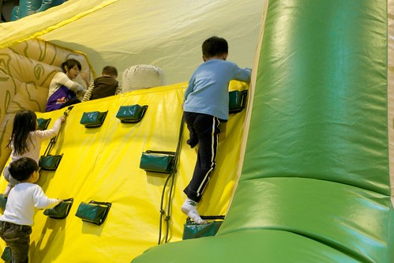

活動會場區分為三區  其中一區名為"歡樂恐龍谷" 就是各種氣墊造型都是以恐龍為主角

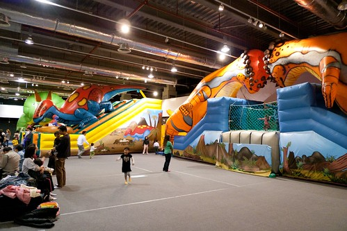

都是很可愛的恐龍造型

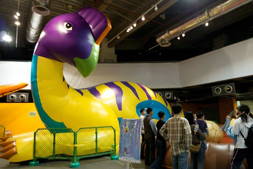

相較於阿徹的"馬上"投入 小愛則是遲遲不敢動作 一臉嚴肅的"觀察"許久 大概過了20多分鐘後才願意跨出她的小腳嘗試

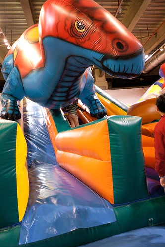

首先選定了上圖的這個溜滑梯 很多人排隊應該真的蠻好玩的吧

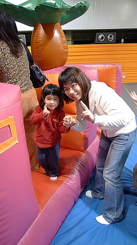

雖然高度其實也不甚高 但坡度達50-60度溜下來也是挺"衝"的 陪玩的我心"碰"了幾下 可是小愛笑的很開心 第一試算是成功了

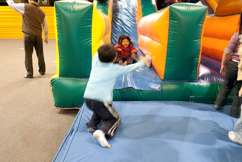

然後再換徹爸陪著溜

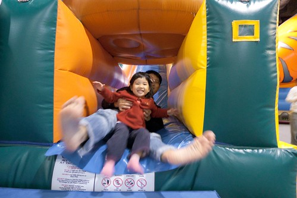

我跟徹爸兩人輪流陪溜了5-6回以上 小愛總算溜出興趣 可以自己獨自勇敢的上山下海去了

幾趟溜下來 已經開始有流汗的感覺 漸漸可以明白為什麼會場裏一堆小孩只有穿著一件內衣跑來跑去  熱阿.......

這是第三個會場的最主要/大型的BENTEN   包含各是各樣的攀爬及溜滑 每個玩過的大人一趟下來應該就都會大喊"累阿...."

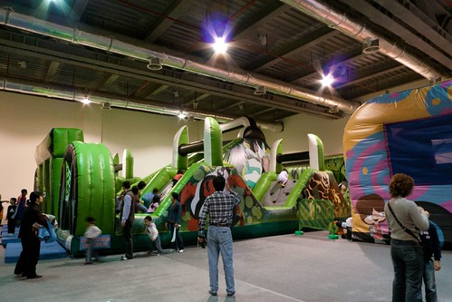

一開始小愛需要我們在後面幫助他攀爬

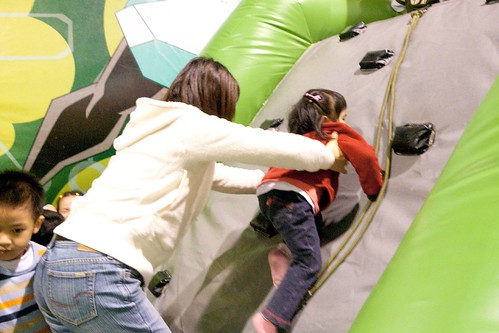

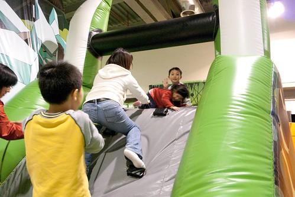

YA!

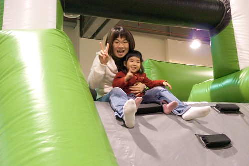

需要跟著她一起溜下來

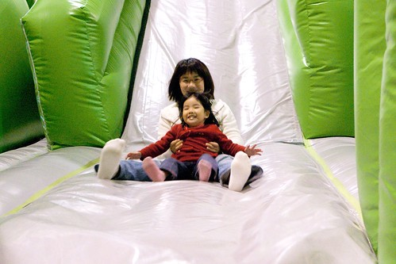

可是漸漸的就可以自己用小手短腳慢慢攀爬

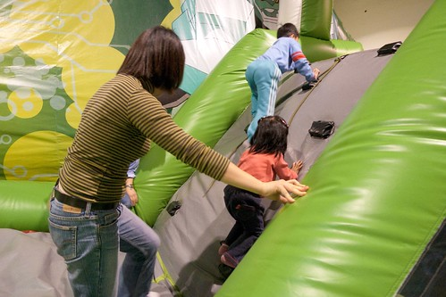

只是我們還是得隨侍在一旁以免慘劇發生 尤其大部分還是以中大班以上的小朋友為主 年紀越大玩法越猛越容易衝撞旁人

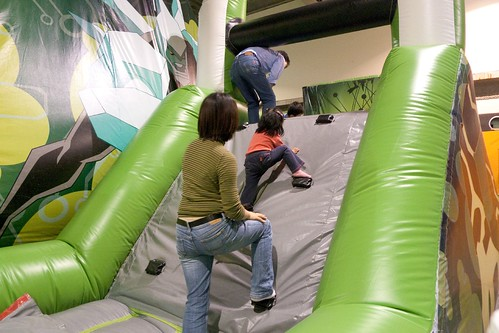

幾趟下來 已經可以自己上上下下爬完全程

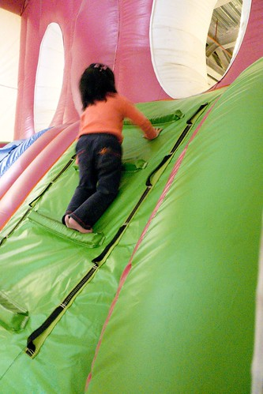

也可以自己"豪爽"的溜下來了

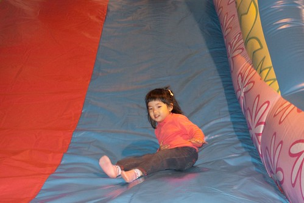

"嚕~" 都是爸爸訓練有素的成果喔

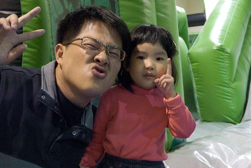

連這趨近80度的攀爬也沒有問題啦

自己爬到至高點 (旁邊的大小孩不知道是不是怕傷到小的 都躲遠遠的)

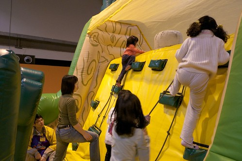

BEN10的正面 衝衝衝啦....

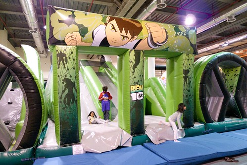

這是阿徹的凶狠版BEN10

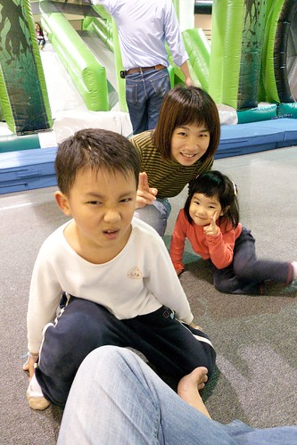

看吧~ 我們家小孩也玩到脫了 尤其是阿徹 即使都已經只剩一件內衣了還是滿頭濕

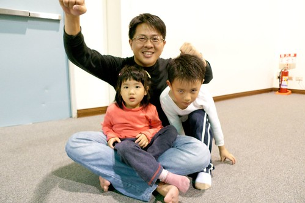

其實爸爸今日腳傷在身 還這樣跟著爬上爬下  累阿....

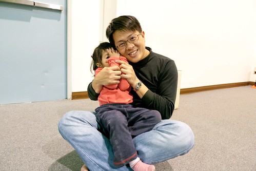

為了家裏可愛的小公主 "奴才"拼命也再所不辭啦

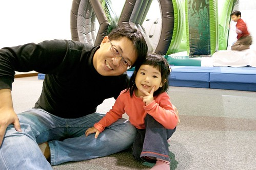

別以為氣墊有什麼好玩的 阿徹小愛們在裏頭足足玩了2個鐘頭多都還捨不得離開 家裏小孩活潑好動的或是你希望她玩累點晚上好睡的 很推薦來這跳跳爬爬溜溜喔!

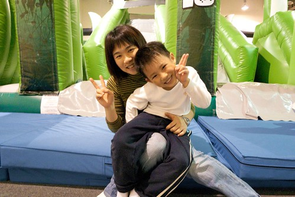

4月底趁著三家子(連徹媽的三兄妹)難得一起回陳媽家  又帶了這些蘿蔔頭一起去跳跳城 雖然大部分的時候都各衝各的  但人多果然又更好玩了

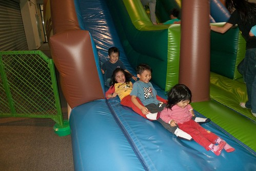

一個火車接龍似的溜滑梯讓她們High到最高點

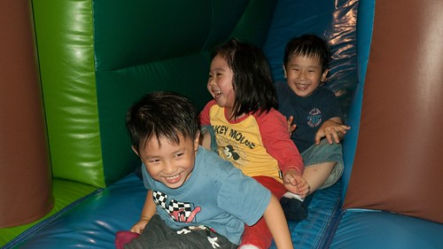

看到她們的笑容 我們這幾個陪玩無聊的大人也就值得啦

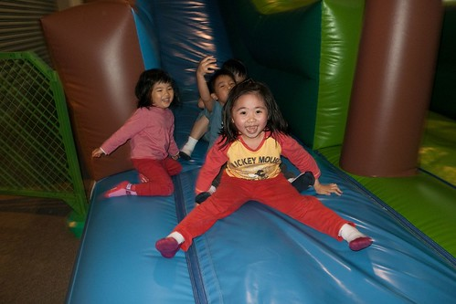

YA! 出擊成功!!!

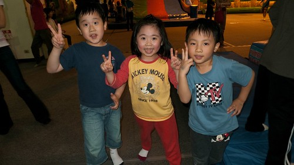

第一次去了後又再大大跟阿徹學校的園長推薦一番 目前幼稚園已經排定5月份的戶外教學要去啦 所以阿徹小愛的跳跳城又即將有第三砲了 真是...太爽啦....

PS. 1. 跳跳城的活動好像只到5/26還24截止 有興趣的人要快去喔 2. 好像每年都會有這樣類似的跳跳城活動 只是主題不一樣 所以來年可以多留意相關的訊息
