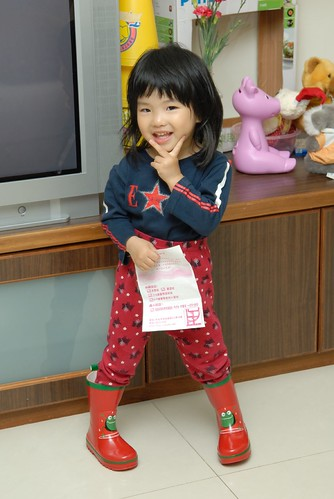
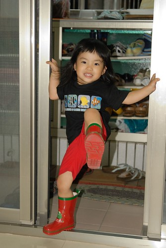
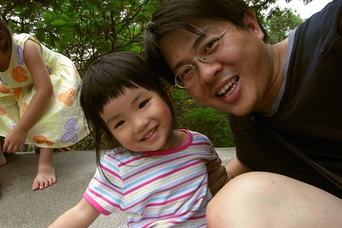
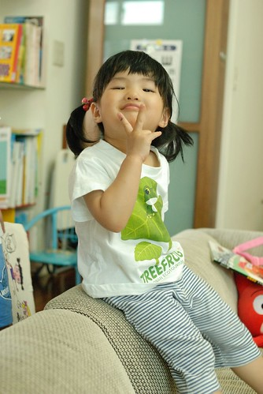
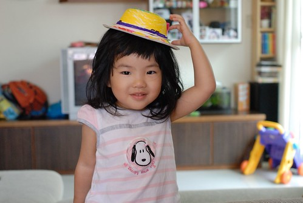

前陣子的小愛有點恰又很愛哭  
很喜歡撇著臉 嘟著嘴說"不要…我不要…"  
有夠難商量 難溝通的  
算是兩歲半的逢半必番叛逆期吧

最近雖然依然有點恰但腦袋似乎有開竅點了  
沒有那麼死腦筋 死要面子 死愛哭了  
比較能夠跟哥哥一起輪流選電視 講故事 洗澡  
甚至更樂於跟哥哥分享玩具 分擔收玩具  
而且越來越愛漂亮且有表演慾了  
抓著爸爸媽媽的頭說要幫我們榜頭髮  
學著Eileen拿著梳子剖邊 邊做邊說"要這樣畫下去喔"  
看著哥哥說故事也有樣學樣的當起Eileen老師講故事給爸媽聽  
故事越說越像是個小老師的模樣  
真的! 小姑娘又長大些了…  
(真的! 媽媽最近真的有懶 春天的照片到現在才po出來....)  
  

以這年紀來講 小愛應該可以算是個不討厭也還算能走的小孩  
只是上學的10分鐘路程卻往往得看小妮子的心情而定  
當沒睡飽 心情kimo不對或遠遠看到小狗時絕對是趴在你大腿上非要你抱著  
而偏偏當下雨天不希望她走時 她卻又愛拿著自己的小傘自己走  
甚至跟阿徹哥哥很愛很enjoy的學起粉紅珮珮豬跳水坑  
(除非雨不大 你也願意跟她共撐小傘 否則就得接受她自個在雨中暴走)  
  
阿徹哥哥有穿雨鞋所以可以跳水坑(當然不可能到"跳"這麼誇張 就是愛踩水踏水)  
小愛則是不管她腳上啥鞋跳了再說  
所以該是買雙雨鞋給她的時候了...  
小愛的腳很小很薄 所以買鞋時可以挑的款式很少   
號稱14公分的腳長卡在嬰兒鞋與童鞋間不上不下(嬰兒鞋功能不好 童鞋常常楦頭太大)  
上Y拍找了找 總算讓我找到適合小愛的小雨鞋  
(雖然也沒花太多時間啦 但還是想說好個皇天不負苦心人阿...)  
鞋子寄到徹爸公司後 徹爸好奇的拿出來瞧了瞧  
徹爸同事見到問說"這鞋是好看裝飾用的吧 穿的下嗎?"  
徹爸擔心的問了我"鞋子真的很小  小愛真的可以穿嗎?"  
我說"14公分就是小愛的size阿 你女兒的腳真的很小..."  
鞋子拿回家後給小愛試了試鞋  
很輕鬆的套了進去 完全沒有太小的感覺  
而腳套進去後也沒有鞋子太大 空空蕩的樣子  
感覺這個鞋就像是替小愛量身打造的一般 ...  
哈~我好像說的有點太神話去了...  
不過能夠替小愛買到一雙這麼合腳的雨鞋我真的很訝異也很開心  
  
有新雨鞋小愛也很開心  
剛開始幾天每天穿著鞋子在家裡逛大街過乾隱  
實在等不到雨天後就也乾脆把雨鞋當靴子穿去上學  
每次大晴天穿著雨靴去上學 都要她再三保證"明天不可以再穿雨鞋了喔"  
可是每天早上出門上學時依舊堅持的套上她的雨靴且保證明天不再犯  
幸好今年五月梅雨不算少 可以讓小愛過足癮  
也總算過了新鞋的蜜月期 不再在大熱天給我穿著雨靴出門去...  
   
  
  
其實這是我在Y拍用關鍵字雨鞋 唯一找到一雙小愛size的女童雨鞋  
所以對於鞋子的顏色與圖案根本不敢奢求太求  
本來光看照片時還有點擔心鞋子太顯中性  
但鞋子上了小愛腳後 唉喲~真的可愛到爆~ 我跟徹爸滿意的不得了  
  
(小愛連上頂樓騎腳踏車也要穿雨鞋  天沒下雨 頂樓也有屋頂 小愛真的是穿雨鞋穿爽的 )  
  
  
  
頭髮越來越長嚕...  
可是早上常常不愛綁頭髮   
都被媽媽威脅"不綁就把你帶去給阿姨剪短短喔"  
可是小妮子都一附無所謂的樣子   
倒是阿徹哥哥直說"不可以 要留長頭髮才美麗 才會像公主"  
雖然媽媽的綁法技術也實在不是太好  
但披頭散髮去學校總有點有辱家風的感覺....  
  
早上不管有綁沒有綁...每天放學時都可以接到綁的可可愛愛的小女生啦  
只是那個被綁的很可愛的小女生常常在進家門後就大力扯掉她頭上的束縛  
  
  
  
有時候要拜託她 把髮型留著給爸爸下班回家後看"  
  
  
  
小姑娘短短兩年多的時間已經認清這個家可以吃定的人就是爸爸  就如她哥吃定她媽一樣  
即使老爸前面一秒板著臉念著"不可以這樣 再這樣我就要..."  
下一秒後卻又笑臉盈盈的捧著姑娘小臉龐 柔情的說"我們不可以這樣喔..."  
  
  
  
五月的某一天   小愛在低頭猛幹一陣子後  
用害羞的卻又帶點驚喜的表情問我"是這樣嗎?"  
怎麼樣? 喔! 原來是她的小手會比YA了  
那陣子每每看著她低頭 認真喬著小指頭的模樣就會想抱抱她  
大喊"小愛怎麼這麼可愛阿!!!"  
  
  
  
現在比YA已經比的很順手嚕  
照相時不用再給小愛時間預備好她的YA了  
  
  
  
某週末阿徹哥哥與徹爸聯手用紙碗紙盤做了頂帽子  
帽子戴在阿徹哥哥頭上 雖然有讓人覺得真是頂可愛的帽子  
但在戴上小愛頭上後卻才令人有真是可愛帽子的讚嘆阿  
尤其小愛的那頭黑亂髮更是突出了帽子的黃  
  
  
  
很愛東撿西撿垃圾尋寶的阿徹 從阿公家帶回的喜餅盒緞帶跟這頂帽子很"速配"  
小愛這模樣像不像日劇中的日本小空姐  
  
  
  
學著哥哥穿浴巾裙 跳扇子舞  
  
  
  
早上起床換好衣服後的亂髮樣  
  

