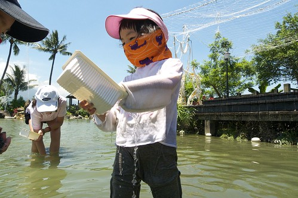
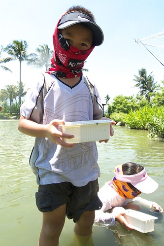
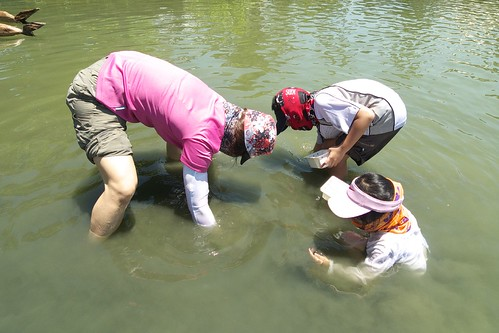
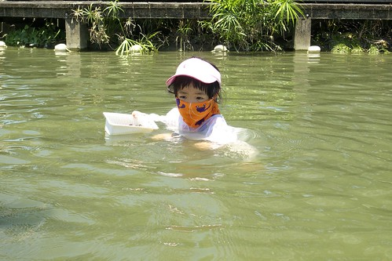
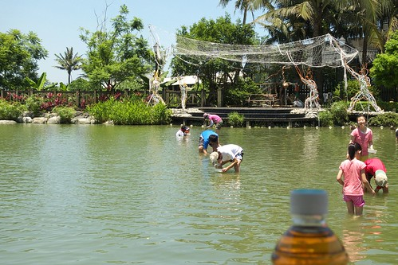
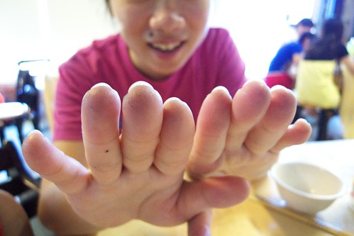
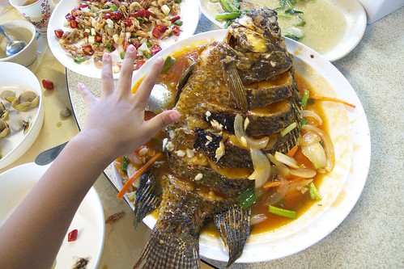

這一年阿徹常三不五時就叨念著想要去摸蛤 所以這回的花蓮行 我們除了許阿徹連三晚的溫泉外 也在最後一天安排立川漁場摸蛤 或許是因為暑假的關係 這回看到摸蛤的人還真不少而來吃飯的人就又更多 這裡儼然成為花蓮熱門景點了 跟我們三年前的秋天第一次來的情形差很多 那時候或許是因為季節的關係 遊客很少 水很清 蛤很好摸... 這回就真的名符其實是摸蛤兼洗褲子........... 

因為火車到壽豐的時間是上午11點多 我跟徹爸倆人內心掙扎著"透中午去摸蛤???" 可是因為答應了阿徹 所以很難用"只是去吃飯"打發他... 我跟徹爸說 12點摸應該比1點多摸不熱些吧!? 於是寵小孩的阿母義無反顧得透中午時領著兩個小人下水摸蛤去... 我們把騎車時用的帽子 領巾還有我的袖套全又再上身 也塗了厚厚的防曬油 就怕這幾天的防曬最後功潰於此 徹爸笑說 "開玩笑 我們可是剛去曬過的 裝備可齊全的哩"

第二次摸蛤的阿徹很有經驗了  準備好就啥也不怕的逕自下場摸蛤去了 而愛愛在好不容易變裝完畢雀躍的要下場時  赫然發現怎麼怎麼水裡有這麼多魚在油阿 (因為徹爸說 他可不要女兒曬的黑嘛嘛 所以很堅持愛愛得"全套"準備好) 愛說 "媽媽好多魚在裡面啦" 徹爸說 "泡溫泉時　你不是喜歡讓魚親你的腳" 愛說 "可是這個魚好大．．．" 媽媽湊到水邊一看　哇賽! 還真有點大 就像可以上桌的吳郭魚那樣大 這魚害得原本雀躍萬分　轉身就要衝下去的愛愛止步不敢前進了...

好想下去摸蛤的愛愛　看著哥哥摸蛤的身影好羨慕好掙扎阿... 

這時候善良的媽媽只好伸出援手跟她提出建議"我抱你到比較遠的地方看看　如果那也有大魚你再決定要不要下去" 幸好除了池邊附近比較有大魚出沒外　其他地方都只是小小魚 愛愛終於可以她的第一次下水摸蛤體驗　（上回還算小baby的她只能在岸邊摸乾蛤） 

雖然水不是很深但是對於愛愛的身高來講要站著摸很吃力　很難不栽到水裡 於是他只好蹲著摸 

大半的時候她的身體就是這樣泡在水裡　整個人看起來像是靜止不動一樣 但其實水底下的小手可是很認真的摸來摸去的哩 

阿徹哥哥也很認真在摸蛤　但同時也很努力把一些不是蛤的東西(例如石頭或是螺)要夾帶走 所以哥哥今日蛤的數量並未比妹妹多 

這回可能因為夏天摸蛤的人很多　池裡的人不停的來來往往 所以水很濁　蛤的量也不多甚至都是藏在沙子裡得靠手去挖阿挖摸阿摸 等摸到疑似蛤的東西再拿出水面搓一搓瞧一瞧 跟上回清澈的水　蛤大剌剌的躺在砂上等你撿（是撿喔不是摸喔）完全不一樣 

不過我們母子三人很賣力地　這樣摸了１個半鐘頭的蛤．．．(真是難為我的這把硬骨頭) 

相對於認真摸蛤的我們　徹爸在做啥ㄋ? 就是拿著相機照照我們　照照噴泉　偶而用他的腳摸摸蛤 

其實不是媽媽真的這麼孝順　而是因為看到愛愛這麼認真投入摸蛤的模樣 讓媽媽忍不住也賣力起來　想要把盒子裝的滿滿的阿! 

一小時後　我們的蛤總算總算有快要滿起來的感覺了... 

此時岸邊剛好有歐吉桑在虧現場服務的小姐＂小姐我們花了好幾百　結果才摸到這幾顆＂ 其實其實蛤真的很少　大半摸蛤遊客的盒子裡　蛤的數量用數的都數的出來 小姐剛好看到不遠處的我們便跟歐吉桑說＂也有人摸到很多阿＂ 

開玩笑~ 那些可都是我們母子三人一顆顆辛勤的摸出來的 摸到我們的指甲都變黑　手指皮也留下一道道的小刮痕哩 

摸到的蛤有不少是小baby級的　但阿徹還是堅持要帶回家煮．． （摸蛤的１００元主要是體驗費用　摸完後可以選擇不帶回家兌換其他商品） 果然　隔天晚餐喝著我們自己摸的蛤湯真是特別甘甜阿... 尤其那個蛤肉比起市場買的又多了點彈性　果然有運動的蛤有差喔　肌肉比較多

辛苦摸完蛤後　當然得去漁場的餐廳大餐一頓 除了好吃必點的炒蛤外　我們另外又點了炸溪蝦　炒青菜跟糖醋吳郭魚 當我們已經吃到６－７分飽再看到那尾吳郭魚上桌　忍不住大呼＂天阿　怎麼這麼大阿!!＂ 

雖然我們努力的嗑　嗑到當我們車子進到花蓮市時我們還飽到在打嗝 但最終還是得打包1/3尾魚還有蝦子跟湯回家... 吃太飽撐著坐車的我們還"痛定思痛"的說＂下回只能點三樣菜　不可以再吃這麼飽了＂ 好不容易瘦兩三天的我們　因這一餐好像又全白騎了...唉...........
