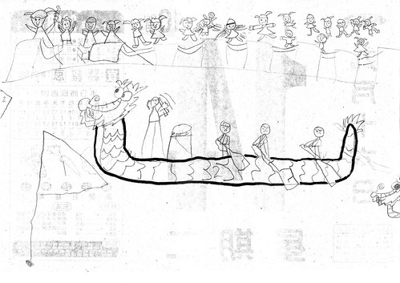

端午節前夕小子問我 想要他畫什麼好讓我可以帶到辦公室貼 我說都可以阿 他說那我畫龍舟送你   然後難得的花了好一番時間且難得細緻的畫了下面這張畫送我

 (原圖連結:  [http://www.flickr.com/photos/hmchen0328/3639639573/sizes/o/](http://www.flickr.com/photos/hmchen0328/3639639573/sizes/o/) )

阿徹的畫畫風格向來都是拿著彩色筆大辣辣的"揮毫"  且都會把整張紙添滿色彩 且阿徹的畫常創意十足 但細緻度用心度卻有待商榷 可能因為趕著/急著去玩別的東西 做別的事 所以常草草結束自己給自己的畫畫功課 這回他難得的畫了張鉛筆畫 (雖然事後他嘗試著要拿黑色彩色筆描邊甚至上色 但在描了龍舟後便宣告放棄) 且超乎平常的認真與仔細雕琢一筆一畫

看到他的畫後發現了幾個很有趣的點 - 最右邊還畫了半顆龍頭代表另一個遠遠落後的龍舟隊 - 兩根旗子的配置還蠻有距離感的 - 划龍舟的那三個人好賣力在划喔 只有打鼓的那個人笑咪咪(比較輕鬆喔) - 岸上的遊客表情各有其趣 且人物越來越小 阿徹說因為越遠人越小阿

講真的阿母我真的很訝異也很好奇阿徹怎麼會畫的這麼好 (雖然實在有自誇的嫌疑 但我真覺得阿徹畫的不錯) 我心裏第一個想法就是 應該是最近畫畫課老師有教吧 問了阿徹"是畫畫老師教的阿?" 阿徹說"龍舟是畫畫課教的 旁邊看的人是我自己想的" 嗯~ 果然龍舟經老師指導所以這麼生動像回事 至於岸上的遊客的畫法真的跟平常的畫法很不一樣 (有機會再貼貼平常的畫給大夥瞧) 只能說小孩的畫風真的每個時期都很不一樣 而每次的不一樣都代表著小孩不同階段/時期的學習成長  蠻奇妙的感受~ 就允我這個媽封這幅畫為阿徹幼稚園畢業前夕的代表作吧! 給我們家阿徹拍拍手~~~
