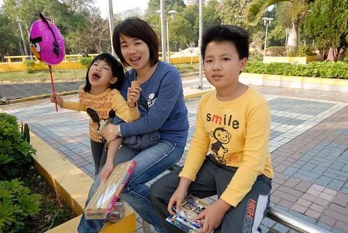

話說雖然徹愛從2歲開始上幼稚園起 早已經歷多少年的寒暑 但今年兄妹倆才算真正過了一個貨真價實的寒假 寒假的前半段 兩人每天跟著我搭捷運通勤 到青少年育樂中心上些有興趣的課程 接著全家一起環島旅行六天 還圓了兄妹倆多年來去墾丁的夢想 然後兄妹倆留在嘉義阿公家 過著沒有爸媽叨叨念的四天沒大人日子(阿公阿嬤只會寵孫) 而最後九天的年假假期 更是放鬆到高點 一整個讓他們笑呵呵 也難怪寒假的最後一天 阿徹頻碎念著"我不想開學啦~" 真的! 沒有安親班的寒假 兄妹倆過的特別放縱與開心!  

(以下就看圖說故事的替兄妹倆的寒假做個紀錄) 寒假第一個週末難得的大晴天 去了答應兄妹兩很久的動物園  我們從門口一路逛進非洲區 澳洲區 企鵝館 爬蟲館... 還第一次看到了團團員員 比我們想像中的可愛與有精神許多  只是那天的動物園大爆滿 一天下來我跟徹爸累到忍不住哀嚎 "你們大了 這大概是我們最後一次來動物園了" 真的~ 大孩子了 對於動物園的新奇少了許多   

兄妹倆的寒假都沒有太多作業要完成 主要就是阿徹的活動與家事日記要完成 愛愛的獅頭要製作 剩下的就是鼓勵每天要閱讀與運動  沒有作業要寫 沒有書要背的日子想當然爾每天很開心 除了多放寬他們玩wii的時間外 其他在家的時間兄妹倆就是卯起來玩 玩扮家家酒  玩一堆有的沒的 而最常玩的還是樂高  愛愛做的小女生  阿徹做的紅綠燈停止人 

因為寒假完全的沒參加幼稚園的安親班 於是我上班時就近讓徹愛到我辦公室附近的青少年育樂中心上些有興趣的課程 第一週時 兩人早上一起上三小時的疊杯競技課 (阿徹其實很想上街舞可惜一直沒勇氣) 原先我跟徹爸一直對於疊杯這樣的才藝課很不以為然 但看到兄妹倆每天開心說著課堂上的比賽多有趣 以及兩人刷刷刷的如表演特技般的變化堆疊著 讓人感覺似乎真的很有趣  同時第一週下午阿徹去上一直喜歡的動力樂高課 而愛愛則去上了她期待許久的烏克麗麗課 擁有自己一把琴的她 每天回家後捧著琴彈阿彈  雖然音色還很零零落落 但據說是班上年紀倒數小的她表現很不俗 深得老師喜愛ㄋ 希望她能如老師結束課程時交代她的 要一直練習喔~  而第二週的前兩天 則是媽媽一開始就很堅持一定要他們參加的攀岩營 這兩三年的寒暑我一直慫恿阿徹參加攀岩營 可是小子一直很沒勇氣 難得今年妹妹符合資格可以一起去 我當然用盡手段讓兄妹倆一起去攀岩 結果沒想到原本喊著自己膽小會怕的阿徹反而食髓知味 兩天結束後高喊著"太好玩了 以後還要參加" 而一開始躍躍欲試的大膽愛雖然也說好玩 但卻也說以後再也不要參加 不過看著兄妹倆可以這樣一起行動 回家後還有共同的話題講個不停 真的很有趣也很一舉數得!

下面是活動結束後Y17所PO的照片: 兄妹兩分到同一小隊 兩人一臉認真的聽帶隊老師說話 真的很有參加營隊的FU阿 (話說我以前也超喜歡參加營隊 玩團體遊戲的)  兄妹倆形容 總教練超級神的 還能在空中倒立 我想這些攀岩高手絕對在兄妹兩心中留下"英雄"的身影  第一天去接小孩的時候 剛好看到團隊攀爬比賽的最後 遠遠的 看著小女孩背影 我想那應該是愛愛 而小女孩一開始爬不太上去的模樣也讓我更確定那是愛愛 只是幾分鐘後再看 小女孩爬到兩三樓層高的地方了 我看著背影想我應該認錯人了 小不點愛愛沒這能耐的 我又看了好久 直到小女孩平安落地 轉頭反身的那一刻 哇塞~ 真的是我家愛愛耶~  想不到小手短腳的愛愛竟能爬這麼高 阿母我內心真是無比興奮又欣慰阿  而看到照片後 我更能深刻感受到攀在上面的愛愛是有多麼專注 多麼努力  我沒有親眼看到阿徹的攀爬 據他形容"爬的時後就會不自覺的一直往上爬 可是等到要下來時後突然覺得好恐怖"  而阿徹很棒的第一天就爬到4/5的高度 第二天甚至達到最高的地方 大概有4-5層樓的高度 對於走吊橋會發抖的阿徹來講 能有這樣的表現真的很出乎我的想像  雖然據兄妹倆的說法 沒什麼技巧 就是找可以踩可以握的地方 然後就一路上去 但我相信那是需要足夠的認真 努力與毅力才能達到的 (據說有像阿徹這樣的小男生因為不夠勇敢與認真 被老師吊在上頭一個小時都哭了 不過最後還是達到一定高度)  最後拿到證書的兄妹倆開心的不得了 回家一整路上吱吱喳喳的  很棒的營隊體驗 給兄妹倆的寒假留下美好回憶 

結束營隊後 休息一天跟著媽媽上一天班(當然是媽媽辛苦開會趕工 而他們被打發的看了兩部電影) 然後是我們家的年度大旅行 六天的花東外加墾丁 最後玩到兄妹期待好些年的墾丁 兩人開心到爆表  之前總說自己的夢想是去墾丁玩的愛愛(每次聽到愛愛一臉認真的說起自己的夢想是去墾丁就會覺得很妙) 幸運的在冬天時分還能在墾丁玩到沙 踏到浪 圓了夢想的愛愛想當然爾是有多麼的開心與滿足 尤其又買了件她超喜歡的南洋風味小洋裝  旅行的第三天 兄妹倆就說快要忘記家裡什麼樣子了 可見他們有多麼享受於旅行中 而同時我跟徹爸則難以想像他們還要再過10天不在家的日子 到時候會不會把所有台北的家裡與學校都忘光光了....

旅行的最後一天 順道經過嘉義把兄妹倆放在嘉義跟阿公阿嬤單獨生活幾天 兄妹倆開心的打著如意算盤 可以如何不受爸媽限制的縱情在阿公阿嬤的寵幸中 只可惜礙於兩人旅行最後high過頭犯了些錯誤以致得接受不能接受阿公阿嬤小禮物的處罰限制 話說同時阿公阿嬤也早已盤算好要帶小人去買玩具 討好他們 這個處罰有多考驗爺孫兩方 可以想像.... 即時中間過程兄妹倆有在電話中大哭喊著想我們 希望我們早點回嘉義 但很高興那些天 兄妹倆給阿公阿嬤帶來了可以跟姑舅們說很久的甜蜜回憶  過年期間 徹爸所有的兄妹姐妹們都陸續回到嘉義 頂著明明還飽的肚子  大夥一起吃鱔魚麵是阿徹的重要過年儀式與回憶之一 果然就像阿徹說的 鱔魚麵要大家一起吃才好吃~ 阿公兩天花了快兩千元請這些孫子們吃鱔魚麵果然是值得的ㄚ..(阿公買的超暴發戶)  年初三還難得的跟著陳嬤的兄妹姐妹一起回陳嬤在阿里山下的老家(嘉義番路鄉)  小村落一年一度的大熱鬧 讓城市小孩開了眼界  雖然不太習慣 但這是小學生難得的社會課實際體驗阿  熱熱鬧鬧的 今年的年真的分外有年味  今年的年還有一樣足以紀念的大事 就是阿徹會玩大老二了 我跟徹爸還是覺得很不可思議 我們的小孩竟然已經大到會玩大老二了 嘖嘖嘖~ 雖然一切起於同樣是小四生的萱萱姐姐教導  但難得有機會受到這麼多舅舅們的指導難怪學習快速阿... 好笑的是 幾天後阿徹還真的跟我們玩大老二賭錢  第一盤就賺了他爸爸30元 我的4元 雖然徹爸說的"讓你的" 但阿徹堅信那是他的好運氣 好賭氣阿 阿徹的賭徒生涯在今年被啟動了!!!  從旅行開始到年假間 天氣都很好  兄妹倆超級喜歡南部的好溫度好天氣 也因著好天氣 去了好多趟的公園 還跟徹爸玩了好多的飛盤  回台北前 我們更是大放送的讓她們去公園玩彈珠台  好手氣的愛愛換了喜歡的小禮物 開心的不得了  同時還帶他們去盡情的逛玩具反斗城 百貨公司玩具部  只是得花自己的零用錢  哈哈~ 從照片中阿徹把玩的雙手就可以知道當下的他有多麼掙扎阿 很高興他都忍住了 把錢一直累積下來打算買他想買但還不夠錢的小樂高 我們不只一次稱讚他"真的長大了" 但同時我們也不太看好他能撐多久就是了....  而兩次都用小金額買喜歡小玩具的愛愛則一整個開心 直嚷"我這個年真是大豐收 得到好多禮物喔" 果然每個人的標準不同 快樂也就不同... 不管怎樣兄妹倆都有想清楚 都不懊悔自己所做的每個決定 就都是件好事  兄妹倆的這個寒假真的超乎我們原先想像的充實與快樂阿 也難怪向來總是期待開學的阿徹今年一反常態的哀號著"我不想開學阿" 真的! 這個寒假真的有讓人喜歡~~~
