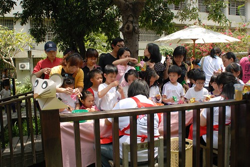

五月是光輝的月也是忙碌的月 有著各校的校慶活動也有著跟兩邊爸媽吃飯的來回奔波 或許這就是我們這年紀這身份所面對的責任義務吧 難怪人家說三四十歲是夾心人　年紀越大小孩越大越能體會箇中點滴...

參加完校慶活動的那天　阿徹問我為什麼今天是校慶阿 咦～好問題耶... 為什麼不是開學的九月或是新學年開始的七月反而是個很難理解的五月 而且還很多學校都在五月哩　這就怪怪哉了.... 後來我只能跟阿徹說　因為要在開學前先成立學校做準備阿 幸好阿徹接受了我的答案...

記憶中自己並不是很喜歡小學 現在兒子上小學了　透過兒子自己重新體會小學的人事物 老實講自己依舊不喜歡小學 但幸好小孩子的適應力其實比我這大人好很多... 自己也沒有想太多　因為覺得這就是小孩成長的一部份 必須經歷的部份 所以只能像徹爸常跟阿徹說的那樣＂你就看著辦吧　Good Luck＂ 我們相信不管怎樣都有學習有收穫的 就像在台北市的跟在鄉下的　在美國的跟在台灣的 不同的生活　不同的學習　不同的成長　不同的快樂　不同的幸福 努力的做自己能力能做的事就好.....

幾週前阿徹學校的'莒光小子'就已經高掛天空 每天開心的跟大家打招呼

前一晚上我跟徹爸看著活動單討論老半天 '到底該幾點到校ㄋ' 單子上寫著家長8點50即可到校 又寫著10點20要領小孩 咦...到底要幾點到阿?! 後來我們還是在九點左右到達學校 到的時候已經人聲鼎沸 活動開始

進入校園後很快就找著一年級坐的區域  可是黑壓壓一片上哪找自己小孩阿 就算後來看到阿徹的班上的小菁老師了 要從萬頭叢中辨識岀自己小孩還是很困難的一件事

而且在層層人群之後也看不清場上正進行的活動 實在無趣 於是我們便前往阿徹班級所在的二樓 從二樓望下去的四年級健康操表演果然有壯觀  原來這就是小學的'氣勢'阿....

我們偷偷去看了阿徹的教室

永遠第一排的阿徹現正坐在第一排正中央的位置(椅子掛著紅色包包) 看了看他的抽屜竟然出乎我們意外的不是太亂 還算整齊哩

教室後方的成果牆...依著座號展示著每個學生的作品或作業

看著教室裡雜亂甚至有點髒亂的模樣 忍不住想這就是小學阿 呵呵... 還是覺得很不可思議 自己的小孩竟然已經是小學的一份子了 現在每每人家聽到我有小孩而直呼不可思議時 我總愛再補上句'我兒子都已經唸小學了' 哈哈~因為就覺得自己似乎還挺年輕的阿 可是小孩卻已經唸小學了 小學給人家就是覺得孩子已經夠大 好大了阿!!!

後來我們又更上層樓到三樓看操場上活動的進行

看的認真的小愛其實想的是想找到他的阿徹哥哥 '要哥哥...'

對愛愛來說小學應該還是遙遠的事 可是愛愛很愛跟著哥哥一起唱莒光的校歌 甚至常說著'哥哥 以後我去莒光 你要帶我去...你要...'之類的話

小妮子其實超級崇拜也依賴阿徹哥哥的說

在三樓遠處觀望的太無聊 徹爸還是忍不住帶著愛愛下到操場找小孩 沒想到竟然還真讓他們拍著阿徹了 聽說徹爸站到阿徹班上隊伍的最後面時 愛愛那高分量又極易辨識的'哥哥'  果然讓阿徹給聽到 回頭衝著比YA

看著妹妹的阿徹應該也跟愛愛一樣開心吧

YA!  父女倆任務圓滿成功

真佩服徹爸就這樣扛著愛愛去找阿徹 這是媽媽永遠比不過爸爸的地方

後來輪到一年級的保齡球趣味競賽時 徹爸竟然也照到阿徹了

猴利害阿~

或許是因為人太多的原因 也或許小學就是這樣吧 我們不是太喜歡 也不習慣這樣舉辦的活動  (看來是真的被幼稚園給寵壞了)... 好不容易艷陽下孩子們曬了二個鐘頭後  校慶大拜拜結束小孩子退場回教室

因為接下來的活動得由家長領著各自參與 ( 沒有家長接的小孩只能待在教室) 所以教室門口外擠滿了準備接小孩的家長們

小朋友排隊領了外出單及老師親眼看到家長後才能離開教室

然後到校園中參與園遊會形式的各項攤位活動 (老實講我很懷疑這樣的攤位能夠應付全校5-6千的學生嗎)

中庭裡的攤位以科學類的創意遊戲為主 像這個是創造出龍捲風的瓶子

還有酒精瓦斯槍

阿徹排了10來分等著玩瓦斯槍 最後竟在只差一個人次時被擊出煞那的聲音嚇的說他不要了

雖然他好奇的直想嘗試每一個攤位 可是艷陽高照加上每個攤位排隊的人都好多阿 我們極力的勸說他回家休息去

最後在麥當勞中餐的交換條件下 阿徹總算願意提早離開 離去前留下一張'第一次'的紀念照

只是...只是...要離去時在校門口一旁的閱讀園竟然正有著說故事活動 阿徹小愛的腳當然就又被黏住了.... (幸好這裡有大樹遮陰 不用再辛苦的頂著烈陽)

故事聽完 阿徹看到閱讀園的摺紙闖關活動當然又是想去的嚕

於是阿母我只好領著闖兩關: 摺紙& 裝飾

就是要先摺岀這樣的'東西南北'(是這名稱嗎) 然後再做主題造型

阿母給他有夠認真吧!!!

阿母努力又認真的幫愛愛完成了一隻小老鼠

而阿徹也獨自賣力的完成他自己的小老鼠 最後在小舞台前留下美麗的見證....

只是這麼一耗竟然一個鐘頭過去了... 不過閱讀園這一小角落的活動是今天校慶活動裡最讓人滿意地 (這角落也是阿徹平日下課最常遊玩的地方)

中午十二點校慶活動結束 這就是阿徹的第一個校慶 小學生辛苦了 小學生的爸媽也辛苦了...
