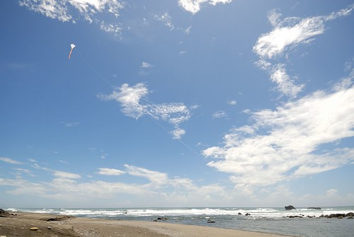

握在手上的風箏 希望它飛的高 卻也擔心一個不小心線斷了 風箏飛了... 上週末  兄妹倆第一次在沒有我們的陪伴下 出門搭接駁車 進百貨公司買溜溜球 雖然哥哥每一個階段都有打電話回家報平安 但在家裡的我們卻無法平常心的睡午覺 一個多小時後 順利買到妹妹心愛溜溜球的兄妹倆 開心的回到家 那一刻 四個人總算都鬆口氣 但徹愛的臉上卻也散發著"自己好棒"的光彩 那天晚上入睡前 躺在床上的我 想起兄妹倆獨自出門的模樣 還是覺得好不可思議 我們總說時代不同 但是不是父母的我們自己也設限太多... 小學生 其實沒有想像那麼脆弱 或許 父母的我們該是更勇敢 更堅強 去相信你知道他長大了的孩子!
