自從去年七月去澄清湖棒球場看全壘打大賽後 我跟徹爸心裡便一直念著全家去看場真正的棒球比賽 夫妻兩人空講了好幾個月 好幾個可能的場次後 總算在六月初成真了~ 雖然不是我們原先最想看的猿象組合 但起碼是我們一直想親臨的桃園國際棒球場 原先徹爸還碎唸著現在的賽程不緊張(=>不好看) 但後來才發現今日是獅隊的可能封王日 所以雖然比賽或如徹爸所說的不精彩 但觀眾們的加油與最後封王的彩帶 卻也讓我們大開眼界且著實的享受到敲棒吶喊的快感! 雖然我們加油的是落寞的那一隊 進場看球就如進廳看舞台劇一樣 都是很棒的過程享受! 真高興我們也有了第一次.. 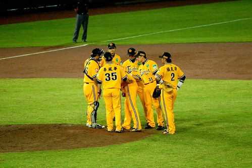 

那天的天氣有點陰 但如果沒下雨其實是個看球的涼爽好天氣 因此我們臨時決定去看球 所幸還能買到位置不錯的票(雖說現在看球人真的很少) 準備進場看球的我們 心情難掩興奮 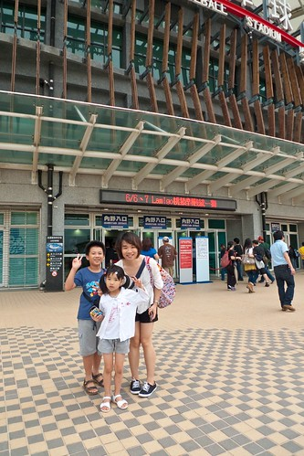 如劉姥姥進大觀園 很久沒看球賽的我們真是好奇又開心 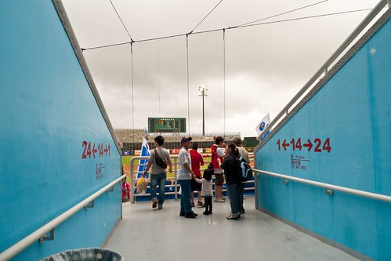 之前打算看球時 徹爸還曾上網研究了一下桃園球場的座位區 我們坐在G區 一壘休息區的上方  這樣可以就近看到進出的兄弟球員 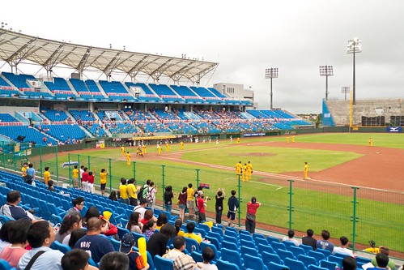 難得來大場子的愛愛忍不住皺起她的眉頭  不知是疑惑還是緊張 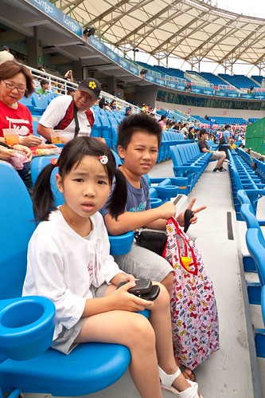 球賽還沒開打 兄妹兩卻是先開始"野餐"起 一人一罐大可樂 這可是平常完全不會有的事 加上啃著烤肉串 大人打發小孩的意圖非常明顯 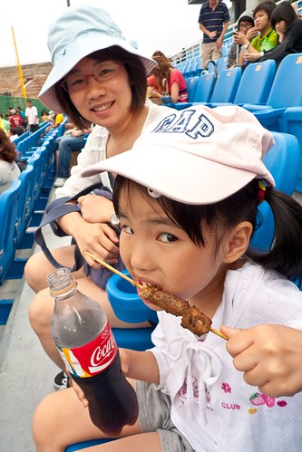 等到球賽開始 一家子可要努力的替兄弟象加油 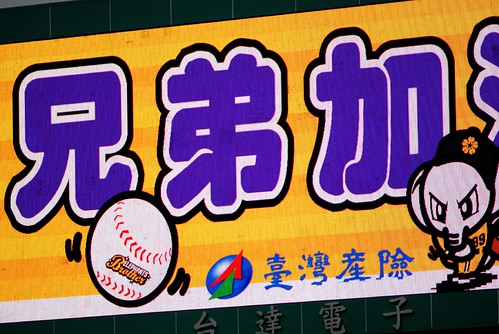 徹爸說今日先發投手是今年最夯的本土新秀投手 很多年沒關心中職的我果然是不認識 更別說整個兄弟隊中 我能叫出名字的選手 三根指頭都數的完 不過那一個個教練 我倒是有都認得 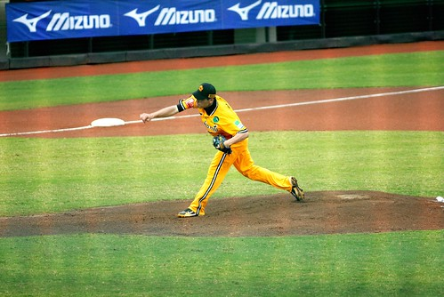 其實今天的敵手是徹爸最不喜歡的球隊 但今日看球重點不在輸贏 也不在技術 純粹是來感受球場熱鬧氣氛 一切就不計較了 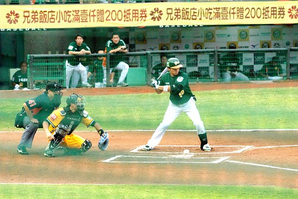 今日等著上半季封王的獅迷們 幾乎坐滿三壘一樓看台區 而加油的拼勁與聲勢 更是讓第一次看比賽的徹愛看的嘖嘖稱奇 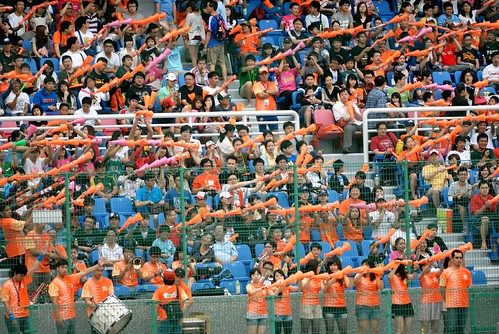 雖然一開始就讓敵手先馳得點了 但我心裡總是想 "最後一定會逆轉的 老天爺一定不會辜負我們的" 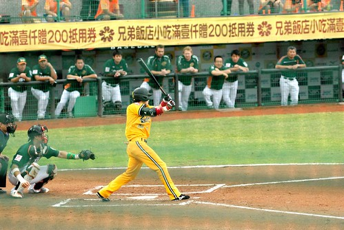 只是兄弟象那串不起來的攻勢 卻是讓我們一局局的失望 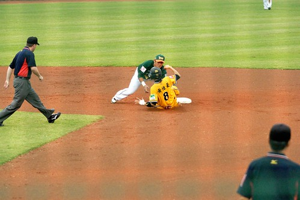 其實棒球是個冗長甚至會有點沉悶的球類比賽 尤其我方是防守方的時後 因此我們完全不敢期望徹愛能專心看完比賽 想說沒耐性的話就到邊邊人少的地方讓小孩走跳就好 只是沒想到結果卻跟我們預想的完全顛倒 阿徹完全的沉浸在比賽中 每一個下半局都奮力的拿著加油棒跟著大家敲擊吶喊 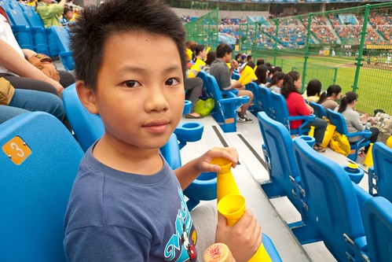 而愛愛則是第三局不到就開始喊著好無聊 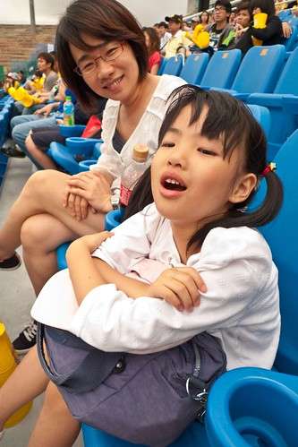 於是拿出帶來的卡片玩耍 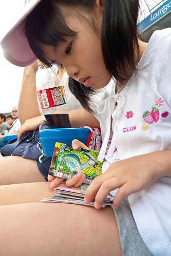 卡片玩膩了 那就來吃便當拖延點時間 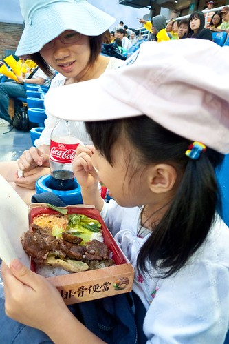 在球場吃便當對徹愛來講很新鮮 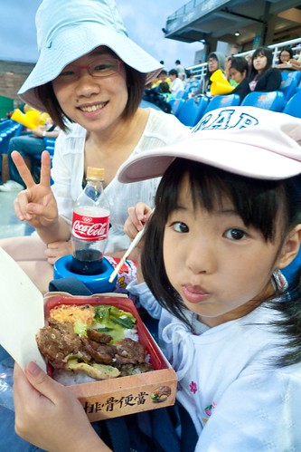 雖然便當冷了 天空還飄著絲絲細雨 但異常美味 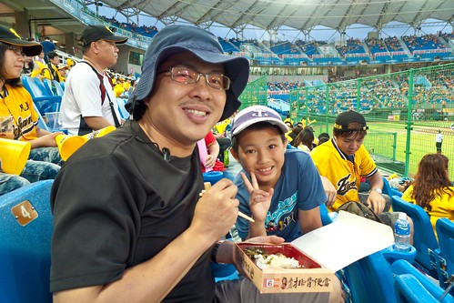 只可惜桃園球場沒有場內走動販售人員 不能在位子上買爆米花 買汽水讓看球少了一味 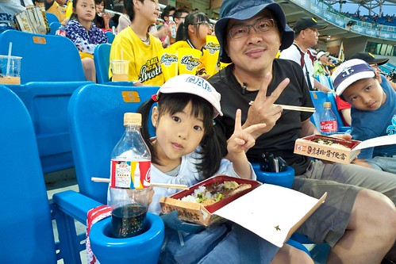 吃完便當愛愛又開始喊無聊  為了振奮她於是答應中場休息時帶她去買新型的加油棒 結果後來買了個嗩吶?還是該說是小喇叭的"加油器"回來 (就是在球場內發出叭叭叭的那個樂器) 還真不能小看這樂器 沒有點技巧跟中氣還真吹不出來 起碼我一次都沒吹出來過 不過愛愛練習個幾回後竟然就吹得有模有樣 只是每次吹完臉都脹的紅咚咚 鼓鼓的 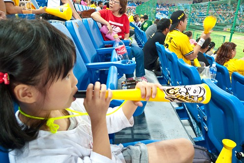 有了新玩具 愛愛也開始沉醉於比賽中了 愛愛吹著她的新玩具 阿徹用著跟了我們10年的加油棒 一起為兄弟加油 一定要逆轉阿~~ 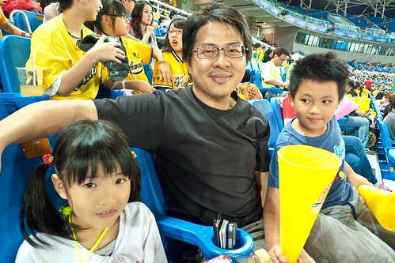 只是兄弟的安打數沒少人家很多 怎麼分數卻越差越多 棒球果真是團體運動 打線沒串連一切都是枉然阿 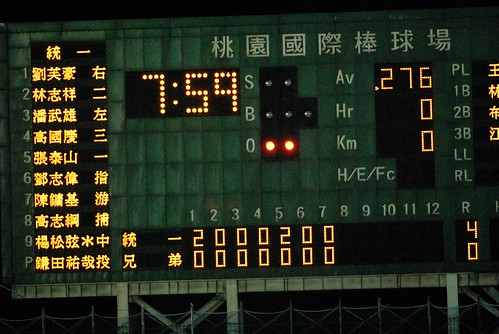 看著分數 心很冷 而一陣一陣的雨  讓時時得打傘看球的我們感覺更是冷 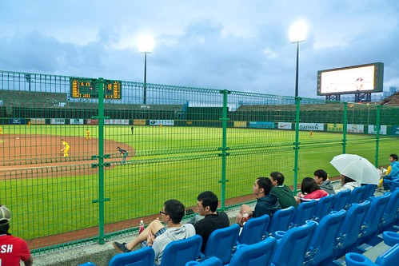 兄弟 要加油阿~  花花今日的打擊不錯 可惜後繼無人 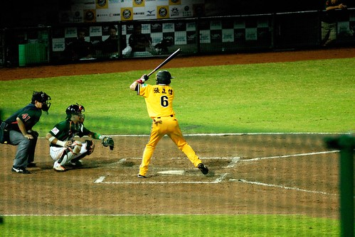 我唯一最熟悉的球員 恰恰 可惜今日沒能看到他的好表現 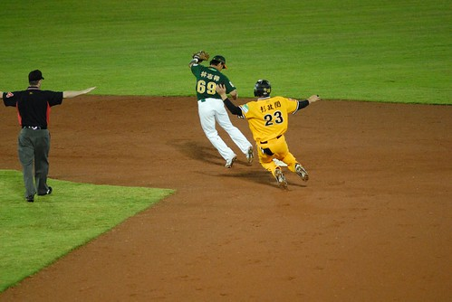 有一度雨下的好大 讓人想躲到沒雨的地方 甚至回家去 但還是想期待兄弟的逆轉 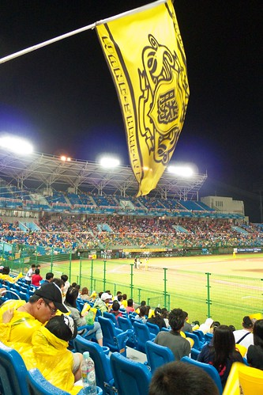 換坐到後排較高位置的我們依然奮力的加油著 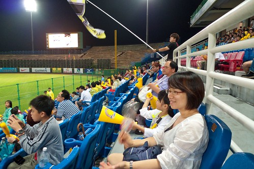 只是唉~ 唉~ 唉~ 好吧! 就算逆轉不成 那留下來看人家拋彩帶也好 畢竟這是第一次有機會看見球場上的拋彩帶 雖然是我們不喜歡的隊 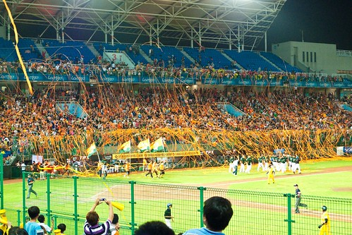 只是看著人家拋彩帶 拿冠軍 心裡還真是有點小失落 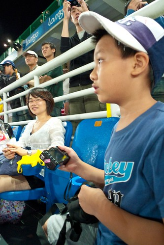 獅隊放煙火 開香檳慶祝奪冠的同時 我們離開球場回家了 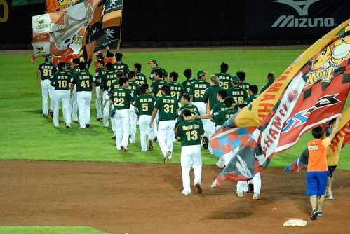 其實對於輸贏不熱衷的我們也並沒太在乎比賽的結果 而且就如我一開始就說的今天我們是來熱鬧的 來感受比賽氣氛的而已 只是很久沒有擊棒吶喊的我以及第一次看球賽的徹愛 我們加油的很開心! 我說應該像舞台劇一樣 一年都該來個2-3場比賽的 愛愛開心的說"OHYA~今年我們還可以去看一次~" 嗯~希望這個球季還能再去看場球 下回也要去不同的棒球場... PS. 話說我發現球員們的球衣比在電視上看的要來的白皙 挺拔與有型揶
