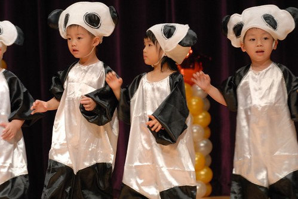
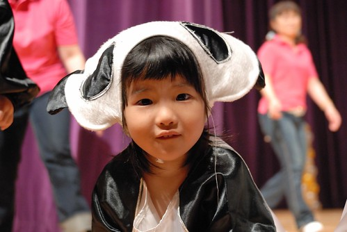

如果說阿徹的表演是熱情奔放   那小愛的表演應該就是害羞矜持吧 不過小愛的認真度可是一點也沒輸哥哥喔...

在阿徹班上的開場表演之後  緊接著登場的就是寶寶熊的帥氣小牛仔們

這回表演除了一樣的靦腆外 小愛似乎多了很多分的緊張感

看她站在舞台上那緊繃的眼神 緊抿的雙唇 我竟然也跟著緊張了起來

不過幸好該拍的地方 小愛一拍也沒少 節奏感果然也是比媽媽好很多 應該都是遺傳自徹爸的吧

表演結束拍照時總算露出一點點的笑意 但還是害羞阿....

休息兩個節目後接著是舞蹈初級班的表演 曲子是輕快的哆拉A夢主題曲  對小愛來講跟的比較辛苦一點

雖然動作因為緊張拘緊及來不及跟拍子顯得不是那麼"完全" 但小愛還是照著自己的節奏 認真的做著每個"小"動作

鑒於上回阿錡跟阿嵂兩人在舞台上槓起來  這回舞蹈老師刻意的把兩人分置最左與最右 只是跟阿錡配對的愛愛似乎有受到影響  偶而跟著呆了 呵呵

覺得這套舞衣很漂亮 讓女生像個小公主一般 但小愛那不小心露出的褲頭讓人忍不住遺憾"哎呀~ 難得這麼美的衣服..."

公主裝+帥氣的三七步 讓我覺得還挺酷的哩

搶搭動物園團團圓圓的熱潮(戶外教學也早已去看過團圓嚕) 最適合裝可愛的寶寶熊寶寶們一隻隻的被打扮成貓熊模樣了 一字排開的大陣仗貓熊寶寶很吸睛 惹來台下一陣驚訝歡呼聲 就像園長說過的 寶寶熊只要一排站上舞台就是"笑點" 不管做什麼事或是什麼事也不做都讓人覺得"可愛"

貓熊寶寶們在台上表演貓熊一天的生活: 裝可愛 洗臉 擦嘴... (愛這臉洗的還真有點嚴肅哩)

表演中 小愛的嘴巴大概是她"表情"最豐富的地方

這好像在彈琴吧 ...

坐下來時依舊嚴肅的過貓熊的一天

總算在看到台下轟場笑後 露出了一點點得意的笑容  但還是害羞

貓熊坐下來幹麻?! 重頭戲勒~ 一群貓熊寶寶前滾翻 你有沒有看過? 就算翻的東倒西歪 卻把今日表演的"笑"果帶到最高點 聽說小朋友練習幾天後好不容易大家都學會翻了 可是卻在表演前兩三天試穿表演服戴上帽子後 大家又都不會翻了 於是大家只好再接受戴帽子前滾翻的特訓

貓熊也會這樣像小貓"喵喵"叫嗎?  呵呵

表演結束總算 小愛總算放鬆的笑了

跳的太high的阿綺不小心栽跟斗撞頭在台上罵罵號 不過還是很勇敢很棒的繼續在台上

愛愛雖然因為緊張 動作顯得有顯放不開 但回家後再仔細觀看她表演影片發現 她真的很認真的在做每一個動作 尤其當最後其他的小朋友都已經亂成一團或是呆成一團時 她還是"堅守崗位" 且一臉認真的做好自己的每一個動作 看著那畫面我忍不住大笑出來  真是太有趣的寶寶熊 而看過影片的美賢說"不管左邊右邊的小朋友怎麼亂 小愛就是自己認真的跳自己的  她以後一定是一個不會隨波逐流的好小孩" 哈哈!  美賢阿姨的結論下的很好笑

Video 1 [http://myvlog.im.tv/?id=5761313&mid=322793&MemberID=&inIMTV=Y&album=0&playnext=0](http://myvlog.im.tv/?id=5761313&mid=322793&MemberID=&inIMTV=Y&album=0&playnext=0)

今天的音樂發表會我跟徹爸一樣忙碌於座位與台前間 我甚至因為跪錄太久 當晚出現"疼腿"現象 幸好這已經是最後一次這麼辛苦啦 今天九月阿徹上小學後 就很少有這類的活動了...

