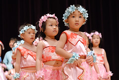
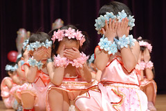
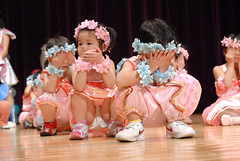
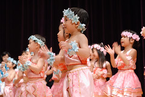
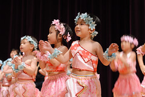
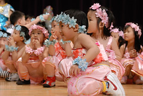
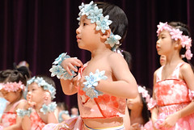
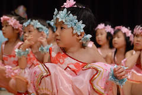
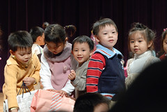

聖誕活動表演結束  
阿徹生活早已回歸平靜 彷若此事從沒發生過  
但為娘的我卻還沉浸在這驕傲的喜悅中  
覺得阿徹這模樣真的超像頭戴桂冠的古希臘人  
  
  
  
那天還有一件事讓我很感動(其實是笑翻了)  
  
全園小朋友們表演結束後 等待著聖誕老公公的出現  
瞧...他們用小手認真的遮住眼睛 等著1..2..3..  
   

聖誕老公公到底出來沒  眼睛可以睜開沒  
有小朋友忍不住偷看了 但還是有人認真的遮住眼睛  
  
  
哇~總算出來了  
  
  
伸長脖子 眼睛努力的跟隨聖誕老公公的身影  
  
  
小朋友再度蹲坐 排隊等待聖誕老公公的禮物  
視線還是離不開聖誕老公公 猛看猛望...  
  
  
到底還要等多久阿 大家都在等 都在看...  
  
  
換好衣服 總算輪到咖啡熊排隊拿禮物了  
  
  
哇~真好 每個小朋友都有聖誕老公公送的禮物  
覺得小孩子真是幸福  
享受著聖誕老公公帶給她們的等待 驚喜與禮物  
  

