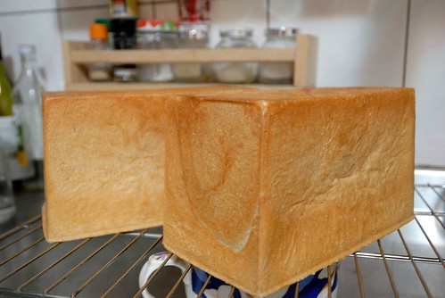

忙碌的生活中 簡單是最好的方法與態度 吃的簡單 用的簡單 想的簡單 連快樂也簡單 只是簡單似乎是"知易而行難" 尤其在這日新月異的科技時代 經濟發展時代 我沒有任何宗教信仰 但我著實相信聖嚴法師所說: 接受 面對 處理 放下 能這樣 就真的可以很簡單了

吃的方面 常常越是簡單的東西越令人回味與難忘 也最是能嚐到幸福的滋味 大學住宿台中時 我最愛買的零嘴就是白吐司 常邊看電視邊啃著一片片的吐司 而到現在我最喜歡做的麵包也是白吐司 不論是簡單白白的吃 還是烤的酥酥脆脆吃亦或抹上果醬吃或是鋪上蔬菜焗烤著吃 都很好吃... 只是怎麼最愛自家麵包的人還是我自己...  偶而會有些洩氣... 總算我的"簡單"麵包獲得最難養愛愛的青睞 上週愛愛吃著出爐沒多久的麵包 邊吃邊不可思議的大喊著"媽媽 你的麵包怎麼這麼好吃 我以前都沒有發現..." 乖孩子~ 阿母更有動力 努力做麵包了~~~  

BTW 今天在FB的PO文: 去年買過的"新社蜜柑" 真的很好吃喔 連我那挑嘴的老闆都讚不絕口 上週問我有蜜柑了嗎 我說網路上還沒看到訊息耶 接著老闆用很"家常"的口氣說"如果是我 就會打電話去問" 是是是! 小的趕緊打電話去問... 昨天接到新社蜜柑對去年客戶發出的簡訊通知 我用FB回覆感謝並多說了一兩句話 結果今早收到她們很有感而發的分享 我真的好喜歡這樣直接跟農夫買而產生的交流與感動:

因為蜜柑一年只有一次，從小苗到大樹，為了蜜柑，已經有好幾年錢是只出不進，而最近這3年才好不容易開始有點產量，但是卻欠缺的是推廣，只能任盤商宰割，雖然去年有你們，賣掉1/3了，但還是2/3賣給盤商，是全家人花好多時間照顧的，不想在這樣被賤賣掉了。所以我把工作辭掉，專心回來幫忙家裡(所以我現在是米蟲XD)。

其實我對於我們家的蜜柑是很有把握的，只是欠缺讓人知道， 雖然說去年有買買氏的大力幫忙，對於買買氏(他跟我說了很多)，以及對於支持的妳們，我也非常感謝，但我總想著要如何讓人對於我們家蜜柑更多信任、更多認識，所以花很多時間在粉絲團上，希望透過紀錄詳細的栽種過程以及整理更多關於蜜柑的資料，讓大家了解蜜柑。

為了推廣，去年還參加420小時課程地方特色推廣行銷課程學習美工軟體，(這大頭貼標章就是這樣來的XD)，之後還去參加FB舉辦的演講，如何讓更多人看的到自己的優勢，如何經營等等之類的，這些的一切都是為了我家的蜜柑。

當然，這也是有去年你們的鼓勵稱讚，不然看爸爸已經這麼老了還要這麼辛苦，然後還要被盤商層層剝削，都想叫爸爸不要在做下去了.....。前年有嘗試網路上賣，但凡事起頭難，結果失敗了，絕望中看到買買氏經營的直接跟農夫買，讓我看到希望。

謝謝您們，讓我們看到有繼續做下去的動力。也希望你們能多多幫我們推廣喔>////< 。

咦@@，不知不覺跟你囉嗦這麼多，不好意思>///< 可能看到您說的太有感觸了，一不小心就講一大堆 不要介意阿，呵呵呵XD

有興趣買蜜柑的朋友 請參考下面網址: [www.facebook.com/notes/%E6%96%B0%E7%A4%BE-%E9%98%BF%E7%94%9F%E8%9C%9C%E6%9F%91/-2013%E5%B9%B4%E8%9C%9C%E6%9F%91%E9%A0%90%E8%B3%BC%E9%96%8B%E8%B7%91%E6%91%9F-/533175043373879](https://www.facebook.com/notes/%E6%96%B0%E7%A4%BE-%E9%98%BF%E7%94%9F%E8%9C%9C%E6%9F%91/-2013%E5%B9%B4%E8%9C%9C%E6%9F%91%E9%A0%90%E8%B3%BC%E9%96%8B%E8%B7%91%E6%91%9F-/533175043373879)
