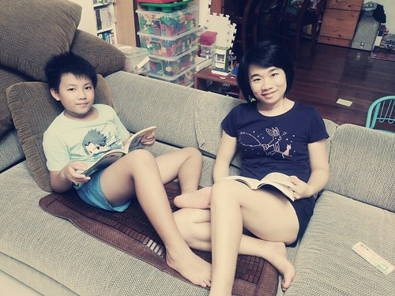

這一週 小學生開學了 日子總算回復到習慣了的生活節奏 而我的心也總算回復往常的怡然 徹爸應該是感受最深的人 因為不用再像暑假時那樣看我臉色過日子 (前陣子真是難為他了) 我想我果然是適合把更多時間與勞力放在家裡的人!

跟著小學生的作息 每天晚上多了好多的閱讀與聊天時間 而日子在過也更加覺得踏實與快了~ 

最近因為胖子麵包事件  勤於做麵包的媽媽們越來越多了 常在FB看到朋友po可口美味又健康的麵包照片 我自己則是如常的一兩個禮拜做一次麵包  放在冰箱冷凍庫裡以備不時之需 當天出爐的麵包 肯定是最美味 所以做麵包的隔天 徹家的早餐一定是麵包 但經過充分攪打與發酵的麵包 冰凍過後再吃其實一樣的很好吃 所以徹媽偷懶想晚點起床時 早餐也會是麵包 但我與徹愛很喜歡且肯定三兩下就清潔溜溜的早餐其實是剛起鍋的煎餅 義大利麵煎蛋餅 加了蔥花或有的沒的米蛋餅 或是蔬菜煎餅.... 再搭配杯現打香蕉牛奶或現煮鮮奶紅茶  這個早餐就好飽滿  其實日子可以不用那麼依賴大部分是進口的麵粉 可以像古人那樣"大中華以米食為天" 真的~ 沒事多吃米 多吃米沒事~ (ㄟ...米好像也有事件 但家裡吃的是直接跟農夫買的好米 嘿嘿) 
