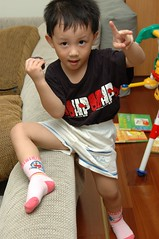
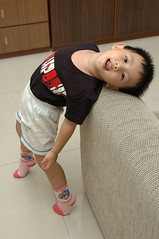

阿徹好像從小就喜歡紅色  
甚至還延伸到粉紅色 芭比娃娃(因為是粉紅色的)  
他常說"我覺得紅色很漂亮耶"  
若再問他為什麼覺得紅色很漂亮  
偶而他會說"因為紅色很清楚阿"  
ㄛ~的確是清楚又閃亮的紅色

有時候帶他去逛街買衣服  
他會對紅色衣服多投以關愛的眼神 "這紅色衣服好漂亮耶"  
而我們常以"那是女生才可以穿的衣服啦"來拒絕他  
有次當他又說"我以後要當女生"時 我追著問"為什麼想當女生"  
他說"因為女生就可以穿紅色衣服"  
ㄟ...  
有次也不小心被我試探出 他對於女生的裙子有著高度興趣  
而我們也承諾他若妹妹長大後 妹妹的衣服她穿的下我們會讓他試試

唉~跟徹爸實在擔心阿徹日後會不會有"性別"的困擾  
雖然我跟徹爸都算是明理的現代人  
但~真的還是會很難接受哩

前幾各週末陪著爸爸去賣場買襪子時  
阿徹看到A夢襪子很開心 要求要買  
好ㄅㄟA夢迷 就讓他有雙A夢襪子吧  
只是阿徹竟然很堅持的要買"粉紅色的"A夢襪子  
我改變不了事實只好把決定權交給徹爸  
而徹爸竟然也尊重了他兒子的決定  
回家後阿徹迫不及待&滿懷開心的穿上他的襪子  
還很開心配合的讓徹爸拍照  
看到他這38模樣 真的是哭笑不得

很撩人的姿勢吧

晚上睡覺時他又堅持要穿著睡覺  
而且還拉到小腿肚上  
我開始擔心起 明天會不會要穿出門上學  
因為是我帶阿徹上學的 所以徹爸在旁揶揄一附等著看好戲的樣子

隔天上學前 阿徹應該有考慮要穿襪子上學  
但是我說"穿去上學會髒掉 就要洗了 晚上就不能穿著睡覺了ㄛ"  
他才沒再多看他的襪子 幸好~ 我忍不住鬆了一口氣

可是晚上爸爸找他一起去燦坤時  
他又說要要穿他的紅色襪子出門 他說"我覺得很漂亮阿"  
不管我怎麼威脅制止"男生穿紅色襪子出門會被笑笑喔"他就是堅持要穿  
而且紅色襪子還搭上了他的藍色A夢"拖鞋"  
真的是給他俗..俗..俗..俗到最高點  
真是難為徹爸了~

隔幾天當徹爸又起鬨問他"要不要穿紅色襪子出門時"  
他說"穿出去會被笑耶"  
    "而且穿出去會髒髒耶"  
哈哈~我總算洗腦成功  
而那雙紅色襪子在陪阿徹睡了幾晚後 目前正被棄在房間的一旁  
徹爸說"趁現在趕快收起來吧"  
哈哈...........
