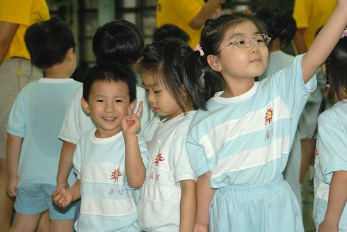

阿徹班上有10隻大蜜蜂 7隻中蜜蜂 4隻小蜜蜂 (大中小班)  
4隻小蜜蜂分別是阿徹 Ella Apple (下圖由右至左)還有Thomas  
聽說他們平常感情超好的 超麻吉的  
尤其是阿徹 vs. Ella Apple  或是 Thomas vs. Ella Apple   
好笑好玩 想分享的 阿徹都會想到Ella 跟Apple  
問他"那Thomas 沒有嗎" 或是"怎麼很少聽你說跟Thomas玩"  
阿徹會說"Thomas都會生我的氣 不跟我玩 " 或是"ㄎㄧㄤ 我也不知道耶"  
據老師的觀察 Ella個性溫和少有脾氣  Apple個性大剌剌不記仇  
反倒兩個死腦筋的男生間常為了一點小事鬧脾氣  
也因此兩個男生反倒都跟另兩隻小女蜜蜂比較好  
而且還曾經為了女生爭風吃醋  
話說前一陣子Ella因病在家休養頗久    
有一次阿徹看到Apple 跟Thomas 十指緊扣看卡通 醋性大發   
從中拼命想要撥開兩人之小手  豈知兩人不為所動  
於是阿徹就到Apple的另外一邊 牽著她的另一隻手  
然後三人幸福甜蜜的看著卡通   
聽Freda講述此段故事時 我們兩人差點沒笑昏  
也許她們年紀尚小 尚未有男女朋友的觀念跟差別   
但地盤顧的很緊喔  
  
這次運動會我跟徹爸總算見識到這幾隻小蜜蜂間的情誼了  
  

整隊集合時 三人湊巧的排了在一起  然後開始七七褚褚  
還會用雙手碰摸著對方的臉頰示意(還是示好)  
徹爸拿著鏡頭要對著他們照相時 阿徹還積極的揮著(拍著) Apple 要他看鏡頭  
  
  
  
看的出來阿徹的心情真的很好 真的很好  
有這些麻吉 難怪他每天放學回家時都這麼開心  
  
  
  
不過阿徹的個子真的超小的  
小蜜蜂排排站就像個四階的樓梯(Thomas卡在Apple與阿徹間 不過也跟Apple差不多啦)  
也許長大後只能透過相片 回憶這些兒時玩伴  
但能有這些好朋友 好同學一起學習 玩耍 分享   
真的是件令人放心又幸福的事  
  

