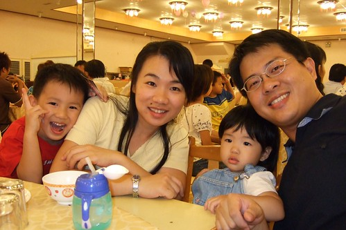

從日本玩回來後的這一個月裏 徹爸拿出小兩的次數用一隻手指頭都數不完  
徹爸說 照到怕了 處理照片也累到怕了  
但前幾天徹爸總算講出真正的原因...  
他不想讓那些在日本拍的精華照片就這麼的被新照片取代了  
有點好笑的理由 但卻也可以理解他這樣的心情  
老實說日本旅行的點點滴滴還在我們心裏頭激盪著(尤其還惦記著那些還沒寫完的注解跟遊記阿)  
而疲累似乎也像烏雲照頂般的久久揮之不去  
累啥???不知道哩 就還是一整個累   
加上最近我與徹爸各自工作上的忙碌  
中秋假期的南投 嘉義 板橋 新莊幾地奔波 累上加累....  
昨晚在陪小孩睡覺時 我與徹爸第一次兩人同時陷入昏迷狀況  
誰也救不了誰....只好兩人一路從小孩房 昏睡到客廳沙發 書房地板  
兩人真的很像累到撞鬼  有點無奈有點好笑  
  
最近跟徹爸的計算日子方式變成 "真快已經玩回來一個禮拜了"  
"哇 已經過了一個月了"  徹爸還補充說明說"1/12年了"  
哇~1/12年 很恐怖的數字哩  轉眼間就快要過年了  哈哈~  
不過講真的起碼再過2個月 2/12年小愛就滿兩歲了   
快~真的快~ 時間用想的真的都過很快~  
  
(為了嗷嗷待哺的阿徹與小愛  兩老可要撐著點阿)  

