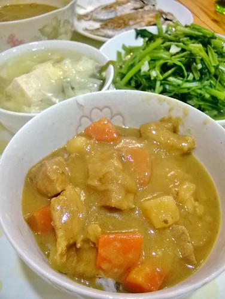

上個禮拜 大家肯定都因為北捷事件而震驚 難過 惶恐尤其事件發生在我平日下班搭捷運的時間與路線 真的著實嚇毛了我們新聞上 FB上 好多譴責嫌犯父母的評論與教養教條的發表其實 教養小孩真的很難 雖然父母是...

隨著愛妹這學期也參加週六早上的足球社團 加上原先徹哥週六下午的球隊練習 我們家現在的週六常是哪也去不了的宅在家 於是剛好讓我與徹爸好好窩在各自的角落 忙著事 一整天的時間讓我更能充分運用 為接下來的一週生活做準備 從早餐的麵包到晚餐的醬料食材準備 甚至那天三餐的全部吃自己 常常待在廚房裡幾個鐘頭過去 或是守在爐邊細心"呵護"鍋裡的豆漿與燉煮時 我會想 當媽其實不難 就是付出時間 用勞力與體力來交換 交換自己對媽媽這個身份的無愧 對自己的安心 當然還有名之為"愛"的踏實 但簡單嗎 當然不簡單! 除了真得要"有心" 還得長時間累積"有力" 然後才能得心應手又樂此不疲!

六年級生的我們 從小看著爸媽辛苦勞力工作的背影長大 現在 我們的小孩很難明白每天在辦公室"對"著電腦的爸媽工作能有多辛苦 講真的 也真的很難讓她們體會 那起碼 媽媽在廚房揮汗煮飯 爸爸萬物都可修的一幕幕 是我們可以留給徹愛的背影!

自從發現網路流傳的好厲害吳寶春牛奶吐司配方後 每週我總會打上一公斤麵粉 做兩條半兩吐司外加好些個加或不加料的小餐包 簡單的吐司是我們最喜歡也最能在早餐變化的麵包 四 五個小時的製作 發酵 等待 換得一週早餐的豐富營養 值得嗎? 起碼很習慣...  在卡士達麵包畫上大太陽 配上一杯波菜濃湯 那早自己心裡頭暖洋洋  夾上生菜 嫩蛋與培根的吐司 配上一杯鮮奶茶 是每次不敗的最簡單早餐  心血來潮自製漢堡包模型  小漢堡包夾上亂亂醃豬片 這天的早餐好澎...  放假的週六早 除了說涯給 還真想不到形容詞形容的現做豆腐肉排 讓我們的小漢堡更是澎拜到高點阿!  雖然老爺說似乎少了外面早餐店的一個味 但謝謝小人很挺老媽 直說"很好吃ㄚ~" 真的! 我也覺得清爽的飽足與滿足  不同於平常日晚餐的四菜一湯 週五的夜晚與週末 端上桌的卻往往是一人一大盤 是簡單吃 也更多時候是為了變化口味的更搞缸 每次以為沒有什麼的一盤也總是讓我們最後吃到撐而心滿意足 只是這樣下來 我們也越來越沒吃外面的能力 一樣的東西寧可在家自己來 省了荷包也免卻踩到雷的空虛感...

停了一兩年沒包的水餃 在一天心血來潮的狂想吃煎餃時又再現餐桌 煎的恰恰香香 剛起鍋的湯汁還會燙舌的自家版煎餃 果然完全擄獲我們的心  最近發現了一樣好物 在COSTCO買的黃金芝麻醬 有了這一瓶 吼~小人每週五問著明天可以吃那個好吃的麵嗎 就是那個有黃瓜 有蛋 涼涼又甜甜的麵..  阿母懂!  就是那個可以有好多菜又有肉有蛋的芝麻醬涼麵  熱熱的天 吃著涼涼的麵  闔家歡心又還可以清冰箱  阿母也很愛這味~  不同於日系的涼麵 炒義大利麵是另一系列常端上桌的麵食  常常菜比肉多的一大盤麵  因為培根香以及起士粉的加持而讓小人大呼美味 再配上一碗蔬菜濃湯 這一餐好color也好豐富 而這麼炒幾盤後 阿母越來越能啥都放的亂亂炒義大利麵 讓我們在家吃自己的能耐又提升了...  同時 中式口味的炒麵 炸醬麵 哨子麵也會臨流上場  穿插在我們週末的亂食中  雖然吃了很多麵 但每天也還是要吃飯  只是一樣秉持一大盤或一大碗公的端上桌 炒飯 燴飯  丼飯  咖哩飯  而不管哪一種飯 搭上一碗凍豆腐味增湯都是絕配! 我的廚房功力隨著這一盤盤累積著 一家子吃自己的習以為常 以及家的味道也在一盤盤間加深記憶著~
