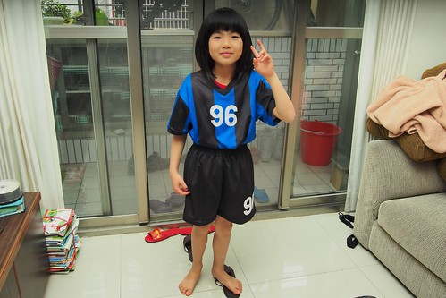
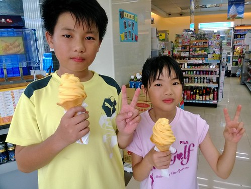
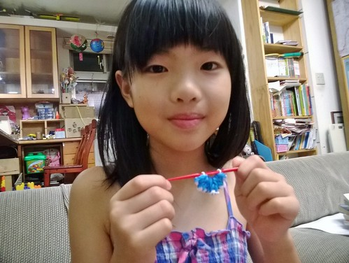

話說愛愛期待升三年級很久了... 因為升三年級就可以換班級換老師 她幻想著可以遇見徹哥的書羽老師的那樣老師 其實愛愛也很是喜歡她的低年級生活與導師 只是她常說如果可以上學開心點會更好 不過在一二年級導師嚴格的要求教導下 愛愛的寫字與學習基礎(規矩)是真的有打下基礎 而且身為老師好助手 同學好幫手的她 做事情的方法與態度也學習許多 也因此不過念二年小學 我們卻感覺愛愛又成長許多 真的就是那句老話"吾家有女初長成" 女兒一年年讓父母感嘆"怎麼長大了!(就快變別人的了)" 

相較於前幾個學期的成績 愛愛這學期的成績單漂亮許多  尤其是向來較弱的國語 英語與閩南語難得的優等 讓她看得心滿意足 沒有安親班的加強也沒有我們的主動介入 愛愛這學期要求自己在每次的國語聽寫小考前自考 閩南語課後與徹爸練習 以及英語的略勤於聽CD 因此看到自己的努力反應在成績上  難怪她會那樣開心 (巡迴美讀前在家的練習)  不過令我更開心是導師對於愛愛的評語 一個活潑 積極 有想法且樂於表達與助人的小學生 雖然因為不夠好的成績總讓她覺得自己不聰明 但絕對是爸媽心中的No.1 

下面就藉學期中累積的照片 一張張細嚼與紀錄愛愛的二年級下學期 受徹哥踢足球的影響 愛參加了學校周六的足球社團 一大群毛男孩中 屈指可數的四位女生 表現一點都不輸男生  領到社團球衣的那天 愛愛就如哥哥第一次穿上隊服那樣興奮  甚至還發願以後也要加入足球隊  參加足球社團後 兄妹間有更多的話題與共鳴 偶而一起去公園踢球  還一起熬夜看了世足冠軍賽  這是父母我們掺不上的部份  也因為越來越喜歡運動(愛愛在班上是運動前二強的女生) 愛愛的食量與體重也相較以前明顯增加著  所以我很喜歡跟她說 我好喜歡看你喜歡運動 大口吃東西的樣子  每每她總笑瞇眼的回應我的喜歡  吃著最愛吃的奶油餅乾  吃著一支支不同口味的霜淇淋 我們有些擔心越來越好胃口的愛愛會不會上三年級後也跟徹哥一樣壯了起來...  愛愛受徹哥的影響真的蠻大的 變得喜歡看漫畫就是其一  總算看懂火影忍者的她 也迷上了火影忍者漫畫  也總算可以加入大家的火影忍者話題討論 更是無時無刻只要有漫畫就可以放鬆(還是該說是安靜ㄋ)  就像這張照片 明明前幾分鐘還穿著幼稚園圍兜自己玩著角色扮演遊戲 下一分鐘就又能切換成無人境地的漫畫模式 擔心愛愛一直當著哥哥的跟屁蟲 沒有屬於她自己的喜好 於是順著小女生橡皮筋編織風潮  阿母第一次主動買這類東西而且指名給愛妹  暑假中在我與徹哥的陪伴切磋下  跟著影片的步驟  愛愛編了好些條漂亮手環  

 雖然大半編過就忘 但編織過程的理解與耐性 我覺得算是挺好的寓教於樂玩具  暑假中 兄妹倆也瘋狂的把圖書館裡的漫畫搬回家(喔 借回家) 從柯南 海賊王 烏龍派出所 我們這一家 到敖幼祥的四格漫畫... 雖然偶看到兄妹倆沉迷的模樣 我會氣急敗壞 雖然看到"應該"的閱讀越來越遠離兄妹倆 讓我有些沮喪 從小刻意培養的閱讀習慣就這樣漸漸枯死 但也只能努力的調適自己 漫畫也是種閱讀 如果閱讀的目的是在於休息與獨處 不過我還是會偶而塞些文字給兄妹 對胃的就會如這套名偵探 讓我與愛愛努力把全套書從各方圖書館蒐集而到 

這半年 我們漸漸放手讓兄妹在家自己照顧自己 在"互信"基礎下 讓兄妹更多自主決定時間的運用 電視的選擇與生活的方式 老實講 這對父母的考驗比較大!  但很高興 我們有正走在好的方向...  這個夏天 我與愛愛努力要一起當馬尾妹迷死徹爸  把頭髮留長的愛愛 相較短髮的猴樣 真的多飄幾分美麗味  穿著學生制服 夾上髮夾  假仙氣質不輸女高中生 (聽說這張照片模樣超像媽媽)  尤其遺傳自徹爸的瘦長腿 讓愛愛也越發明白自己這優點而樂於表現  雖然愛愛不承認 但媽媽有小小覺得愛愛心裡有著那麼點明星夢 尤其她自拍時的從容自信樣  她自己也自戀不已  所幸女兒再怎麼變  還是每天窩在我們身邊的傻女孩  常問最愛的媽咪"你知道我好愛好愛妳嗎" "我為什麼這麼愛你阿"  是爸爸越來越不掩飾且常掛在嘴上講的"我們家的公主"  挾著公主之姿 完全把老爸感情戲弄於鼓掌之間  是上輩子的情人 一點都不假  雖然最愛不是老爸 但最愛她的是老爸阿!  始終如一的 阿母不會吃醋 我喜歡這樣的我與徹爸的女兒! 
