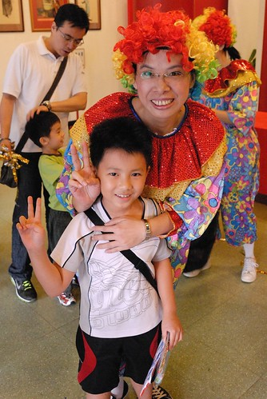

真快! 兩年前那個令我們全家惶恐擔憂的小一新生轉眼間已經結束他的低級小學生生活了 小學的2/6就這樣過去了.... 照這樣的速度 我想可能過沒多久便又可以再聽到我感嘆著中年級結束 小學整的結束了... 總結來講 阿徹的低級生活沒發生什麼了不得的事 也沒什麼大不了的事發生 就是規律與平凡但是快樂又健康 對於這樣的過程與階段結果 我們雖未十分滿意但有十一分的欣慰! 

前陣子看了看自己這兩年來寫的低級小學生日記 有幾點發現 1. 阿徹真的大到有看見 月半了不少 2. 經過兩年小學洗禮 一樣的好動 調皮 鬼點子一堆 (有關這 我就真的相信這是"天性") 3. 四個學期四張成績單長的都好像 一樣的學習等第 大同小異的老師評語 或許該欣慰老師好眼力一下子就看看清阿徹這小子 但也或許阿徹真是好個貫徹始終 兩年所有好的跟不好的特點都保持住了!  最後一個學期 導師的評語如下 "積極閱讀課外讀物 閱讀態度值得嘉許 善於美勞創作 富想像力 作品出色 偶而在著色時缺乏耐性 應付了事 日常表現有些小迷糊 但對新鮮的事物勇於嘗試" 導師一如以前 特別的提及阿徹的閱讀習慣與美勞創意表現 看的我更是欣慰阿徹有維持住這兩件好事  沒枉費我平日的嘮叨 "媽媽不要求你字要寫多美 考試要考100 我只要你做好該做的事 該吃的吃 該睡的睡 該玩的玩 而且喜歡閱讀 喜歡運動就好.." 寫到這 我自己突然發現也是洋洋灑灑的哩 跟開頭的"我只要你.."有點衝突 呵呵! 不過我相信當這些化為生活的習慣 甚至態度後 真的就是沒有什麼的...    

下面瑣碎的寫下我們對於阿徹的觀察與想法 而穿插的圖片則是我覺得很有趣的阿徹造句單 學習單或是閱讀單 (學校的寫作訓練 老師會引導且只要把範本當中的幾個句子替換掉即可 不過對於低年級來講還是個苦事)  雖然阿徹放學後得去安親班呆到6點才能回家 但是因為沒有安排任何課外的英文課或數學課學科  只有他超喜歡的繪畫與黏土才藝課 阿徹在安親班只消把他的回家功課寫完 隔日要的背經或考試準備好 其他的時間便可以閱讀或是跟同學玩 阿徹的安親班生活還算是愜意沒有壓力的...

(阿徹這兩年的安親班Apple老師 與我們想法蠻相近且阿徹很喜歡她 每次做了什麼好吃的阿徹便常念著 可以帶去給Apple老師還有她們家哥哥姐姐吃嗎)  (阿徹安親班最喜歡的同學 園長兒子 小三的Yellow)  不過阿徹也特重視他的回家後生活 回家後除了簽聯絡簿 檢查作業的時候 其他時候 他是怎樣都不願意再花丁點時間在學校的課業上的 也因此每天在學校 在安親班 阿徹總是努力地把他的當日課業完成 就算功課很多時間很少也要想盡辦法完成... 而首當其衝的當然就是字寫的潦草 雖然對於潦草的作業我噹歸噹 擦歸擦 (這時後就是母子間的角力大鬥法  不過如果是徹爸看作業就沒這問題 徹爸常笑說給他簽名比較好應付 因為徹爸都只簽名不管內容) 但其實我還蠻佩服阿徹這點的 我覺得人某些程度的不要太ㄍㄧㄥ是很需要的人生態度 所以只要那天沒惹到阿母的話 我是可以接受把標準從80分降到70分的 只是前陣子的一件事 又讓我真正見識到阿徹對於這件事的堅持度 5月的時候學校在招考直笛團 有點興趣的阿徹猶豫著要不要去報名考試 雖然他說考試的曲子還不會背有點難 但真正讓他卻步的卻是 "直笛團都是早自習團練 這樣我就不能利用早自習寫功課了 早自習對我來講很重要 很好用.." 阿徹邊搖頭 邊感嘆的對我如是說....  聽的我哭笑不得 只能回答"你自己想清楚就好" 不過阿徹現在一心想要參加扯鈴隊 我問如果是早自習練習的話 那怎麼辦 阿徹說" 沒關係 因為我真的對扯鈴很有興趣 真的很想參加扯鈴隊"(他還跟我強調是扯鈴隊不是現在週六的扯鈴社團) 原來是對直笛的興趣還沒強到讓他願意犧牲早自習 而對於扯鈴 阿徹可是做好吃苦的準備ㄋ 很好! 越來越清楚自己的喜好與對事物的取捨了! (阿徹如果能考100分 那個嘴角應該會比他畫的還要上揚)  那不用管課業的夜晚及週末 阿徹怎麼過ㄋ? 就是跟小時後一樣的 每天跟妹妹在家裡大玩 玩到每天的遊戲區滿木蒼遺 收玩具的時間比拿玩具的時間還要多很多 不過除了這樣的大戰外 不可否認阿徹也多了很多安靜的時候 例如每天飯後來個1-2本火影漫畫 那20分鐘裡專心地 沉浸地讓人看的也好羨慕.. 也例如三不五時拿著直笛樂譜練習著直笛 甚至在被罵而情緒不好時 自己躲進房間裡大哭一場 然後吹個直笛宣洩情緒 恢復平靜的回到客廳裡... 我們跟阿徹說 你越來越懂得打發時間 越來越懂得享受 也越來越學著調適自己的心情了! (阿徹的圖畫裡常會出現我們家的場景 途中便是遊戲區的櫃子與她們的書桌)  阿徹的小學是板橋的明星小學 常有所聞對於作業的恐怖要求 雖然阿徹的導師中規中矩 沒有少做也沒有多做太多 但很欣慰起碼不會"壓榨" 就是符合我們期望的讓阿徹小學生活 正常與平凡 但是我們很是欣賞學校對於音樂 閱讀與體育的重視與安排 每週一次的音樂課 讓阿徹在不知不覺間竟也學會了數十首的曲子 而且樂於學習新曲子 並且三不五時來個一曲自愉  我覺得這就有達到學習音樂的目的 ( 不像我小時候一直夢想著學鋼琴 但又怕死了學校音樂課 所以音樂只能一直停留在對於鋼琴的幻想與遺憾)  而閱讀方面 學校除了有每周一堂的閱讀老師導讀且介紹好書外 班級的巡迴書箱讓阿徹常可帶書回家與我們分享 遇到他喜歡的書時 甚至交代我要念給愛愛聽 而閱讀恆星的認證 則讓小朋友讀完約莫50本還幾本的書後 可以獲得獎狀並接受表揚 為此阿徹還第一次朝會時上台領獎ㄋ 只是這認證的過程中 阿徹一如以往的堅持他自己的作法/風格 1. 堅持每週只寫一本(老師有交代的時候)   每次我跟她說你有看什麼什麼書也可以寫阿 他就一付很麻煩的樣子跟我說"不用啦 而且你說的阿 有閱讀習慣就好了"  ㄘㄟ... 明明是自己懶惰 不想在那小小的格子裡用一兩句話介紹這本書... 2. 獲得一張認證後 我說你可以拿新的單子繼續累積阿(他有同學已經獲得好幾個認證)  他又搖搖頭對我說"有一張就可以了啦  你說的阿....(我就不用重複了)" 真的是喔 Orz! 真不知道是天生還是後天環境造成這樣的想法...或許都有吧!  不過我們真的比較重視 當阿徹無聊時會想到拿一本書看 而當我們在看書時 他也可以靜靜的在一旁看著書 至於那些有形的東西 就順其自然吧! 

學校的體育課除了暖身操 跑步 外 各學期都有不同的學習重點與目標 一上是跳繩  一下是呼拉圈 二上是桌球自拍 而二下則是...(哇勒 熊熊還寫不出來) 這學期結束時 阿徹拿了個體育老師給的禮卷還是啥活動的參加卷  說是老師給的 只給三個體育好的同學 而阿徹是其中一個 以前徹爸一直覺得家族沒有運動細胞 阿徹的運動神經應該不甚好 但這兩年體育課的多方追逐跑跳訓練下來  加上下課後的常往操場跑甚至跟同學玩足球 阿徹的肌肉越來越發達 對運動的興趣也越來越濃烈 而每天在學校這樣的跑跑跳跳也難怪阿徹的胃口越來越好 體格也跟著越來越壯碩了 我們跟他說 你現在這樣叫壯不是胖 可是要小心以後沒運動的話就會變成胖子了 阿徹聽了伸了伸舌頭 ....  真的希望他可以持續這樣"愛動"下去  每次看阿徹的照句單 我常會被她句子的內容或是一旁的插畫給逗笑 小子的想像力還真是蠻豐富的 尤其那配合其中一個句子所畫的插畫常有畫龍點睛之效果 雖然每次月考時 照樣寫短語跟造句都讓阿徹吃足苦頭 因為少標點或錯字而被扣好多分 而阿徹也曾嚷著說 他要把老師念的或是老師訂正過的句子給背下來 這樣考試會比較好 但阿徹每次寫造句時好像還是會像阿母寫blog時一樣 字很多上身 自我表現的一發不可收拾 呵呵! 沒關係 人生考試的日子還很長...慢慢會抓到要領的... (這個氣象報告 我覺得挺絕的)  阿徹一直很喜歡畫畫 但除了安親班那不算畫畫訓練的畫畫課外  阿徹並沒有受過專業美術的指導 寒假時 讓阿徹參加Y17美術班的美術創作與油畫營 算是阿徹的第一次正規訓練 當時老師跟我說 阿徹很有創意也可以做的很好 但耐性不夠時那個作品表現就落差很多 而阿徹也抱怨著 老師都要我塗滿 要我.... 不知道是不是因為這樣 這個暑假再問阿徹要不要去上美術營隊 阿徹猛搖頭 他寧可還是在家裡 在安親班的才藝課裡開心的畫 想畫什麼就畫什麼 而不想畫的時候不畫也沒關係...  (阿徹很是滿意他畫的這幅種西瓜  他很得意他連路燈還有滿天星星都有畫喔)  

上面講的好像都是好笑的 好的阿徹 但其實阿徹還有著很多的惡行惡狀  例如迷糊 敷衍 調皮 愛哭 睡覺不認真 不感興趣的事不認真 不以為意的事不積極 而被打屁股 被處罰想當然爾也是家常便飯的事 只是小子情緒來的快 去的也快 加上不記仇 哭一哭之後依然笑咪咪一尾活龍 所以我跟徹爸總在被氣過的心平氣和時 捏捏阿徹跟阿徹說"你喔~" 這個你喔背後的情感 我想即使過了20年 我們還是會記得的  在現今的社會 在台北這樣的城市裡 我們絕對算是排在前面的不積極爸媽 阿徹的生活中 與我們的相處中也還有很多的摩合與學習等著 但我一直深信且欣慰阿徹朝著一個正向的方向走去  起碼不是個離我們期望與能力太遠的路 阿徹~ 接下來的中年級請繼續加油!  用你的方式!! 用我們家的方式!!! GOGOGO!!! 

