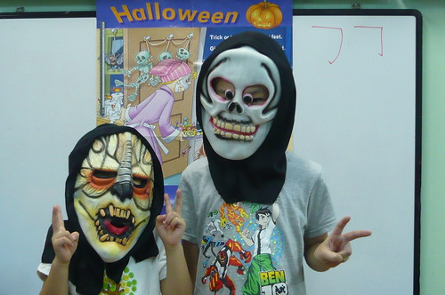
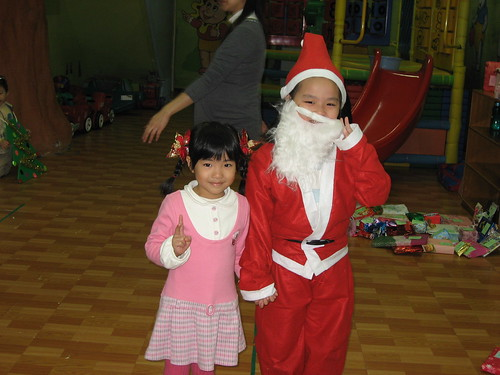
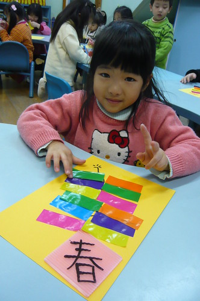
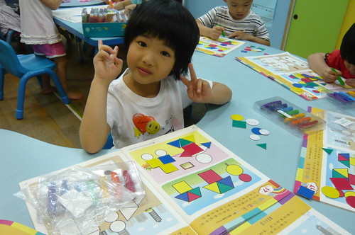
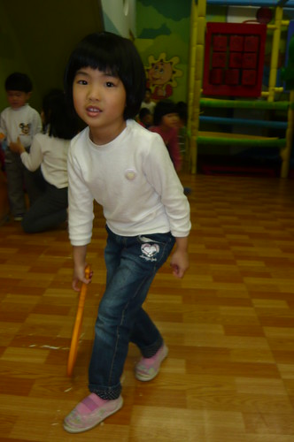

常聽人說''看別人養小孩都過很快'' 其實自己養小孩更會覺得日子過的超級無敵快... 而那個小孩本身 我想應該也覺得日子過很快吧!  怎麼轉眼間變成小三 變成大班的大姐姐了!! 

小孩子每天玩耍的日子從星期一很快就數到星期四 然後一家子常不約而同的喊著'好快! 明天就星期五了 再一天就又週末放假了' 週五的夜晚更是興奮著'好開心! 明後天不用上課了' 可以做什麼玩什麼.. 而週日的晚上則依依不捨著'怎麼這麼快就又星期一啦!' 一週一週這樣過下去 不知不覺便是一季又一季 然後是一年接著一年... 尤其跟著幼稚園過一年當中的每個節日 更是讓人深深感受到時間的流轉阿~

2010年的八月 愛愛從小班升上中班 這是那一個夏天的學校玩水樂  那一天愛愛在家裡穿好泳裝 清涼又招搖的這麼去上學  九月中秋節到了 做應景的蛋黃酥  戴應景的柚子帽  甚至還假裝自己是嫦娥奔月裡的那隻無辜兔子  接著是光輝的十月  好像準備上街頭遊行的群眾  小孩搞不懂族群 搞不懂中華民國跟台灣的差別 只是猛開心的喊著'我們國家的生日快到了耶!'  光輝十月的最後是嚇死人不償命的萬聖節 面具一遮都看不見我們家的愛愛了  可愛版的面具造型... 可是還是很難找到我們家的愛愛 .........................................................................................偷偷提示很黃的那個  每年的上街頭搗蛋遊行因為天雨只好改在學校各班級教室間瞎搗 紅色系的咖啡熊 有那麼點扶桑花的味道  十一月有愛愛的生日 愛愛吃到想了一整年的生日蛋糕 雖然礙於壽星人數太少 所以只有小長塊的蛋糕 但是愛愛好開心她有吃生日蛋糕 長一歲了!  十二月緊鑼密鼓的練習著聖誕晚會表演  喜歡跳舞的愛愛舉手頭足間越來越成熟有自信了  在聖誕鈴歌聲下送走了2010年  剛過完個新年 便又要忙著準備農曆年嚕  想想中國人真幸福 有兩個年可以過 從聖誕節一整個歡樂到農曆年 一年的1/6沉浸在這樣的歡樂中  春聯 鞭炮 煙火全都來了 濃濃的年節氣氛  吃完年夜飯 領過紅包後 這年還一路再過到元宵節完才算結束喔  而就這樣 日子就又馬上到三月了 這一個月總算正常沒事些了 不過這是個容易生病的季節 要多注意身體!  四月兒童的月 有多歡樂那就不用說了 而短髮公主愛愛也更是在大中小混齡的咖啡熊班混的如魚得水 大小通吃阿!  四月的歡樂還沒完 趕緊又接著準備感恩的五月  那兩週每天一物 讓我這媽媽都快吃不消 不過小孩子很樂 因為送的東西大半都變成她的了 尤其是那小手環 小項鍊... 而五月裡還有接著的音樂發表會與運動會 讓媽媽累的好充實! 果真是媽媽的月阿!  六月 七月 天氣熱了起來 而學期也準備進入尾聲了 跟著小孩這樣過一年 真的過很快!  以前看著阿徹幼稚園班上的女生長大 有著很深的感覺 就是小女生在中班以後好像會突然的成熟 長大了起來 外表好像因為身子拉長了 體態柔美優雅了 所以不一樣了 而那個腦袋 言語 進退應對之間 也好像開竅 甚至開始成熟了 起碼在我家愛愛身上 為娘的我真有這些感覺 得承認 我跟徹爸對她的寵愛多一些 很愛像愛愛小baby時候 那樣抱著她 跟她說著'你以前還這麼小 你以前怎麼樣...' 不知不覺間 小baby都已經是個"類"亭亭玉立的小少女了  老人家常說小孩子那麼小就唸幼稚園都唸老油條了 但老實講 現今的環境下 尤其又在台北 我真覺早點上學並沒什麼不好 關鍵只在於父母的態度與選擇 選擇讓小孩處在什麼樣的環境 受什麼樣的影響 學習什麼樣的事物 我一直很喜歡也很感恩晨暘讓徹愛每天在健康快樂下學習成長 但得承認或許因為從阿徹兩歲到現在已經六年了 對於幼稚園年復一年的大同小異活動真會有點疲乏 甚至有些難搞了起來 但我始終相信這學校是考量我們家總總條件與需求後 最適合的選擇 而且能看到愛愛每天這樣開心的上下學 嘰嘰喳喳的說著學校的大小事 這樣就好嚕!  中班的課程開始認真的認數字 認ㄅㄆㄇ  還有資優數學 KMI腦力激發等的課程  聽說愛愛的邏輯推理能力很不錯 總是認真 快速且正確的解答出操作  另方面 中班的課程依然延續著幼小班的手指訓練 不過越來越精巧  勞作的作品也越來越美觀 像回事了  雖然感覺愛愛的創意真的沒阿徹哥哥多 但是愛愛做的東西讓人感覺乾乾淨淨很清爽(阿徹做的東西常會感覺髒髒的)  雖然畫畫主題總是女生 男生 新娘 小孩的畫來畫去  但塗色的耐心與技巧比阿徹哥哥好很多 兄妹倆在創意與耐心的表現上真的南轅北轍  愛愛除了美勞作品清爽外 對於食物料理方面的耐性與表現成果也是清爽美麗  在學校是同學的管家婆 在家裡是越來越可用的小幫手  每周四是愛愛的運動日 早上的體能課 下午的舞蹈課 那一天胃口總是特別好也特別的好入睡  小孩子在體能 趙老師的操下 各各都越來越身手俐落&勇猛  還會跳馬箱哩 嘖嘖嘖!  當媽的 看到小孩能吃能跑能跳 其實就已經好欣慰  課程裡還有電腦課  玩玩小遊戲訓練滑鼠的使用  還有音樂課 不知不覺還真會彈奏瑪莉有隻小綿羊了 

除了上面這些一般中大班的各式課程外 咖啡熊是全美班 所以每天早上都是外師進行的美語課程 只是我們從沒冀求也沒認真配合複習/應用美語 愛愛在前半年也曾經因為捱不住老師的要求 而嚷過幾次的"想要轉去一般的中班" 但好歹她還是都挺過去 且似乎越來越習慣且樂在這樣的英語學習中 只是反倒是我這媽 每每看到外師聯絡簿上寫著 "talk too much.." "need more concentrate.." "need more practic.." "need more familiar with the lesson.." 而且不是偶而喔 是10次當中有8-9次這樣 我看的壓力真的好大阿! 果然養小孩的過程真正考驗的是父母阿...  要不然撇開英文課不講 我真是喜歡咖啡熊較多元 活潑的教學  而除了學校內的課程外 還有每個月一次的或大或小戶外教學 所以北台灣的很多玩點 其實徹愛去的比爸媽還要多很多 尤其是那各式各樣的博物館  我們絕對不會去的baby boss 去了第二次 體驗當做可樂的小工還有小消防員  還換裝上台當小MODEL  超卡哇伊的偽沖繩女孩  去了醬油博物館  彩繪瓶身 直到現在每次看到這張照片 愛愛就會說一次"那裡的姐姐說我畫得很漂亮喔"  ㄟ...我不知道名稱的XX堡 很多球很多設施小孩玩得不亦樂乎  桃園某農場某童玩博物館  真的! 小孩念幼稚園後才知道原來台灣這麼多博物館 這麼多農場... 雖然戶外教學去的地方都是不是我們家平常會"走條"的地方 但是我肯定且欣賞學校這樣不怕麻煩 每個月大工程的拖著一群小孩子出去玩 讓小孩體驗不同的玩樂方式 體驗團體的玩樂方式...

而且學校最猛的一點是 每年四五月會有大班畢業旅行+中班春季旅行的兩天一夜在外過夜旅行 愛愛羨慕哥哥好多年 總算等到自己也中班也有機會跟著老師同學 自己在外面過夜嚕 旅行的前幾天 阿徹哥哥與我們便開始害怕寂寞 感覺難過 可是愛愛沒有絲毫的緊張害怕 反而情緒隨著日子一天天逼近一天天的越high 出發前一晚 我忍不住逗她"你也假裝難過一下下 讓我們好過點" 結果愛愛一臉搞不懂我們的臉 天真的說"我很快就回來啦!" ㄟ...是啦...也才34小時看不到愛愛而已  是我們自己太不夠堅強了.... 可是兩天旅行回來後 問她"有沒有想我們阿" 愛愛毫不思索的大聲答"完全沒有" 嗚嗚嗚....我們的熱屁股一整個的貼到冷臉... 莫非這就是射手女的不戀眷 無情... 直到徹爸開玩笑說"你都沒想我們 不讓你玩wii" 愛愛才開始說"我有一點想你們啦" 不過真的很高興 愛愛可以自己在外面照顧好自己而且跟同學玩得這麼地開心 就像Freda在寶寶手冊上寫的" 可以出去玩 孩子都是開心滴~ Cherry會一路和同學說個不停 唱著她們自己的歌 然後又一起哈哈大笑 high到最高點 "  中班這一年 除了各式各樣的課程學習讓愛愛的日子豐富又快樂外 與小班時分開的三個小男生 又再度在咖啡熊每天一起吃一起睡一起玩 雖然愛愛還是會提起班上其他同學的名字 但這三個男生的名字還是最常出現 每天在家裡 阿嵂長 阿奇短的... 講到阿徹哥哥都吃醋地說"媽媽 我覺得愛愛都被那三個男生帶壞 以後真的不要讓她跟他們結婚"  阿徹甚至三不五時 煞有其事地評比這三個男生哪個才能嫁 只是不管哥哥怎麼說 愛愛還是一如三年來的選擇與堅持說"我以後要跟阿嵂結婚" 而且每當哥哥問愛愛的夢想是什麼 愛愛總是說"我想要當爸爸媽媽"  看著愛愛成天跟這三個小男生在一起 加上媽媽對於英文課的壓力 掙扎了很久 我向愛愛提出"大班時 去念一般大班"的建議 勇於嘗試新事物的愛愛當然是躍躍欲試 不過只要想到那就不能跟阿嵂一起上課就會猶豫 經過幾回的反覆後 七月初的某一天我又認真的跟愛愛說明了我的考量以及我尊重她的最後決定 愛愛都聽懂 但是她為難地笑著說"可是我好難決定喔" 我問"那要不要媽媽幫你決定" 愛愛又搖搖頭說"我想一想後再自己決定" 那當下我真認為交給愛愛決定 百分之99就是繼續留在咖啡熊了 不過我還是等著一天的決定時間到後 再問她最後的決定 結果沒想到隔天放學的路上 愛愛自己主動的告訴我"我想好的 我決定去XX老師的大班" 聽的我超級地訝異 我問她"為什麼做這個決定"  愛愛說"我想去XX老師班上試試看" 那表情與語氣真是超級地肯定與"望向遠方" 而且下了最後決定的那天起 愛愛沒說任何更改或是後悔或是害怕的話  生活一切如常 反倒是我有一天忍不住問她"你決定不在咖啡熊 真的OK嗎" 愛愛用著她常會出現的淺淺笑容跟我說"會有一點點難過啦" 然後什麼也沒多說... 決定換班的整個過程下來  我跟徹爸真覺得愛愛是個真女子阿! (對照真漢子的說法)  於是我很難啟口的跟Freda說了我們的決定... 愛愛要升小班時 全園的老師應該都覺得愛愛應該是理所當然的循著哥哥的模式從小班開始念咖啡熊 可是我們讓愛愛在Jenfier的一般小班 那時候應該有跌破大家的眼鏡 Freda還笑說"沒有關係 總有一天我會等到你(愛愛)" 升中班時 愛愛總算轉去咖啡熊 那時候大家 包含我自己以及愛愛都覺得就是這樣到大班結束畢業了  那麼地理所當然... 所以這回升大班做的轉班決定 老實講連我自己都震驚 苦思著原因所在 給Freda的最後一次寶寶手冊上 我這麼寫:

Dear Freda, 首先，要謝謝你這一年作為愛愛導師的教導與照顧！ 其實一直很喜歡咖啡熊相對開放、自主、活潑與多元的教學方式，所以要做轉班這個決定，我思考很久也掙扎很久…，所以我要再次強調真的不是對你的不信任投票啦！ 思考最主要的原因就如跟你所提及的美語課，認識這麼久你應該也明白我是個不重視課業(應該算是吧)但很重視生活體驗的自然派媽媽，所以這一年中每次簽英文聯 絡簿總是讓我小小痛苦，我常問我自己這樣的"給"真的需要？真的是我們所想要的嗎？另方面，真的覺得愛愛跟那三個小男生實在太熟了，需要給點空間，去拓展 不同的朋友圈；再加上自己這一年來對於很多事有不一樣的體會領悟，覺得幼稚園這一兩年給予小孩"有形"的東西似乎越來越多，多到有點快超乎可接受範圍。因 此雖然痛苦，但我還是決定要有勇氣的做決定。 當我們跟愛愛說最後讓她做決定，換或不換都尊重他最後的決定，愛愛思考一天後，主動的跟我說"決定去 XX班，因為她想試試看在不同的班級"，很有愛愛的勇敢嘗試的精神，但我很訝異也很欣慰，愛愛有很認真的聽我們講，然後自己思考、衡量並下最後的決定。後 來我曾經問過愛愛，真的離開咖啡熊沒關係，真的捨得？愛愛跟我說"有一點點難過"然後淡淡笑著。 就如決定不參加畢業典禮時，我說"反骨"也是一種 學習，我相信去新環境重新來過也是一個值得的學習，其實小孩子的適應力往往都超乎大人的想像，反而是大人要去克服那個關卡…。前陣子，在媽媽是最初的老師 網站看到一段話很是喜歡，「幫助孩子成長是一份得先苦而後才能輕鬆或甘甜的工作，它所考驗的，並非孩子的資質，而是父母的價值觀。一個孩子能不能在言行舉 止間化紀律為自律的美感，在他們還沒有成為人生的正駕駛前，父母的方向盤掌握了真正的道路。」，與你分享! 最後還是要再次感謝你，謝謝你過去對我們全家人的照顧！ 以後還請繼續多多照顧及多多指教！

而Freda最後兩次的寶寶手冊上這麼寫 "Cherry是一個很有自己想法的小朋友 在學習上也都是認真且努力 也因如此 所以不用太多的提醒 多數的工作都能在老師的期待下順利完成 馬上就要成為大姐姐了 相信Cherry一定可以做一位稱職的大班姐姐的 加油! " " 媽咪不用介意 Freda也認為Cherry真的可以試著開拓不同的視野 在同齡的小孩間 Cherry是那麼的不同 我們應該給她更多 更大的發展空間!! 並且期待Cherry的表現 相信她一定可以做得很好"

謝謝Freda的理解也給予愛愛這麼大的信心與祝福 相信大姐姐的愛愛一定會月來越棒 越來越是自己的"張有愛" 
