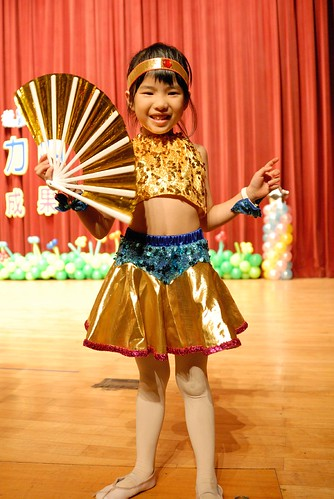
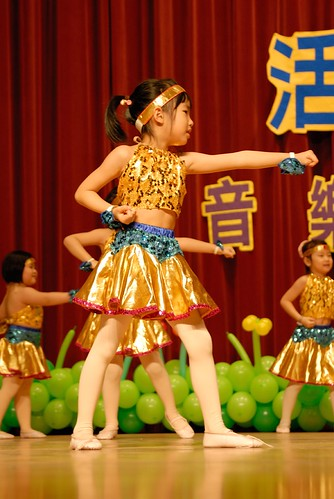
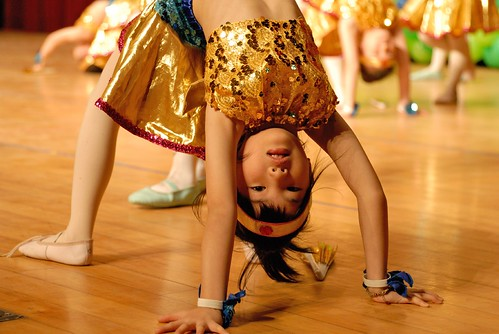

上週六參加了愛愛的畢業典禮  還是覺得很不可思議我們家愛愛畢業了 不同於阿徹 愛愛的幼稚園畢業很是讓我百感交集 或許因為真的很難相信我們養小孩已經養到都入小學的階段吧! 是感嘆也是欣慰!! 不過寫畢業之前 得先把愛愛的大班生活做個結束!  

用這幾個月的愛愛照片以及這學期寶寶手冊上我或老師寫的話 替愛愛的最後幼稚園生活做個紀錄  M:"那天在台下等著愛開始表演時 每當布簾拉起 我們便得睜大眼睛努力尋找愛愛 因為穿上表演服的愛愛更是大大與我們腦海中baby模樣不同 真的有種吾家有女初長成的喜悅與小感慨 那天愛愛也第一次在舞台下看舞蹈高階班的表演 原本就很喜歡且滿意自己在舞蹈班表現的愛 更是期待與幻想起自己也將變成那樣漂亮又厲害的高階班姐姐 我們也希望可以的話 愛愛能一直開心的跳下去 "  C:"愛在練習音樂發表會的節目時就很認真了 Candy告訴她們是要表演給爸爸媽媽看的 相信愛的認真是來自於家中每個成員 在舞台上的愛也是充滿自信ㄋ 有次愛情緒不好的來上學 每位老師小孩都很關心她 但會使她越哭越大聲呀 所以只好讓她跟我黏在一起直到她穩定些 但愛並不會把原因說出也就不強迫他 不過哭完 一整天心情都很好呢 "  M:"愛愛真的很愛面子的 所以怎麼可能把自己不乖的事情告訴人家 她自己隔天上學時還自言自語的說"今天一定又會有很多人來問我昨天的事" 我問那你怎麼回答 愛說"我就只是笑"然後還笑給我看... 經過那一陣子噹了幾次後 愛原先有點失控的脾氣又收了點 好像就又這麼渡過一次的低潮與叛逆期 "   M:"愛愛最近總算開始換牙了 她除了很高興長大到開始長大人的牙齒外 也很開心總算拿到牙仙子的金幣而且還一次兩枚呢 "  M:"愛愛回家後都會很主動的把功課完成 之後才會去遊戲或做自己的事 大半時候愛愛都可以獨立完成 只有偶而才需要媽媽或哥哥幫忙指導一下 愛愛甚至每天都還幫媽媽督促Owen有沒有完成作業 甚至還會就美觀度指導一番 總惹得Owen大叫"阿姨說你只要看有沒有寫完啦.." 我跟徹爸兩人常私下自嘲愛以後一定是做班長的料 因為真的很愛管又超級熱心 真的不知道是好還是壞阿 "  這半年來越來越會主動幫忙做一點小家事 當然很多時後是很ㄍㄟ熬的 不過週末輕鬆煮 碗盤不多的時後 我可以放心的讓愛愛清洗全部玩盤 而到阿嬤家的麵店時 愛愛也常會主動的幫忙收拾客人用畢的碗盤以及擦桌子 不怕髒且不像哥哥那樣的三分鐘熱度 讓人高度期待她的越來越能幹 徹爸笑說沒讓愛愛像媽媽那樣當老闆娘的女兒真是可惜了  C:"愛的懂事我覺得和家中的教育有關 相近在家很多事都要自己來 至於管人 這和個人氣質有關 有人適合被管有人適合管人.. Candy相信愛是當班長的料 相信愛自己也會很喜歡 "  M:"愛愛到現在還是會看著繪本自己亂講一通或是每天的睡前故事時間仍是由媽媽朗讀 不過前陣子可能稍有感受到學校壓力 同儕的刺激 愛愛偶而會拿著故事練習拼音 不過可能因為每每讀完一段後完全忘記故事說了什麼 愛愛下了這樣的結論"以後上小學就會了" 然後就不再勤奮的拿故事拼音了 "  M:"隨著畢業典禮謝詞的開始練習 愛愛自己也開始離別悵然了 而同時也擔心起小學 她說"雖然很期待可是也有點害怕" 呵呵 會緊張就好 不過我們對愛愛有信心的啦 相信謹慎的她一定可以讓自己盡快適應小學生活的"  C:"我也相信愛上國小一定會適應的很好 就怕她容易把壓力往身上放 有次我們在摺龍舟 最後的步驟愛不太會 是揚哲教她的 Candy聽到揚哲說"終於教到愛 難得愛不會" 有趣吧 "  雖然在換班的這一年裡 愛愛常會想起中班的好  說現在班上男生的如何調皮 但愛愛多了好多的好朋友也成為Candy的最佳小老師 她常常很開心這一點  雖然很捨不得這些好朋友 總說希望以後還能繼續在安親班當同學 愛愛還是一如既往的期待每一次的新環境與改變 所以小學放馬過來吧! 愛愛沒在驚的!!!  媽媽每兩週要交一次的功課 交了五年總算要結束了(從阿徹開始算的話 七年嚕)  雖然我常常遲交 尤其在這堅持手寫的一年裡 (以前常偷懶的從BLOG節錄或是當作寫BLOG的用電腦寫) 但我喜歡這樣的交流方式  知道了很多我們所不知道的愛愛也分享了許多我們的心情  一直很喜歡晨暘LOGO的那句話"每個孩子都有自己的顏色" 很高興我們的愛愛在晨暘有自己的顏色 且是多彩又多姿的~~  

下面是學期中園遊會與音樂發表會的照片 等這麼久就等這一天一起清了~ 五月園遊會的闖關遊戲中做勞作  大口的吃西瓜  專注的釣魚  闖關完成後 放鬆的喝可樂休息  四月的音樂發表會  哥哥總是比我們還興奮緊張的拍下/錄下愛愛的每一個表演  舞蹈班的最後一次幼稚園表演 真的很難想像這亭亭玉立的背影就是我們家的愛愛阿  四年了 還是一樣的喜歡彩虹老師 喜歡上舞蹈課 喜歡跳舞的時後  不容小覷的女孩  站上舞台 舉手投足之間很不一樣  雖然還是會有點靦腆  但越來越勇敢  認真的記住老師的每一個交代 呈現最棒的自己  再換套衣服 我跟徹爸又費了好一會勁才認出我們的女兒  還記得我小時候最喜歡像這樣的水手服 看到愛愛這模樣我第一次覺得女兒真的好像我  參加了五年了音樂發表會 總算是最後一次了... 我們完成了最有趣但也艱辛的幼稚園階段了!  一路走來 雖然我們獨立的永遠只是我們四個人 很高興我們的手越牽越緊 心緊緊的連著   雖然不用再窩在台下等著愛愛的出場 但呵護的心還一直進行著.... 
