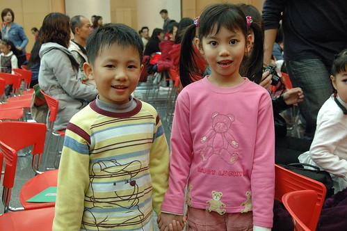

昨天第一次以"家長"的身分在家裏接待客人 那種感覺真的很奇妙… 且接待的客人還是阿徹這一兩年很喜歡 很想結婚的那位大眼睛洪同學 更是深深覺得 "緣分"真是奇妙的東西阿~~~

話說兩週前的那個週六晚上 我們難得的走路去我們常關顧的那家涮涮鍋店 (平常百分之95我們都是四貼騎車去的) 在人來人往的文化路上突然聽到有人大聲喚著"張有徹" 訝異的睜大眼睛往前一看"咦 那不是洪同學還有他的爸媽嘛~" 既然不期而遇 身為有禮貌的大人當然彼此認識 聊一下天 而在這即將畢業的時刻 很理所當然的問著對方"你們是哪個學區的阿" 洪爸爸說"新埔國小 你們ㄋ?" 我說"我們是莒光國小" 洪爸爸說"哇 莒光很不錯喔"  我說"ㄟ..阿就剛好" ㄌㄟ了一下後 我開玩笑的說"我家可以給你們寄戶口" 洪爸爸笑笑著說"滿額學校來不及了啦" 然後雙方很有禮貌的道別結束這令人訝異驚喜的不期而遇 而分開後我馬上就笑阿徹說"哇 洪同學是新埔國小跟Thomas一樣耶"

一般家長聽到莒光國小都會說"不錯喔" 大概只有我跟徹爸對於學區完全無動於衷 甚至我還有點擔心阿徹會無法適應明星學校的光環而想換學區 而莒光國小這幾年都是滿額招生 所以小一新生的入學資格必須是 有房屋在學區內 或是已經入籍滿6年 或是法院公證租賃等等嚴格的要求 因此我們都很自然的認為 如果沒有符合上述條件很難進莒光的 而我的那句"我家可以給你們寄戶口"還真是順口而出的玩笑話

而萬萬想不到就在隔週四的晚上我突然接到一個陌生號碼的電話說 "你好 你是有徹的媽媽嗎 我是ㄩˋ丞的媽媽…." 我有點被嚇到 因為第一次有陌生人打電話給我一直稱我"有徹媽媽" 而我也因為習慣聽到"洪同學" "洪ㄩˋ丞" 我邊回應電話邊努力的想誰是ㄩˋ丞  是阿徹班上Rex嗎?是@@@嗎? 我想了一分鐘之久有吧 才恍然聯想起原來是洪同學 洪媽媽說"我們爸爸打電話去莒光國小問 說今年沒有滿額 現在還可以入籍送資料  所以我們想說可以用你們家辦獨立戶口嗎" 我還真從沒實際想過"寄戶口"或"獨立戶口"到底是什麼東西 有點慌了 洪媽媽說"只要借她們戶口名簿辦理獨立戶口 然後讓她們寄一張電話帳單到我家即可.." 聽起來挺容易的 要"寄戶口"或是辦獨立戶口都好 幫這種忙對我們來說不是問題 唯一考量就是把戶口名簿交給別人有點不放心 所以最後我們約了週六早上一起去戶政事務所辦 只是洪爸爸週五中午又打了電話過來說 他打去戶政事務所問過只要我們的房屋稅收據給他們便可以辦理獨立戶口 不需要麻煩我們跑一趟 因此約了那天晚上她們過來拿?單去辦理戶口即可 而那天因為剛好有事打電話去幼稚園 我還跟園長打探了一下洪家 聽園長講了一堆結論是 洪家是好人 洪爸爸是個偉大的爸爸 粉照顧妻女也很願意為小孩子做犧牲…

那天接阿徹放學時跟他說今天晚上洪同學她們要來我們家拿東西喔 因此阿徹那天晚上沒把家裏弄很亂 我們也服裝儀容整齊的等著她們來 晚上近9點樓下電鈴響起 我們緊張的喊著'來了 來了" 結果只有洪媽媽上樓 然後在我們門口稍微聊一下即離去(洪爸爸在樓下等) 阿徹有點失望也只能安慰他 因為很晚了而且她們可能很忙… 而為了讓洪媽媽們不用大熱天跑來跑去 我們也說下次把東西放在小孩子書包請老師代轉就好省得麻煩

可能因為時間性 這週二的時候洪爸爸來電詢問是否已收到他名字的電話帳單 也因此當昨天我在信箱看到她們的電話帳單後 去電告訴洪爸爸 詢問是否明日放在阿徹書包轉交或是她們要過來拿(我自己心裏是覺得明日就是週五 今晚拿一拿隔天就可以去辦 趁早了卻一樁事的) 結果洪爸爸果然說 他們晚上8點多過來拿 因為以為這回應該也像上次那樣由洪媽媽上來拿而已 所以沒有刻意要求阿徹維持家裏整齊 而我們也如平日般的邋遢 不過幸好阿徹因為想看新發的CD所以提早收玩具 而我也因為看不過家裏的地板而用紙拖把將家裏地板清過 稍微降低當她們一家三口來到我們家後我們的囧樣

洪爸爸洪媽媽很客氣 聊天過程中感受的出來她們跟我們一樣是好爸媽(哈哈 順道稱讚一下自己) 原來她們想念莒光不完全是因為明星學校的關係 而是她們這幾個月刻意搬到板橋後的學區學校並不是那麼喜歡 洪爸爸去辦理新生報到後回家便跟洪媽媽說"我看我們還是再看看其他學校" 據洪爸爸說法 新埔國小就像是比較重視"智育"的傳統學校 他們比較喜歡像莒光這樣重視課外活動 比較活潑彈性的課程安排…

洪同學一家人在我們家待了近一小時 大人聊著學校 房子還有小孩子的事 而洪同學則是跟我們的阿徹小愛玩番了 我笑說 想不到洪同學這麼活潑 跟我平常看到的大眼睛文靜斯文樣都不一樣 小孩子們玩的很愉快 捨不得分開 最後兩人還拉著小手講了一下悄悄話 道別時洪同學跟他爸媽說 "我週末還要來" 而阿徹也問我"請她們週六再來好不.." 我跟洪爸爸洪媽媽說 以後如果阿嬤有事或是洪同學想來歡迎隨時來我家 我可以接小孩時順道一起接來我家 只要她們放心的話 洪爸爸說 有什麼不放心的!!! 呵呵~希望她們真的可以放心把小孩拖給我們家 如果說青梅竹馬都是像這樣從小培養起的 還真小小幻想一下阿徹跟洪同學以後的發展 也許這是老天爺給他們的機會也說不定 呵呵~~

補充說明: 1.洪家之前住中和為什麼來板橋上幼稚園我也不清楚 可能因為洪媽媽的娘家在幼稚園附近所以喜歡這間學校吧 2.洪爸媽常需要加班而且之前他們家是住在中和 所以之前洪同學都是在學校待到7點多最後一個小朋友回家的  直到最近搬到板橋後才請阿嬤先接回 3.為什麼洪家最後搬到板橋ㄋ? 據我從園長那得到的消息應該是因為想讓洪同學上晨暘的安親班而且洪同學的妹妹以後也可以唸晨暘 這應該也算是一種孟母三遷吧

