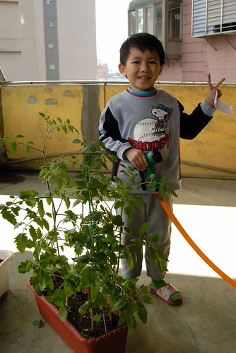
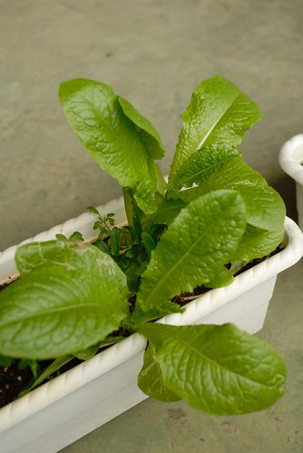

去年底阿徹撒種仔種下的番茄  經歷了漫長的發芽 長高 開花 結果  
總算在上週出現了第一顆紅澄澄的小番茄  
一顆小番茄讓四個人高興的輪流一人吃一口  
更感動的是味道真的就跟平常買的聖女番茄一樣耶  
  
  

阿徹說他們班上有18個人  要請大家吃他種的番茄  
數了數枝上的番茄數量是有大於18顆沒錯  
但我們真的不能保證每顆番茄都會轉紅阿  
而且轉紅的時間應該很不一致 很難一次紅18顆吧  
  
  
  
今天早上澆水時又發現了一顆成熟的紅番茄  
跟阿徹說'你要不要摘去請同學吃阿 '  
阿徹說'可是我們班有18個人耶'  
我說'18個人要一起請很難耶...  
    你可以先請你的好朋友 下次再有再請其他人阿 這樣大家就可以輪流都吃到啦'  
可是阿徹還是說'那可以先冰起來阿'  
ㄟ...有創意的想法但是不太好吧  
最後阿徹小心翼翼的捧著一顆小番茄去上學 要與他的好朋友分享  
  
  
  
回家後問他 那顆番茄送給了誰  
阿徹說'我給Jessica 但是Jessica給彥彥了'  
ㄟ...感情上又一次的挫敗....  
沒關係 番茄樹上還有好幾顆番茄在轉紅了  
應該還是有機會的...  
也希望最後真的可以達到阿徹的目標 班上18個人都能吃到番茄....  
  
  
  
自從天氣轉暖後 徹爸每天早上上班前都會先上頂樓澆水  
如果我們母子三人沒托托拉拉 趕得及一起出門的話便也會上樓巡一巡  
  
  
  
(徹爸測試幫徹伯買的Sony相機 覺得光真的打的不太優哩  還是我的小3好)  
  
  
  
當初我們三個各自選擇了一種種仔栽種  
阿徹選蕃茄 我選A菜 徹爸選\*\*花  
我的A菜最先發芽 可是被野貓當沙坑大便揉擰後一切泡空  
而徹爸的花則在己個月後也長了不少株 只是看起來有點營養不良 很懷疑會不會有開花的一天  
反倒是阿徹的番茄出乎我們意外的長的好  甚至還有番茄可以採收(雖然數量實在很少)  
看著親手栽下的種仔發芽 開花 結果 我想阿徹的心理一定也是超開心的吧 (起碼會高興贏爸媽很多吧)  
  
  
  
前陣子土壤裡突然又冒出了幾株A菜 應該是當初留下的遺種吧  
想不到竟也長的頭好壯壯 最後被摘下混到菜市場買的A菜裡一起煮   
  
  
\]  
  
這是從嘉義搬上來的高麗菜 是阿嬤幫我種的  
因為A菜失敗後 我改種地瓜葉   
想說地瓜葉應該最簡單吧 很難失敗吧  
結果沒想到 從嘉義移植上來的幾株地瓜葉還真的給我都翹辮子了  
不死心的我 請阿嬤用嘉義的土再幫我植幾株 順便種了2顆高麗菜  
種了2-3各月高麗菜雖然有長大了 但還是看不出一顆的態勢哩  
想不到一顆高麗菜也要種這麼久阿  
真是好個古人說"盤中薞 粒粒皆辛苦阿"    
應該再加句"菜菜也皆辛苦阿"....  
  

