猶記得上一次的花東單車旅行中 愛愛才在吵著她也要自己騎一台 還把哥哥的車子玩"落鏈" 沒想到一眨眼 已是兩年前的事了... ([blog.yam.com/hmchen1975/article/37822235](http://blog.yam.com/hmchen1975/article/37822235)一切彷如昨日阿) 因為愛愛的青黃不接 給爸爸載太大隻 自己騎16吋太要命 我們一家子隱忍再去花東騎車的想望 一切就等愛愛的升級20吋與獨當一面 等待的兩年 愛愛努力的多吃飯 多長肉 多有力氣 多有能耐些... 而那一天真的來到時 就如愛愛自己說的"很開心但也有緊張"... 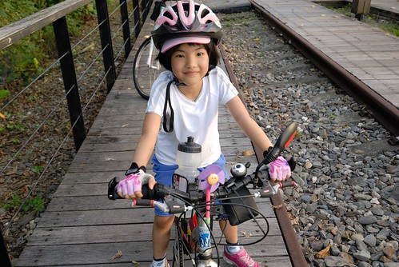 

雖然一開始因為些狀況讓愛愛騎到哭了 但她還是邊吸鼻涕邊踏著時速只有5的車子 那時候她的心裡肯定滿腹委屈 咁苦無人知 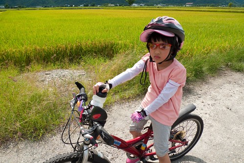 所幸爸爸終於發現這不該是愛愛的表現 仔細檢查車子後才發現輪子不知不覺中出了狀況 車子調整無誤後 愛愛才總算開始享受馳騁花東鄉間的快感 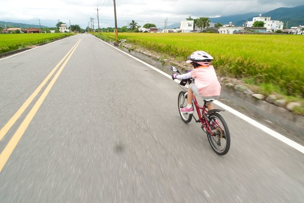 第一天 小女子就總算明瞭單車旅行不是好玩的 但爸爸 媽媽 哥哥給了好多鼓勵  好多擁抱 也好多現實忠告 愛愛還是笑著迎接可能艱辛的第二天 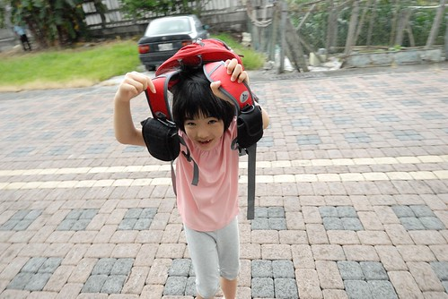 第二天 雖然大半的路又直又下坡 但在30幾度的烈陽下騎車 對於愛愛來說是體力與耐力的大挑戰 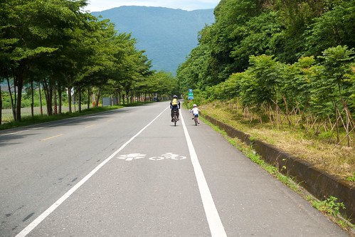 更別說是上坡的時候了... 幸好除了牽一次車外 愛愛一段一段的撐過那看似平順實則上坡的路段(連我都騎的有些喘了) 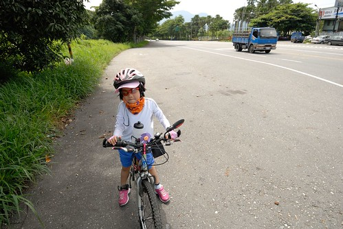 騎了30公里 經過路線中的最高點後(接著就是一路滑10公里) 算是已經通過考驗的愛愛開心的不得了 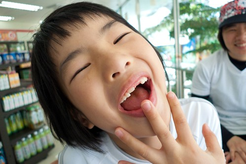 雖然與哥哥相較之下 這樣的第一次實在太輕鬆 而愛愛的體力與耐力果然也不如哥哥那樣強健(男女生真的有差阿) 但寶貝女兒ㄇㄟ~  我們還是給予高度肯定 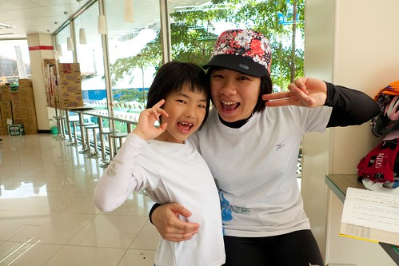 雖然完成後 愛愛喊著"好累喔" 眼神盡是不想再有下一次 但其實她也好享受於這樣的單車旅行阿 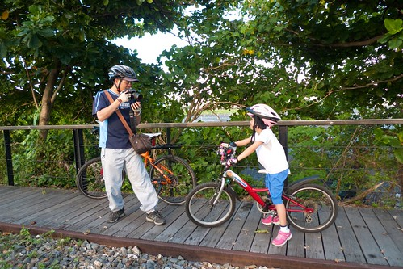 而且她是我們家的開心果~ 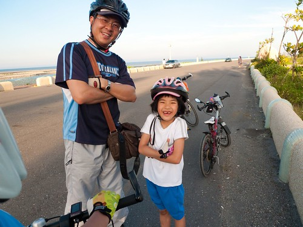 怎樣都要她再跟我們去花東騎車 況且我們等她等了這麼久... 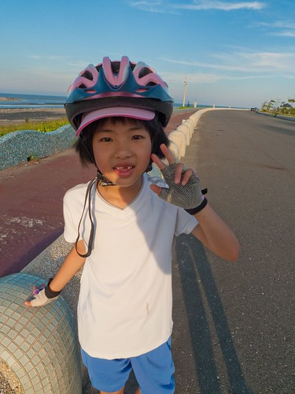 回程的火車上 愛愛大跳騎馬舞 紅咚咚 汗流浹背 但卻神采奕奕的模樣 讓媽媽心理備感欣慰 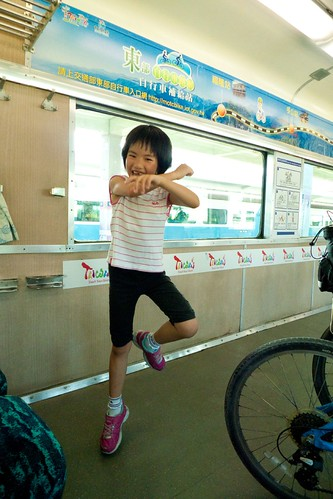 但也真的累了 很快就睡著了 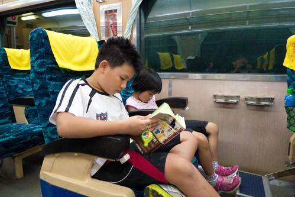 只是沒想到 媽媽約定好的放飯時間都還沒到 睡不到一小時的愛愛就如充飽電的電池 又活力百倍的吵吃便當 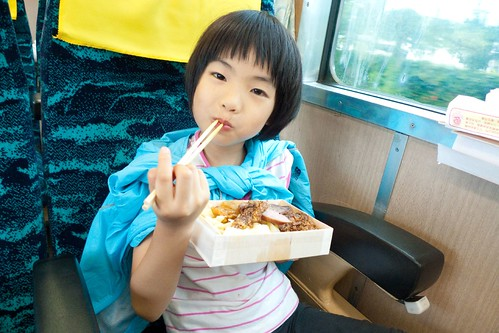 放飯後 愛愛專注又努力的吃著她自己的那顆便當 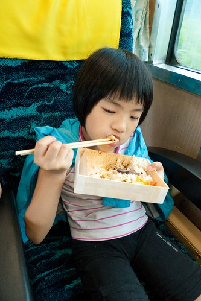 從來沒有看過她這樣拼命吃飯 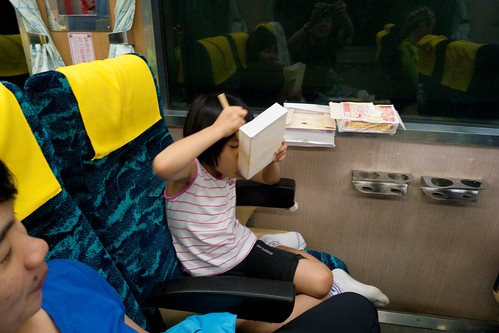 果然! 有累到 有餓到~~~ 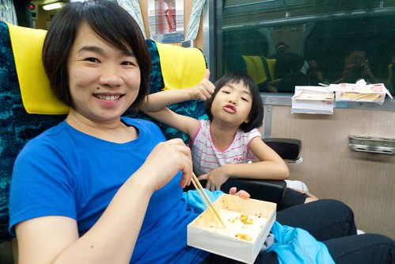 而看著小孩可以這樣騎 這樣睡 這樣吃 這樣笑  父母的再多涯給都是值得~ 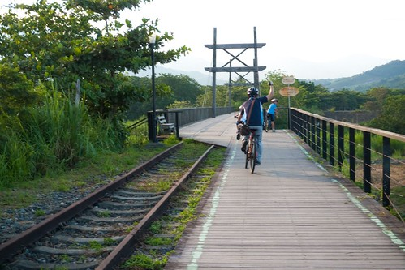 

PS1. 同場加映哥哥版 [blog.yam.com/hmchen1975/article/29396890](http://blog.yam.com/hmchen1975/article/29396890) 果然 對於兒子還是殘忍了點...

PS2. 順道補上出發前一週末 一家子騎去動物園練車的照片 這是愛愛升級20吋後的第一次長距離挑戰 板橋 木柵動物園來回的40公里 剛好讓我們好好檢視與調整她與車子的狀況 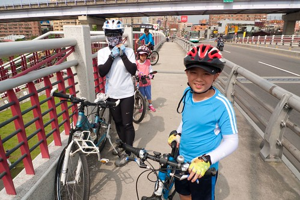 出門在外 車子是自己的重要夥伴 所以愛愛得多跟她的車子培養點默契 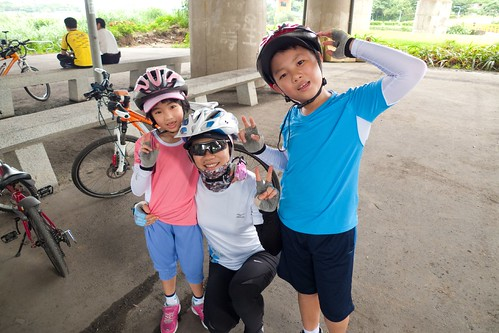 在英名爸爸的supervise下 一切妥當 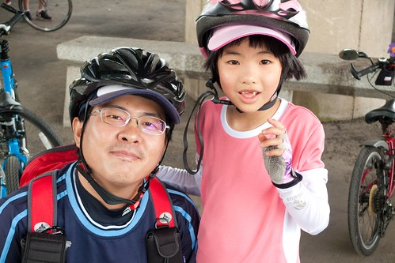 唯一例外是 媽媽買的剛好身高的褲子太大件啦 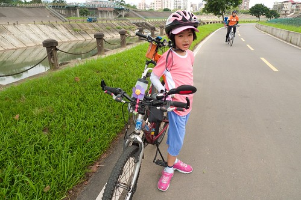 重要的是信心就定位 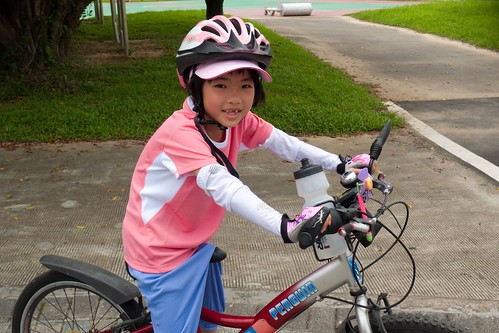
