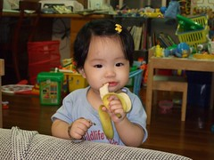
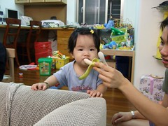
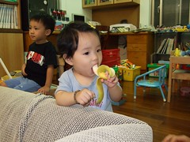
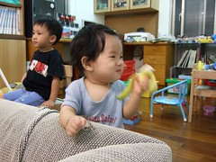
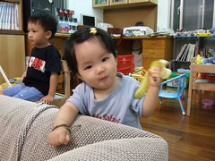
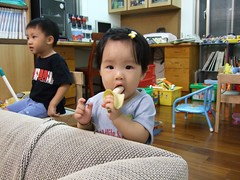
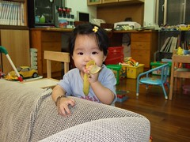
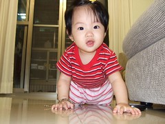

9月中去埔里家族旅遊時  
民宿主人送的美人蕉(其實應該說是張嬤張公跟人家要的)  
總算在我無為而治的放了二個里拜多後成熟可以吃了  
小小瘦瘦的身材實在很像我們家養的小孩 哈哈~  

小愛一直很喜歡吃香蕉  
每當我用湯匙刮香蕉泥給她吃時可不能有絲毫的停頓  
要不然可會哀號的彷若被人苦毒

今兒個 看到這瘦小的美人蕉  
口徑實在很適合小愛那小小的嘴  
因此剝好香蕉皮後讓她自個試著咬一口

  
嗯~咬的還大小蠻剛好的  
再試著把香蕉交到她手上  
帶著她自己把手上香蕉送到口中  
嗯~對的還蠻準的沒往鼻孔送

就這樣 小愛一口接一口的 自個兒吃完了一根香蕉

  
小小的小愛吃著小小的香蕉  
那模樣真的好可愛 好好笑~  
莫非美人蕉就是為這種小美人而生的~哈哈

