最近阿嬤們還有許多人常跟我說"阿徹再沒多久就要比你高了..." 我總說"還久的哩" 但我知道這將是一二年內的事了! 而雖然阿徹的外表明顯朝著青春期發展著 成熟著 但許多心智與行為模式卻依然還是我們一直以來記憶中的純與蠢 不過就如我跟徹爸倆人常自嘲的 如果不是這樣純蠢那就不是我們家阿徹了!

 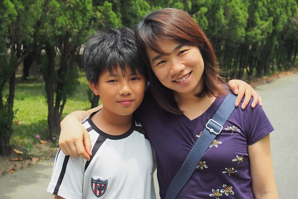 阿徹的身高一直用自己的速度緩慢增長著 但最近卻好多人說 阿徹長高很多 我們想 是因為五年級加入足球隊後的大量運動讓阿徹變精實 所以讓人誤以為變瘦的他長高許多 但其實真的沒有.. 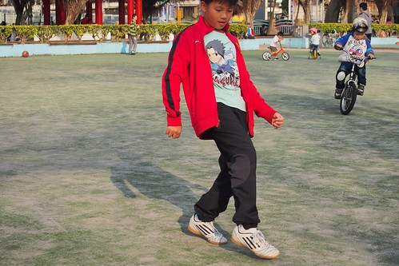 雖然阿徹的足球功力果不如我們所預期的只是陪練的板凳球員 但阿徹能享受運動時的快樂與快感 且展現出難得對一件事的堅持 我們給予他十足的支持與鼓勵 希望阿徹可以挺過身為板凳球員的煎熬與磨練 甚至益發堅定與強壯! 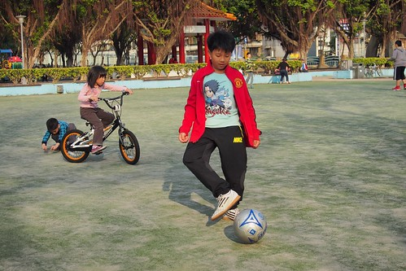 而且因著徹哥 愛愛也踢起足球 甚至發願要進足球隊 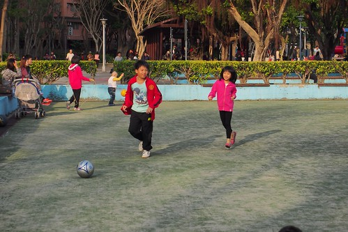 阿徹果然是妹妹學習的標竿 不論好的 壞的 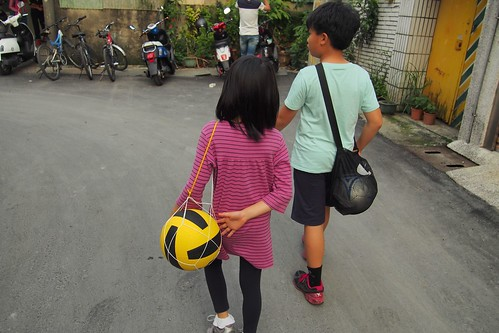 阿徹還是小小孩的時後 長的很秀氣 很多人說像媽媽 沒想到10年過後 卻越長越man 越像起爸爸 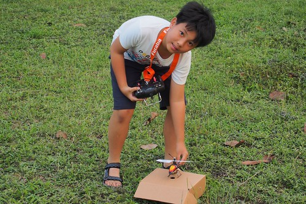 尤其是喜歡嘗試新奇事物 專注投入喜歡事務的心無旁鶩 真的! 是爸爸的兒子無誤! 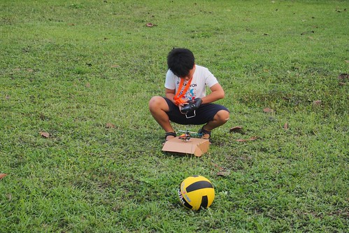 五年級的阿徹  課業 學習 甚至感情 依然不是他感興趣 在意的事 依然還每天活在他自己的世界中 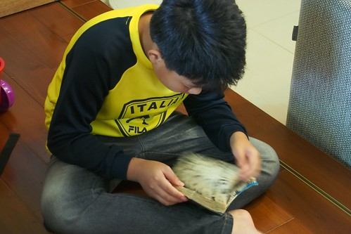 漫畫 卡通 以及想法永遠層出不窮的小遊戲 是他每天的生活重心 不過愛妹好喜歡這樣陪她玩家家酒 而且真的好會玩的哥哥 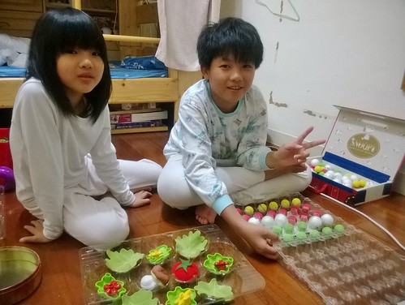 雖然阿徹的創作常會被我吐槽 精細度可以再多用點心 但阿徹堅定的堅持這就是他的創意與風格 而且不假他人之手 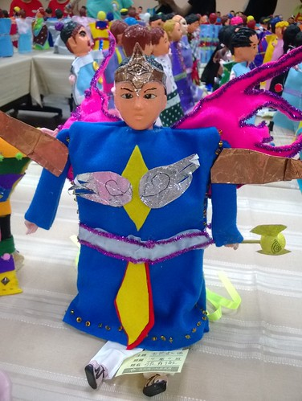 (阿徹學校美勞課製作的布袋戲偶 配色真的很"ㄘㄨㄚ" 而油亮亮的西裝頭 是阿母覺得最屌的地方) 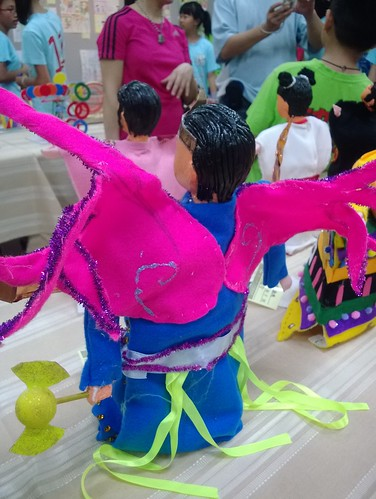 前陣子撿到一張阿徹製作的遊戲卡 卡上可愛明亮又溫暖的"晴天雲" 我看了好喜歡  而又在一次不經意翻看阿徹鉛筆盒的時後 看到他筆下的自己 我努力忍住不噗哧大笑 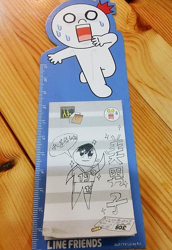 想當美男子 可見我們家徹哥真的長大 真的開始青春了! 而穿著19號球衣的美男子 真的是我兒阿!!!  尤其在設計師阿姨費盡心思剪了顆帥頭後 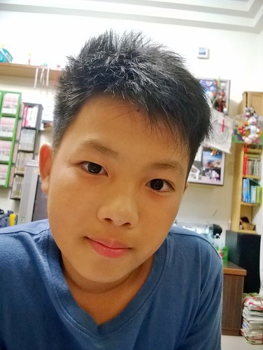 不過我跟阿徹說 我還是最喜歡這樣開心笑著的兒子 這樣最帥! 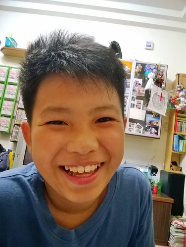
