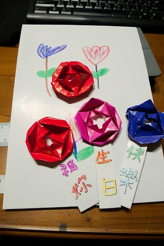

前陣子跟愛愛兩人一起買了桃紅色的鞋子 回家後 徹父子倆不敢相信我怎麼會買這種顏色的鞋子(第一次買這種鞋子也就算了) 阿徹很含蓄的說這顏色看起來像拖鞋 不適合我 誠心建議我或許買個咖啡色好些 而徹爸則是搖搖頭 笑著說"你果然老了" 繼上回買的布鞋帶有桃紅花邊之後我再次犯桃花 哈哈~ 我果然是老來俏了!  不過也真是到了快開花的年紀了阿!!!  

今天晚上八點看完小孩功課後 阿徹很豪氣的跟我說"媽媽 你今天可以下班了"(平常我很堅持9點半準時下班) 徹爸說"怎麼這麼好" 阿徹說"因為今天是媽媽生日阿" 徹爸說"那也把我送給媽媽好不好" 徹愛大喊"不行" 我則笑說"那誰顧小孩阿" 徹爸接著說"那我送你今天不用洗衣服" 我說"今天不用洗 明天還是我洗阿.." 而後來我依然因為忙些廚房的事 愛愛吹頭髮的事 洗衣的事 沒能提早下班 這就是我的生日夜! 但另方面 我卻也是一如平常的在每天的家事之後上些網 寫些網誌 看些書 其實日子可以每天這樣穩定又踏實 對我來講就是老天爺一直在送給我的大禮阿!!!

不過後來我還是很任性的要徹爸幫我抓今晚才照的這張照片 徹爸笑說"今天 就滿足你的虛榮 讓你炫耀一下吧" 哈哈~ 是滴~ 就如每次工作中跟新的研究者合作時 老闆第一句話總會特別強調"別看她這樣 她已經是兩個小孩的媽了" 不好意思的表情下 其實我那坐在椅子上的屁股是翹起來的 我喜歡現在的狀態 不論是家庭 工作與個人 謝謝每個成全自己的貴人與家人 祝自己38歲生日快樂!!!  PS. 這是兄妹倆前幾天晚上神秘兮兮卻又高調的讓人很難不知道她們在做什麼下做的我的生日禮物 今天晚上回到家 兄妹倆迫不及待的拿出禮物送我 我看著阿徹手上捧的三朵花 我說你要不要怎樣的把花弄在一起 要不然這樣零散的三朵花我實在不知怎麼處理 阿徹馬上拿去加工下 然後又興沖沖的拿來給我說"這樣可以給你當書籤" 哇~ 真是有創意的利用 不過我又很不滿足的說"那你要不要在白白的紙上寫些給我的祝福" 謝謝阿徹給我這樣色彩繽紛的生日祝福!
