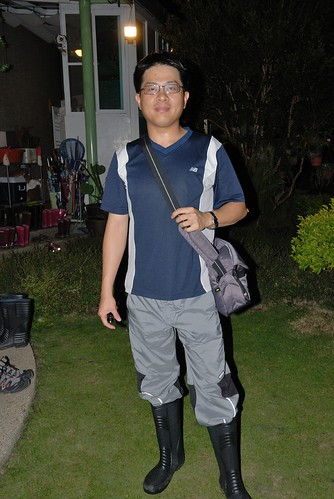

 疑? 徹媽什麼時後變的這麼高挑?? 徹家變成有兩個女兒??? 都不是啦! 這是被依賴的玟姿阿姨背影以及兩天內總黏著阿姨的燕華家兩個女兒 我很喜歡這張照片的FU ... 有種"人被小孩追著老"的感慨 感動與開心.... 這回在玟姿阿姨的犧牲貢獻下 促成了我們四個大學同學五個小孩子的埔里小旅行 這是徹家成軍9年來 第一次在家族旅遊除外 跟著別人一起出門過夜旅行 也是我們三個好同學(這時後徹爸就要排外了)在成家生子後第一次一起旅行...

這個旅行其實決定的很倉促 是在一週前才決定一起出門玩的 這一年燕華因為老公的工作而舉家住在馬來西亞 7月底回台灣過暑假 9月要再回馬國 雖然以前我們就也不常連絡碰面 但不知道為什麼這半年我跟玟姿特想他 兩人還常巴望著跟電腦很不熟的燕華出現在FB或SKYPE 多跟我們講講話 有一次我電腦打"回台灣後有機會一起出去玩" 燕華回應"好阿" 嚇著了我 因為我知道她是個怕麻煩 不愛亂亂熟的懶媽媽 所以我完全把她的回應當作思鄉情緒下的不假思索 可是想不到等她人回到台灣 電話問她要不要一起出去玩時 她竟然也還是跟我說"好" 這真的...驚嚇到我們! 因為我們壓根不看好她會願意在老公不在台灣的時候 自己帶著三個小孩出門的.. 不過最厲害的還不在她 而是在於玟姿 她竟然願意當燕華母子四人的司機+室友+保母 勇氣超級的可嘉!!! (來賓請掌聲鼓勵鼓勵) 決定一起出遊後 我跟玟姿不約而同的想到埔里的桃米 因為離台中近 有大自然 有青蛙看 有水玩  一個很容易親近但又有深度的地方 只是暑假的週末熊熊要訂到房間 我們預測應該不是件太容易的事 於是花了一早上時間 我列出桃米內民宿優先順序清單  兩人FB確認 玟姿電話詢問訂房匯款... 很幸運的第二優先順序的民宿就讓我們訂到房間! 不得不說 愛玩的我們兩個 行動力果然超強! 說做就做阿! (徹爸才開個會 完全不知道頭跟尾 就被我賣掉了)

我們的旅行其實是從8/13週六的中餐算起 可是五個小孩在火鍋吃到飽的"迦南園"裡 忙+亂的讓我們完全忘記要拍照留念 (要顧小人還要顧活跳跳的蝦真的讓人手忙腳亂 不過迦南園的海鮮鮮 冰淇淋濃 讚! 推!) 直到2點從台中出發往埔里 近3點抵達桃米社區的民宿後 才開始有出門旅行的感覺 辦裡好chek-in 進房間放好行李 大人小孩都喘一口氣後 便讓小人換裝準備去社區內的親水公園玩水 而早上5點半便起床開車載我們下台中且午餐前目睹車前硬生生發生的車禍而成為目擊證人的徹爸身心俱疲的陣亡在民宿內休息  可以去玩水 小孩子都很開心  我們三個女人五個小孩 不是婦就是幼 浩浩蕩蕩的從民宿走路去玩水 旅行才剛開始 五個小孩子就已經完全不陌生的黏在玟姿阿姨身旁...  燕華只消顧好還難以控制的小柏瑞 而我則是一派優閒的落在後頭照相...  桃米社區是在經歷921大地震後的重建過程中 慢慢轉型朝向生態村發展而成的生態社區 而當初組合屋原址旁的親水公園為利用桃米泉水的親子戲水池 泉水很清涼甚在會有點過冰的感覺 但夏天就該玩在這樣自然的水中..  公園內大大小小或深或淺的池子 很適合讓小孩子安全地戲水 只是網路上有人提到的那個磨石子溜滑梯會磨破褲子 經徹愛的泳褲實驗 果然是真的.. 下回不要再鐵齒 還是穿家裡粗穿的小短褲來這玩水就好  愛愛 小艾 芊芊 (上圖由左至右)三個小女生很快的就玩在一起了  玟姿阿姨看的如釋重負的說"玩完水後 她們就有玩伴就不會黏在阿姨身上了..."  我喜歡看到小女生像是姐妹般的玩在一起 而且笑的這樣開心的笑容  只是可憐的阿徹哥哥就被落單了  沒辦法! 小男生真的天性調皮些 玩的方式對小女生來講總是粗魯些  所以雖然阿徹一直很想跟那些妹妹一起玩 可是就常惹的小女生來向我告他的狀  可以的話 就請多多包容我家的阿徹哥哥啦! 雖然粗魯但是他真的還是個好人啦!  玩一個多鐘頭後 吆喝全身冰涼透底的小孩子們上岸吃餅乾休息嚕  然後大家再散步回民宿...(睡了一小時午覺的徹爸被我CALL來照相了) 很久沒有這樣跟同學 而且還多了這麼多小蘿蔔頭一起走在田間小徑上 心頭感動滿滿ㄚ!!!  玩水之後 愛愛果然跟小艾姐姐熟稔起來 兩天中常可見兩個小女生手牽手走路 說話 燕華說 "愛愛跟小艾真的很有緣  生日同月同日(小艾早愛愛一年) 名字又很像 個性又都是一開始內向的慢熟型"  回到民宿後 大伙窩在大廳喝奶茶(民宿內隨時有好喝的自煮奶茶供應) 小朋友爭相用玟姿阿姨的美人模式照相手機拍照  這是小女生鏡頭下的三個老女生 那時後剛上大學 才19歲 而現在已經36了...  20歲那一年 曾經在傍晚時分 陪著燕華坐在籃球場邊看暗戀的學長打球 而後來學長真的變成燕華老公 到現在我還是覺得很奇妙很夢幻阿 ("有愛就去追"的好例子) 也曾經跟玟姿兩人在騎腳踏車趕教室時 只因為天氣太好 天空太美 兩人便索性把車停了 翹課躺在中興湖畔的大石頭上看天空發呆 而直到現在我們兩人還是常在FB上說著好想空 討論著哪裡可以空...  我喜歡玟姿阿姨這兩天中的笑容 跟她周遊列國時的笑容不太一樣... 

(此篇集中介紹桃米的活動) 桃米社區最有名的應該就是"青蛙"  這裡擁有全台灣2/3種類的蛙 社區內 每家民宿內隨處可見青蛙生態池以及青蛙相關創作品  每家民宿也都會有夜間賞蛙活動  由主人家帶領去濕地或是在家院子池子或是附近環境進行 (這已經是我們桃米第五次 第四家民宿的體驗了 不過幾乎都是在愛愛時代前去的) 不過就像玟姿說的 這次是她聽過最專業的賞蛙解說阿 7點半 參加的房客集合在大廳後 便先由解說員(好像是ㄚ婆的女兒)用投影機進行青蛙介紹 包含桃米常見的蛙種介紹 青蛙交配方式以及搭配照片示範每種蛙的蛙叫聲 聽完解說後 之後再到戶外找蛙時 更能明白分辨青蛙間的不同 也更能銳眼找蛙  進行戶外賞蛙的人都必須換穿雨鞋 除了因為會有濕地不易行走外 最大的考量乃是如解說員說的"青蛙多的地方蛇就多" 不得不稱讚一下 民宿提供的雨鞋不只乾淨還各種尺寸都有哩 連愛愛都有適合的雨鞋穿  以前都以為青蛙活在池塘裡 賞蛙一定是從水裡抓蛙出來看的 可是這回的賞蛙卻是繞著民宿附近一圈的道路上草地上 "乾"的耶..完全顛覆以前"濕"的認知  這回也總算徹底見識到原來青蛙真的很小 大約2-3公分而已  小巧可愛的 以前印象中很大一坨的 原來都是蟾蜍  入夜後的桃米才是一天中最熱鬧的時候  青蛙忙著出來 遊客忙著找蛙...  外宿 我們越來越習慣早早跟著小孩一起上床睡覺　晚上10點睡到隔天8點自然醒.. 民宿整個都很好 可是唯一的不好就是那窗型冷氣機發出的共鳴聲 以致我們雖然睡了很久但是卻睡的不太好阿! (小人就沒這困擾 果然老人家比較淺眠) 除此之外 桃米的民宿真的都不會令人失望的.. 2+1人的房間  民宿2樓的走廊  樓梯間擺放的藝術品 可愛的麋鹿  讓人也想跟著一起冽齒大笑的創作品  大廳一隅 閱讀的蛙  民宿建築物的外觀  庭院一側 早餐便是在戶外享用的  我們一行人在庭院用了好久的早餐  佐配在地鮮蔬的粥加上吐司以及咖啡讓我們吃飽飽 而吃飽後 繼續呆在院子裡聊天玩耍 我說一行人就這樣呆到11點退房也挺棒的阿!  阿徹拿出他的相機自拍 也幫玟姿阿姨拍了一張   玟姿阿姨的小孩緣很好 一聲號召下 小人便立刻集合跟阿姨來個大合照  (不過那個硬抱在手上的 竟然不賞臉 哭了.. )  趁著離開民宿前 來個全體大合照吧! 阿姨坐著讓徹爸對焦時 小柏瑞自投羅網入鏡了  只是柏瑞 你擋到阿姨們的合照啦  我還是想說 真好! 這麼多年這樣的友誼! 這樣大手牽小手一起去郊遊!  郊遊成功! 希望這次有立下出遊的標竿 來年繼續一起去郊遊! 話說 這張照片的人員組成真的很純 很應數 如玟姿說的這些小人以後不知道是不是也是應數咖...  柏瑞 你又搶鏡啦!  而柏瑞的姐也high到爬上阿姨身上  看到大家都這樣開心 真好! 

以上一切好像只是三個女人的故事與回憶 但其實徹爸跟這三個女人的淵源可也深了 燕華是班上女生中跟徹爸比較熟 甚至好像還是徹爸的乾妹 所以當我後來轉系回台北 偶而下台中找燕華玟姿玩時 燕華便會CALL徹爸來當司機 (沒辦法! 三個女生少台機車也少個司機) 我跟徹爸在一起後 徹爸就常說"當初 我就是在女生宿舍前面被你驚豔到的 看那個穿短褲綁馬尾的女生真可愛 想不到一轉頭竟然是我的學伴 天阿!" 也就是說徹爸是在被我們利用 等著當司機載我們時 被我煞到的 哈哈! 所以燕華算是我們的推手之一  而玟姿也是另外的一個推手... 因為有一次玟姿揪的大雪山兩天一夜旅行 她自己臨時因為生病無法去 可是就少一台機車了  於是徹爸被玟姿臨時找來充數 也於是我跟徹爸在當了兩年的陌生學伴後 才在這次的旅行中彼此發現自己的學伴原來是怎樣的男生/女生 然後開始談的多 聊的深... 最後成就一段緣份...

前陣子玟姿在他的BLOG分享一首歌 "聽你說" 很有感覺的一首歌...  想用它作為我們這次旅行的最後註解

http://www.youmaker.com/video/sab5-6ae25c75ea1b44a8ab4c45b5484469a5001.html 作詞：王雅君 作曲：王雅君

郁：我很開心因為努力生活　和你們分享榮耀的每一秒鐘 如果難過你肩膀最遼闊　你幫我帶走烏雲滿布的天空 如果生活少了有你陪我　我整天開著手機也感到失落 因為我們都最想看到彼此燦爛的笑容

林：我懂星座卻沒有人像我　真的喜歡一個人安靜的自由 我做的夢我堅持做到最後　就算我爬到雲端也繼續做夢 我唱的歌只希望能快樂　其他的我也不想要想的太多 因為我們都最想擁有自己最真的感動

郁：聽你說　聽你說　我們同時擁有一個真心的朋友 聊日出日落　因為有夢　所以更認真生活

林：聽你說　聽你說　我們真實擁有一片美好的天空 不能常聯絡　卻更緊握　我們交換的美夢　只想聽你說

林：我懂星座卻沒有人像我　真的喜歡一個人安靜的自由（郁：呼嗚嗚） 我做的夢我堅持做到最後　就算我爬到雲端

合：也繼續做夢

郁：我唱的歌只希望能快樂　其他的我也不想要想的太多（林：吼喔喔） 因為我們都最想擁有自己

合：最真的感動 聽你說　聽你說

郁：我們同時擁有一個真心的朋友 聊日出日落　因為有夢　所以更認真生活

林：聽你說　聽你說（郁：聽你說） 我們真實擁有一片美好的天空（郁：呼嗚嗚嗚） 不能常聯絡　（郁：卻更緊握）

合：我們交換的美夢　只想聽你說（林：嗚喔喔）

郁：聽你說　（林：　聽你說） 我們同時擁有一個真心的朋友

林：聊日出日落　因為有夢　（合：所以更認真生活　吼）

合：（郁：聽你說　聽你說）　我們同時擁有一個真心的朋友 聊日出日落　因為有夢　所以更認真生活

合：（郁：聽你說　聽你說）　我們真實擁有一片美好的天空 （林：不能常聯絡）（郁：卻更緊握） 我們交換的美夢　只想聽你說 只想聽你說 聽你說
