覺得自己這一年裡曾經擁有的感動是我目前人生裡最豐富的一年 來自於好些事 好些書 好些旅行 還有好些人...(不過我想跟上了年紀應該也有關) 前幾天上網看SS小燕有約苦苓的訪談 當中的一段話很有趣: "快樂沒有差別 不能說我的快樂就比你高級 不過我的快樂比你便宜..." 一本好書, 一部好日劇, 一趟旅行, 一場家人的大富翁/象棋遊戲, 一頓全心準備的家庭料理以及一段段人與人之間的真心連繫與分享... 這些都是我的快樂元素!  我想我的應該也算便宜吧!? 有人說旅行的意義不在於"去了哪裡 吃了什麼" 而是"跟誰一起做了什麼事" 我想我們這次的4個同學5個小孩的小旅行就是這樣一趟大手牽小手的"愛之旅"吧!  

題外話: 話說今年的夏天讓人感覺特別的熱但也特別的不熱 或許因為今年午後陣雨出現頻率比較多的關係吧! 也讓今年夏天的旅行感覺舒爽..... 其實心裡滿滿的感動與想說的話都在上篇裡講完  FU也都耍完了 剩下的下篇只是填空似的去填滿旅行中的小片段... (所以玟姿阿姨就別太期待了)

題外話二: 玟姿問"這衣服怎麼沒買全家人穿?" 我說"徹爸穿著粉紅小兔的衣服也很怪吧!" 玟姿可能想像了一下畫面後 說"也是..." 哈哈! 所以就我跟愛愛兩人穿"姐妹裝"就好! (姐妹裝是阿姨說的喔)   

前陣子我跟徹爸在書局看到"在地人帶你埔里怎麼玩"這本書 看著書中一張張特色餐廳的照片 覺得怎麼都好好吃的樣子阿 而基立屋是當中徹爸最有興趣的一家店 於是趁著這次來埔里 週六晚上我們循書而來...  基立屋就位在愛蘭國小 廣興紙寮場附近   小巷子裡一個不經意的轉角處 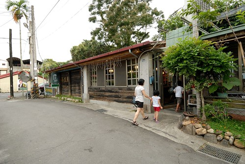 餐廳環境與窗外視野如書上所說的乾淨與遼闊  也真的可以邊吃飯邊看到紅紅太陽西下 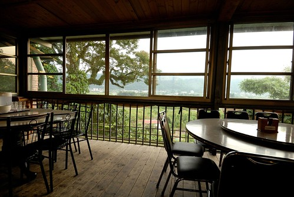 只是原本期待很深的平埔族料理 讓我們有點失望... 感覺有點死鹹.. 跟書上還有網路上大家的評價不太一樣 讓我忍不住懷疑是不是換老闆了阿 還是老闆出門旅行去了... 也或許是因為我們4個小時前才結束的午餐還沒消化完吧! 就像芊芊說"不是才剛吃飽 又要吃飯啦!" 呵呵~  或許因為肚子還沒餓 小人們的胃口都不甚佳 芊芊還因為徹爸不准她椅子連著阿姨坐那麼近而這樣子生氣一整頓飯...  第二天早上在民宿吃完早餐後 其實我是很想再帶小人們去親水公園玩水的 炎炎日頭下 玩著透心涼的泉水多棒阿! 我問小人們 想要去做紙還是去玩水 每個小人都開心的喊著玩水 可惜燕華媽媽說 水太冰 感冒剛好 不准玩水..而且去玩水他就又得溼答答陪小柏瑞下水了 ... 所以我們還是照原定的行程去廣興紙寮(埔里還有幾家紙創館 玟姿說去廣興傳統點..) 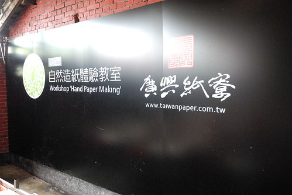 短短10多分的車程到達廣興時 小柏瑞已經睡著了 那時候我心想 真是乖小孩 這場合知道乖乖睡覺不要來亂  抵達後剛好有一個解說正開始 在我們都還搞不清楚狀況的情況下 便被服務人員催往後頭參與解說的開始 透過工廠的動線 解說紙的用處 紙漿的製作 紙的差別... 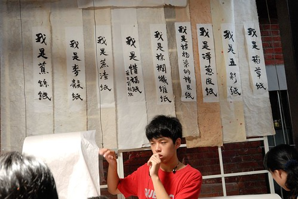 看到師傅俐落地洗紙 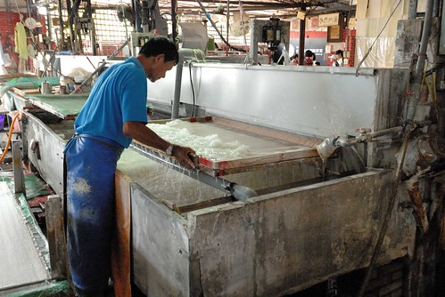 就像吃火鍋涮肉片那樣的 一來一往攪個幾下便"撈"起一張 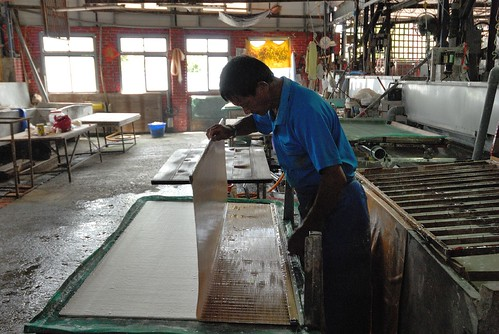 再"涮"的一下 一張紙的雛型便完成 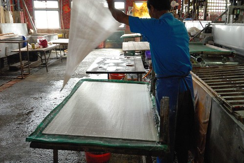 紙壓重脫水個一週後 最後師傅再逐張逐張的燙整平坦 (那張桌子可是溫度高的烘臺阿)  師傅阿姨的身手真的好俐落 好帥氣... 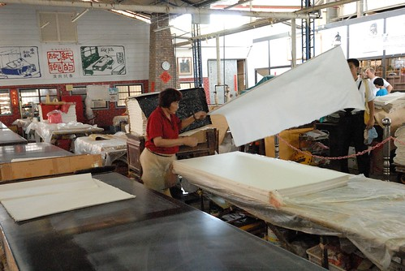 解說最後來到DIY教室 做傳統印刷(拓印)的說明  幾個小蘿蔔頭這樣排排坐在板凳上 挺可愛的..真的好像戶外教學喔  解說的最後"有興趣的請洽櫃檯購買體驗產品"  哇! 當然要去給他玩一下嚕~ 我們有致一同 不貪心的讓每個小人進行一個捲軸的拓印 step 1. 選好紙 付好錢 選個喜歡的圖案 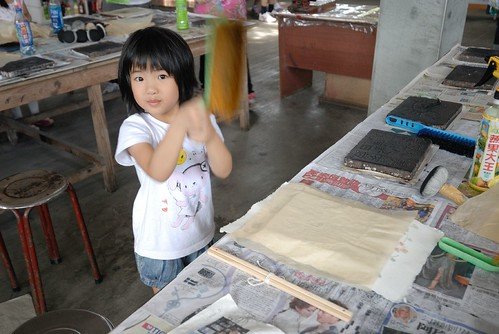 step 2.  蓋紙 噴水 刷刷刷.... 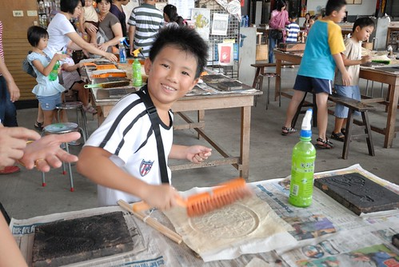 step 3.  刷到紙張不濕 且與拓印台之間緊密連和即可像撲粉那樣的上色 (人手不足加上徹爸自己也搞張DIY 所以沒有仔細拍下照)  這是阿徹拓印好的八卦 話說為什麼選八卦ㄋ 因為火影忍者裡面有很厲害的八卦封印 因為阿徹最近睡覺常哈暝... 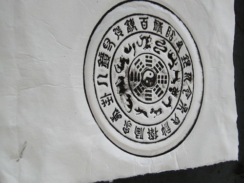 step 4. 放到烘乾台上烘乾紙上的濕氣  檯子很燙 小人必須在大人陪同下才能使用喔  這是徹爸的大悲咒 (好像吧! 徹爸也不確定) 回家後徹爸把這掛在家裡的櫃子上 我說這一掛 家裡多了份莊嚴的氣質 以後生氣時就該來面紙思過 念著"我要乖乖 我不要愛生氣...阿彌陀佛" 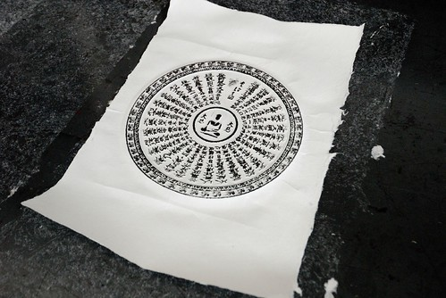 step 5. 黏上紙上下的捲軸 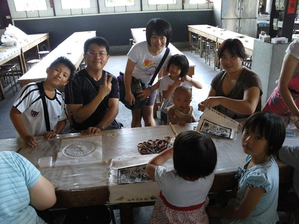 大功告成! 噹噹噹~  小人們DIY的很開心 沒人要跟阿姨照相 只有愛愛最捧場 話說愛愛自己選了個其實檯子不頂好的維尼熊 徹爸裝可愛似的要愛愛印歪的 結果愛愛回家後碎念著"怎麼是歪的 歪的不好看..."  做完DIY後還買了個用紙包的紙飯糰讓小人們嚐鮮 愛愛跟小艾都說很好吃 可是徹爸說"口感很怪 很像吃紙" 我說就是在吃紙沒錯阿...

在廣興結束整個活動時已經快一點 我問小人"中午要吃麵 吃飯還是吃麥XX" 想也知道小人們當然一定開心的選最後一個 而玟姿阿姨則是一臉疲累的表情說"就麥XX吧" 那語氣有種急欲解脫的渴望 於是我們滿足大人也滿足小孩地 浩浩蕩蕩地來到M...  徹爸上樓找位後回報"上面只剩一長排的位子 好嗎?" 玟姿聽了比了比一樓櫃台旁的兩圓桌說"這圓桌就好了" 可是下一秒玟姿想起似的問"樓上有遊戲區嗎?" 徹爸回說有 玟姿手指馬上往上比..... 那眼神那表情真令我過目難忘阿! 阿姨你累了喔 你想打發小人喔! 不過打發小人後 我們四個同學總算可以安安靜靜的好好談天說八卦了....  期間因為小柏瑞這兩天真的超黏她媽媽的 (套她媽媽說的每天連上廁所都哭倒在廁所門口找媽) 正義的徹爸當起惡叔叔 義正嚴詞的唸了一下小柏瑞 結果小柏瑞不甘示弱的用眼神跟徹爸鬥了起來 兩人就這樣用眼神交流 戰鬥好一會....  看的我們三個女生哈哈大笑 玟姿忍不住拿出相機拍下這血腥的畫面 結果一拍 徹爸忍不住破功笑了出來 氣勢馬上弱下去了...........  同時間 其餘小人們在M叔叔的遊戲區裡個個玩的滿頭大汗 很開心 下午兩點 兩天的旅行好像應該結尾了.. 可是我還捨不得結束... 幸好徹爸兩年多前在草屯工藝研究所買的旅遊印章本快用完 徹爸想再去買本新的 於是往回台中的方向 我們一起再到草屯的工藝研究所  兩年半前的中橫旅行有來過工藝研究所的生活工藝中心 覺得是很適合小人的遊戲地 所以我是滿心期待+雄心壯志的想讓小人們在這玩到最高點 讓旅行開心地結尾在這裡 可是竟然...竟然...生活工藝中心整棟樓在大整修阿! (那一刻 身為阿姨的我好想哭喔...) 一夥人只能在有點格格不入的工藝資訊中心逛大街 Orz 不過幸好還有個3D小電影院可以讓小人雀躍 大家一起戴上像太陽眼鏡的3D眼鏡 好酷喔! 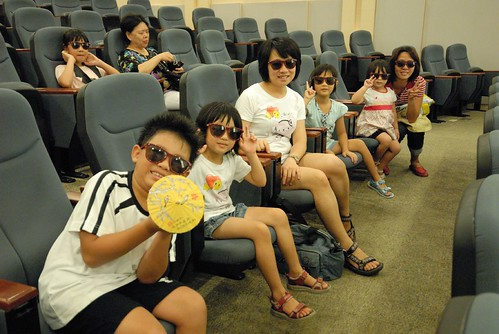 小人們還調皮地這樣戴眼鏡  10分鐘前才在人家中心大門口啪的大吐一番的小艾 口口聲聲說她可以看3D 沒問題的.. 不過嚇的玟姿阿姨貢獻出她包包裡的卡通袋備用 而我則隨伺一旁 三不五時盯問還可以嗎  另方面 膽小的阿徹其實有點不敢看3D  怕3D太過震撼嚇著了自己 幸好共35分鐘的3段影片 內容與長度都還算恰當! (3D效果十足 看到後頭連我都快暈了) 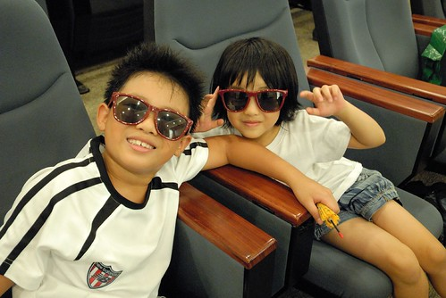 看完電影再小逛一下手創市集 下午四點差不多該回家的時間了 而這時後 小柏瑞總算跟叔叔熟了 玩得好開心... 希望明年如果再一起旅行時 小柏瑞還會記得這個跟他用眼神吵架但又逗的哈哈大笑的怪叔叔! 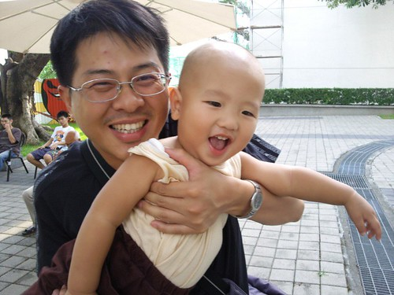 與燕華與玟姿道再見 關上車門 我們的小旅行畫下了句點...  雖然一群小人真的很吵 雖然要滿足一掛人的身心需求真的很麻煩 但我喜歡這些人 這樣的旅行...
