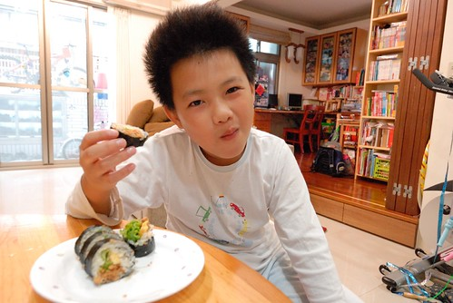

很喜歡林世仁寫的童書 陸續的從圖書館借了好些本回家 繼前陣子母子三人同被"沒有耳朵的流星"感動到紅眼眶 最近念的"和世界一塊兒長大" 恬淡但幸福的筆觸也讓我們感動萬分 這本書是作者以一個嬰兒(名叫欣欣)的成長所寫成的一篇篇動人心童話 而當中有段文字很是經典 很撼動我這個善感的媽媽: 有五樣東西的祝福 就能組成世界的祝福 分別是太陽 山 海 四季神明以及最容易被忘記的媽媽的祝福 太陽祝福欣欣有一顆永不結冰的心 不管遇到什麼可怕的事 只要看到燦亮的陽光就不會憂傷 山祝福欣欣的人生像山一樣豐富 每條岔路都能帶出一處好風景 海祝福欣欣有海一樣的胸襟 任何瑣碎的事 都不能讓她鑽牛角尖 四季神明的春姑娘祝福欣欣永遠懷抱希望 碰到再大的挫折也不絕望 夏先生祝福欣欣個性開朗 喜怒哀樂都能經歷 秋小姐祝福欣欣懂得愛與被愛 懂得哭也懂得笑 冬天老人祝福欣欣身心強健 即使受傷也能很快復原 而每個人的小時候都是在媽媽的祝福下長大的.... 念故事過程中 我常忍不住說"對阿! 你們小時後就是這樣..." 徹愛聽的滿臉不可思議 於是我們去把相本找出來 一起翻看徹愛從出生到1歲間的照片 徹愛換是滿臉害羞 孩子阿~ 謝謝你們帶給我跟爸爸這樣美好的人生經歷與回憶! 希望你們也能具備這五種祝福! 人生就無虞了!

書的最後也帶出書的主題 原來老天爺送給每個孩子最好的禮物就是跟著世界一塊長大 隨著孩子的成長 所接觸到的世界也一直跟著在長大 可不是嗎! 世界因著每個人的所思所想而有所不同 世界是大是小不是絕對值而是每個人心中決定著他的大小 而人真的該多走近大自然(以前人根本是住在大自然裡 哪用走阿) 感受大地給的祝福 心開了 世界也就大了~

永遠記得高中時有一次班級去郊遊 有個同學親手做壽司請大家吃 對於家裡是傳統台式生活的我來說 真是很不可思議的一件事 也因此做壽司便一直是我心目中對於賢淑的憧憬之一  只是卻也是我一直不敢輕易嘗試的事... 總算在這一年裡 自我的心理建設下 加上徹嬤的梅子汁加持 我總算也能做出讓我的孩子稱讚的壽司 我們最愛的傳統壽司果然還要有家的味道才最對味最好吃...  而用在小7買的小包裝蘿美生菜替換小黃瓜後 壽司的味覺與視覺又更是讓人驚艷了 星期六的早晨 就這樣我們吃掉了兩杯米 三大捲的壽司  以前徹爸常說徹嬤會學做外面的小吃食物 可偏偏做出來的都跟外面賣的不一樣 昨兒個我跟愛愛討論著早餐食物 我問"不要白煮蛋 那茶葉蛋ㄋ?" 愛愛搖了搖頭 我說"你不是很喜歡吃茶葉蛋?" 愛愛說"可是你做的都會跟外面不一樣" 雖然我臉冒三條線但還是忍不住哈哈大笑 想不到我也變成了那個跟外面賣的都不一樣的媽媽 幸好愛愛挫我銳氣的同時 我還有一個挺我到底的阿徹 兒子 謝謝你阿! 但是真的不要吃太多變成小胖胖了 
