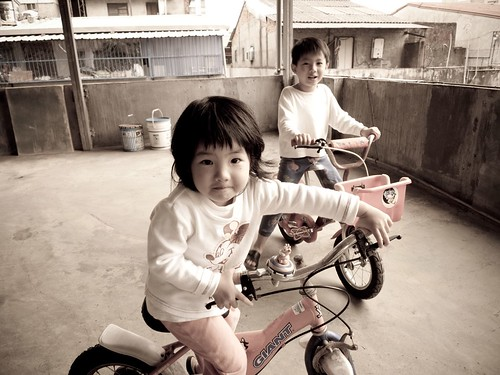
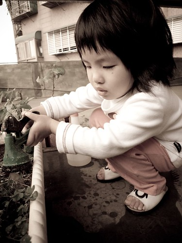

過了個年我們家的阿徹已經七歲 而愛愛也四歲了 七歲! 準備要上小學的年紀 四歲! 即將進入小班的年紀 都算是小人階段很重要的分水嶺  另一個里程的開始

最近聽著這兄妹倆的對話 徹爸常會感嘆"他們竟然已經這麼大了 兄妹倆已經會聊天 真的在聊天耶..." 是阿...不知不覺我們養小孩竟然已經養到這階段了 有欣慰 有開心 更有一種說不出的"小孩在大 大人在老"的苦笑 笑中有苦  苦中有笑  這麼講一點都不誇張也沒搞sense

雖然愛愛已經三歲多 說小隻也不是太小隻了 但她還是很愛睡她那小小的嬰兒床 她自己都說"我喜歡我的床 好溫暖" 只是跟她同床過幾次的阿徹哥哥 越來越依賴這小妹子 每天睡覺前就聽那阿徹哥哥在那苦苦哀求妹妹跟他一起睡 然後兄妹倆為了這事越來越爾虞我詐 妹妹請哥哥幫她忙 哥哥說"那你晚上要陪我睡覺喔" 或是哥哥不肯幫忙 妹妹說"那我晚上不要陪你睡覺了" 只是妹妹似乎年紀尚小 還不太董得人要信守承諾這道理 常常利用完她哥哥後 晚上睡覺時依舊無情的去睡她自己的小床 害得她哥哥常忍不住飆淚 直數落著"你不是答應要跟哥哥睡覺了 你都這樣 下次我不要XXXOOO了" 有時候連我跟徹爸都看不下 忍不住一起跟著數落妹妹

兄妹倆一起同床睡覺的時候超能聊天的 可以從九點半上床後聊到十點還在聊 甚至越聊越High 就像徹爸說的"她們真的在聊天哩" 有一次徹爸聽到他們聊著 "今天學校裡OOO怎麼樣怎麼樣的" 另一個說"對阿 OOO好好笑喔" 哇勒~兄妹兩已經會聊起學校的事了 可見愛愛真的越來越脫離baby的行列 可以加入哥哥的花花世界了

有天兄妹倆玩家家酒時 妹妹不知怎的弄亂東西讓哥哥生氣的數落了一番 愛愛就自己悶不坑聲的拿著娃娃坐在沙發上把玩 過了5分鐘後 哥哥果然一如以往不甘寂寞的要請妹妹跟他一起玩 結果小妮子愛愛悠悠的說著"可是你在生我的氣阿" 哥哥就說"誰叫你剛剛OOOXXX " 然後愛愛又說"那你不要生我的氣了 我才要跟你玩" 於是哥哥只好說"好啦 我沒有生你的氣了 拜託你跟我玩啦" 最後妹妹好像"是被拜託似的"開心的又去跟哥哥一起玩

二月份學校慶生會的時候 老師給了一個大大塊的蛋糕 最終還是沒能吃完的阿徹 竟然就去把他妹妹找來教室幫忙吃完 據Freda說 一小塊蛋糕愛愛吃了半小時之久(事後我問愛愛 她說因為她不喜歡) 期間阿徹哥哥一直想要去遊戲區跟同學玩 便一直問妹妹"哥哥先去遊戲區喔" 可是愛愛不准哥哥去 硬是要她哥哥留著陪她把蛋糕喀完 於是哥哥邊陪邊跟Freda數落妹妹在家吃飯時的惡行惡狀 因此Freda才笑說"阿徹真的被他妹妹吃夠夠"

最近我跟徹爸都戲稱我們家有兩個"阿ㄍㄠˊ" (猴的台語發音) 一隻大阿ㄍㄠˊ 一隻小阿ㄍㄠˊ 而那被笑的兩隻阿ㄍㄠˊ也常就厚顏無恥的扮起阿ㄍㄠˊ的模樣 兄妹倆真的就像兩隻活蹦亂跳的小猴子 整天在家裏跑來跑去 跳來跳去  活力十足(就是皮啦)

阿徹最近有點"叛逆" 常不經意的就跟你唱反調 當媽媽一點一點數落著他 衣服別亂丟 書包別亂放 他可以表情十足的模仿說著我說過的每句話  雙手卻動也沒動 媽媽的話仿若放屁一樣 媽媽自己講爽的而已 有天媽媽總算忍不住拿愛的小手打下去 嚴重警告他"自己不要人家那樣子對你 自己就別那樣子對別人" 其實每次警告阿徹時 小子都懂 只是那個叛逆的小黑人好像常不由自主的就跳出來鬧一下 不鬧不行的樣子

爸媽真的都是當了爸媽才開始學著當爸媽 小孩子永遠有讓人意想不到的麻煩/問題考驗著爸媽 爸媽就像園丁 希望給花園裏的小花小草陽光, 水分, 營養 ...

然後希望有一天可以開花結果.................... (哈! 為了配合這兩張照片的Fu 硬搞sense)

Note: 以上照片都是用家中的新成員小廣所拍 因為徹爸尚未習慣小廣色彩 因此全轉成這搞sense的色調了
