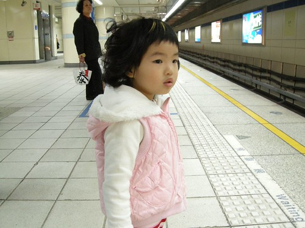

距離5月底的音樂發表會表演又過了半年 相較於上次的傻不巄東 愛愛這次已經明確了解自己將要登台表演 雖然是好玩的成分大於緊張的練習 愛愛常在家裏跳起他舞蹈班要表演的"小浣熊" 有時候自己害羞的換好舞蹈鞋後一個人跳的很爽很開心 有時候卻會硬要爸爸媽媽看著 甚至跟著他一起跳小浣熊 所以現在我們一家四口可都練就一身邊唱邊跳小浣熊的好本領ㄋ 

今天的節目表上 愛愛班上有三個 阿徹的班上也有三個 很剛好的愛愛的都集中在上半段而阿徹的都在下半段 雖然她們每個表演間很剛好的都還有一個別班的表演 讓我跟徹爸在拍/錄完一個表演後還能回到位置上小憩一下 但六個表演這樣下來 我跟徹爸竟累的喘呼呼了 果然家裡有兩個小孩同時上學讓人很忙碌....

在安親班大姐姐大哥哥的暖身表演之後 緊接著登場的就是全園年紀最小的幼幼班登場 其實啥都還不懂的兩三歲小人一起站在台上就已震撼力十足 不管是發呆 置之身外 嚇哭 或是隨著音樂搖擺都可以引起台下大人們的竊笑 因此幼幼班的上下臺總是引起最大的驚呼與掌聲

(總覺老師們似乎刻意的讓小愛與阿綠這對情侶檔一起站在舞台的正中央)

第一個表演是兩首簡短的英文歌曲 愛愛除了一開始稍有頓ㄉㄟ外  有很認真的擺腰扭臀 一整排小聖誕樹的模樣都很可愛 吸睛效果十足 不過我想應該每個父母都覺得自家小孩最棒 最可愛吧! 哈!!

來了! 來了! 愛愛今天的重頭戲: 舞蹈初級班的小浣熊表演 彩虹老師今天因為有公演沒有辦法親自坐鎮 所有舞蹈班的表演都全得靠小朋友自己啦 不過初級班畢竟功力尚淺 有一個老師幫忙拍玲鼓好讓小朋友容易抓節拍

雖然表演的是小浣熊 但全體都穿成了小老虎(小浣熊的衣服應該很難借吧) 舞蹈班唯三的幼幼班"稚齡"兒童: 愛愛 阿嵂 阿琦 分別站在第一旁的最左與最右 彩虹老師應該會擔心這三個會不會是來鬧的吧...

開場音樂開始 愛愛很進入狀況的擺好預備動作 可是不知道什麼原因 音樂突然停止了大約30秒左右吧 趴在地上的愛愛似乎等的有點不耐煩的嘟起了她的小嘴

總算總算音樂又來了 愛愛小老虎的熱情瞬間引爆...

愛愛果然好樣的 自己自得其樂的邊唱邊跳 唱歌的聲音甚至大聲到 我在台前(下面)都聽的一清二楚

雖然動作還是不若其他大同學來的到位確實 但認真度可不輸別人ㄋ (我這媽已經開始老王賣瓜自賣自誇了)

賣力的跳  賣力的踢.... 賣力到媽媽都有點擔心他會不會衝過頭 不小心跳到台下去了

跟愛愛搭檔的應該是中班的小朋友吧 我想愛愛的表現應該沒有太委屈這小姐姐了吧 同時間阿嵂跟阿琦這對拍檔正在舞台的左側爭執互推了起來 害我笑到岔氣 拿相機的手一直抖

之前在家裡練習時 愛愛都會像停不下來的唱盤一樣一直唱一直跳 每當兩三輪之後 看到愛愛已經有點喘呼呼的樣子 我跟徹爸就會跟她說"好了 這樣就好了" 可是愛愛還是一直跳一直跳 表演當天 聽到看到愛愛們就這樣重複跳了5-6遍以上的小浣熊(中間還有一些動作不同) 我跟徹爸總算明白為啥在家裡時 小愛會跳到像是不知道停一樣 可能其實她的心裡有在默數次數吧

最後的穿山洞也有跟上喔

然後回到位置擺好Ending pose 啪!啪!!啪!!! 太棒了 爸爸媽媽給你拍拍手.....

影片連結: [http://www.im.tv/vlog/vlog.asp?Memid=322793](http://www.im.tv/vlog/vlog.asp?Memid=322793)

這次晚會很特別的有一個幼幼班 小班小朋友與老師們一起演的"大野郎與小羊" 每個小朋友一身白的小羊裝果然有可愛也有溫暖 只是小愛的雙手不知為啥一直放在她的羊角上

大部分的小朋友的戲份都很簡單 就是只要玩玩具 然後大野郎來時被吃掉 然後又再被救出來

(小羊的背影) 

愛愛整部戲中 只有玩玩具的時候手是放下來的 其餘的時間 手都在羊角上 而且只有玩玩具的時候最入戲  其他的時候都像是看戲的傻子

(原本皮膚不白 眼睛不大的愛愛在穿了小羊裝後似乎都顯得白皙透紅眼睛亮)

小羊們在跟回家的羊媽媽說 其他小羊被那裡的大野狼吃掉了

然後羊媽媽拿出剪刀把大野狼的肚子剪開救出躲在後面的那些小羊 可憐的懷胎8月Vivian老師要當辛苦奔波的羊媽媽 委屈Eilien老師犧牲色相當大野狼 (果然女生還是不要長的太高壯好)

被救出來後的愛愛小羊還是一樣賣力扶著她的羊角 我忍不住一直跟徹爸說"她會不會是太熱了 所以一直拉著帽子阿" 事後愛愛跟我說 原來她是擔心羊角掉下來啦

等到所有表演結束 全體小朋友都到台上大合跳時 愛愛開心的哩~ 難得看她在這種大場子這樣子的大笑 我想她應該也很滿意 很開心她自己今日的表現吧

阿徹念晨暘念了三年多 也參加過大小接近10場的表演或是遊行了 曾經我很質疑 為什麼表演服裝要用租的 一套200元的價錢其實也不便宜 可是慢慢明白 這樣除了可以省去爸媽的麻煩(不是每個爸媽都有美術天份 手工能力的) 甚至荷包外(隨便去外面買套洋裝可能都更貴) 其實讓小孩嘗試不同的造型也很有趣 小朋友們都很愛這樣的變裝

也曾經我一直覺得 為什麼小朋友不能在自己的表演完之後坐到台下去觀賞其他人的表演 整個晚會時間都只能在後台 現在逐漸明白園方擔心的不是小朋友在台下觀賞時的難以控制 而是對於參與家長們的難以控制 也許現在家長都熱烈的想要替自家小孩留下更多 更好的成長紀錄 但父母們在搶著照自己小孩 甚至不管小朋友們的全體集合表演 猛吆喝自己的小孩 更甚至把小孩拉到一旁好跟其他家人合照 其實這樣已經大大影響到整個活動的進行與進度掌控

教育真的不止是學校單方面的責任 重點還是在於家庭 父母的身教阿....

附註: 表演那天又湊巧的約了全家去剪頭髮 設計師阿姨在幫愛愛剪了留海後 用電捲棒幫愛愛搞了一頭捲髮 當媽媽帶著洗好頭的阿徹回到位置上時真的有被這捲頭給嚇到 第一 這樣去表演實在太不低調了 第二 可愛歸可愛 可是我覺得真的有點像小丸子的媽媽說...

不過小愛自己對於這捲頭可滿意喜歡的哩

鳥巢的背面

牽著這樣的小孩走在路上還真讓媽媽有點害羞不習慣 幸好下午一場午覺醒來後捲頭全被壓扁了  晚上可以低調的去表演會場了.....

