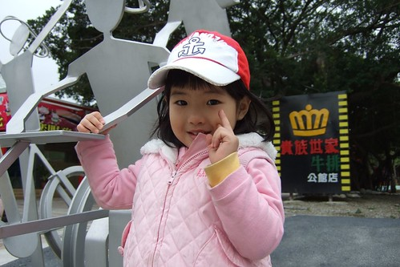
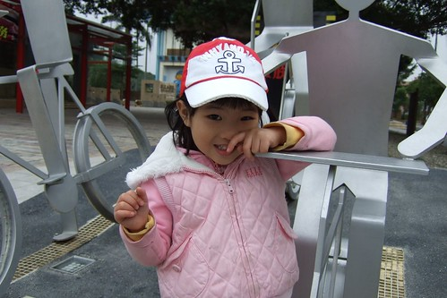
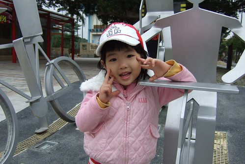
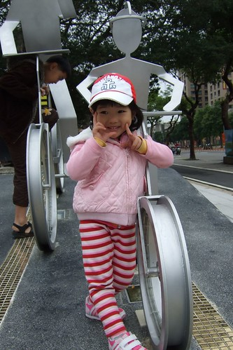
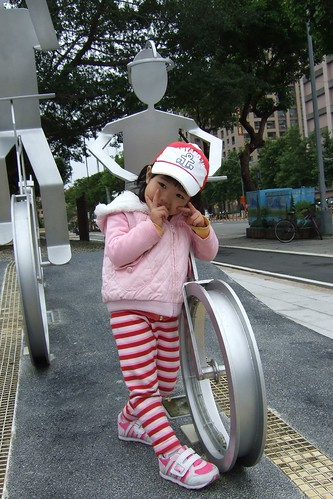

三月出院後的隔一週因為起伏的咳嗽狀況 小愛又接受了一週的抗生素治療 而隨著那變化多端的天氣 感冒似乎有好過但似乎又染上新的了 於是接連幾週都還是得去馬偕找醫生報到而藥也一直持續的吃著 總算上週一(4/20)醫生宣判"痰音聽起來滿意多了  再吃三天藥就可以畢業了" 媽媽心理忍不住OS"吃了好久好久的藥總算總算真的要結束了" 另方面醫生也交代"要趕快帶去打肺炎鏈球菌疫苗" 這個疫苗 打從去年冬天開始就一直唸著要帶小愛去打 可是小愛狀況一直不好 所以也就一直拖著 這回好不容易身體狀況合格可以打針了  說什麼也要趕快帶去打了

跟小愛說"帶你去打一種好厲害的針 打了後就比較不會咳嗽到要住院喔..哥哥小時候也有打過喔..." 小愛一臉不以為然的回我"等長大後就比較不會咳啦!!"  (她應該是覺得哥哥很少感冒咳嗽吧) 我說"長大不一定就不會咳 但是打了這針真的就不會咳的那麼嚴重 以後就不用住院了喔" 小愛總算有點相信我的話 但她還是覺得打針好恐怖... 於是我跟徹爸開出了打針的條件: 買診所的維他命軟糖? (不要) 再加買貼紙(還是不要) 那買一個拼圖(總算要了)

趁著上週四徹爸回診以及小愛最後一天的吃藥  一股作氣的帶去診所打疫苗了 先給醫生檢查完踏出診間時 小愛問我"有要打針嗎?" (她可能以為進去就是要打針了) 我說"要阿 等護士阿姨準備好再進去打" 小愛又問我"打針會痛嗎?"  (這是她第一次問我打針會痛嗎 ) 我說"可能有一點點吧 應該就像蚊子那樣叮過" 小愛沒再說什麼 只是認份的等著阿姨準備好 等到真的要打針時  小愛總算開始"閃躲" 唉叫了幾聲  幸好還是認命的坐在我腿上等著接受

我問阿姨"要打手還是打大腿" 阿姨說"都可以 不過小愛那麼瘦打大腿比較好" 我很尊重的問小愛"你要打手還是大腿?" 小愛說手 阿姨面露難色"妹妹 打腿腿你比較不會痛喔" 於是小愛恐懼的讓我們扒開褲子........... 雖然小愛快哭的嚷著"不要" 也出現一些躲避的動作 但算是很認命的接受這一針非打不可的事實 只是在針打下去的一秒鐘後還是哭的一把鼻涕一把眼淚 甚至打完後那晚走路都呈現半跛腳半大外八的模樣 惜皮的模樣讓我跟徹爸忍不住在私底下竊笑 而她在打完針的第三天也就是週末還說"我的腳已經好了 不會痛了 可以去爬山了"

Anyway, 打完這針 我跟徹爸的心總算可以安心一些了 雖然打了肺炎鏈球菌不代表就不會得肺炎 但起碼有打有保佑 症狀應該會輕一些吧! 希望.........

PS. 貼了一系列跟打針沒關的照片 呵呵!!  清照片ㄇㄟ 照片攝於台大公館往自來水博物館自行車道巷口處 等徹爸跟哥哥會合的空檔 小愛主動要求我幫她照這一系列的照片....

